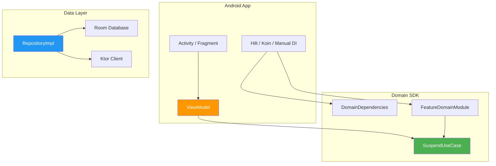

# Guía de Integración Android

[← Volver al README](README.md)


---

## Arquitectura en Android


---

## Paso A1 — Configuración de Gradle

**Escenario:** Tu app Android tiene un módulo `:app` y quiere usar el SDK.

```kotlin
// app/build.gradle.kts
dependencies {
    implementation(project(":coredomainplatform"))
    implementation("org.jetbrains.kotlinx:kotlinx-coroutines-android:1.8.1")
}
```

---

## Paso A2 — Providers de plataforma

**Escenario:** Proveer implementaciones específicas de Android para `ClockProvider` e `IdProvider`.

```kotlin
// módulo data — AndroidProviders.kt
import com.domain.core.provider.ClockProvider
import com.domain.core.provider.IdProvider
import java.util.UUID

val androidClock: ClockProvider = ClockProvider {
    System.currentTimeMillis()
}

val androidIdProvider: IdProvider = IdProvider {
    UUID.randomUUID().toString()
}
```

---

## Paso A3 — Implementación de repositorio con Room

**Escenario:** Implementar `TaskRepository` respaldado por Room.

```kotlin
// módulo data — TaskRepositoryImpl.kt
class TaskRepositoryImpl(
    private val dao: TaskDao,
) : TaskRepository {

    override suspend fun findById(id: TaskId): DomainResult<Task?> =
        runDomainCatching(
            errorMapper = { DomainError.Infrastructure(detail = "Fallo al leer DB", cause = it) }
        ) {
            dao.findById(id.value)?.toDomain()
        }

    override suspend fun save(entity: Task): DomainResult<Unit> =
        runDomainCatching(
            errorMapper = { DomainError.Infrastructure(detail = "Fallo al escribir DB", cause = it) }
        ) {
            dao.insertOrReplace(entity.toEntity())
        }

    override suspend fun delete(entity: Task): DomainResult<Unit> =
        runDomainCatching(
            errorMapper = { DomainError.Infrastructure(detail = "Fallo al eliminar en DB", cause = it) }
        ) {
            dao.delete(entity.id.value)
        }
}
```

---

## Paso A4 — Integración con ViewModel

**Escenario:** Un ViewModel llama a un caso de uso y mapea el resultado a estado de UI.

```kotlin
class TaskViewModel(
    private val createTask: SuspendUseCase<CreateTaskParams, Task>,
) : ViewModel() {

    private val _uiState = MutableStateFlow<TaskUiState>(TaskUiState.Idle)
    val uiState: StateFlow<TaskUiState> = _uiState.asStateFlow()

    fun onCreateTask(title: String) {
        viewModelScope.launch {
            _uiState.value = TaskUiState.Loading

            createTask(CreateTaskParams(title))
                .onSuccess { task ->
                    _uiState.value = TaskUiState.Success(task)
                }
                .onFailure { error ->
                    _uiState.value = when (error) {
                        is DomainError.Validation ->
                            TaskUiState.ValidationError(error.field, error.detail)
                        is DomainError.Infrastructure ->
                            TaskUiState.Error("Algo salió mal. Intenta de nuevo.")
                        else ->
                            TaskUiState.Error(error.message)
                    }
                }
        }
    }
}

sealed interface TaskUiState {
    data object Idle : TaskUiState
    data object Loading : TaskUiState
    data class Success(val task: Task) : TaskUiState
    data class ValidationError(val field: String, val detail: String) : TaskUiState
    data class Error(val message: String) : TaskUiState
}
```

---

## Paso A5 — Wiring manual (sin framework DI)

**Escenario:** Conectar todo sin Koin ni Hilt.

```kotlin
// AppModule.kt — crear una vez en Application.onCreate()
class AppModule(context: Context) {

    private val database = Room.databaseBuilder(
        context, AppDatabase::class.java, "app.db"
    ).build()

    private val domainDeps = DomainDependencies(
        clock = androidClock,
        idProvider = androidIdProvider,
    )

    private val taskRepository: TaskRepository = TaskRepositoryImpl(database.taskDao())

    val taskModule: TaskDomainModule = TaskDomainModuleImpl(
        deps = domainDeps,
        taskRepository = taskRepository,
    )
}

// En tu Activity o Fragment:
val appModule = (application as MyApp).appModule
val viewModel = TaskViewModel(createTask = appModule.taskModule.createTask)
```

---

## Paso A6 — Wiring con Hilt (opcional)

**Escenario:** Prefieres Hilt para DI en Android.

```kotlin
@Module
@InstallIn(SingletonComponent::class)
object DomainModule {

    @Provides @Singleton
    fun provideDomainDeps(): DomainDependencies = DomainDependencies(
        clock = androidClock,
        idProvider = androidIdProvider,
    )

    @Provides @Singleton
    fun provideTaskModule(
        deps: DomainDependencies,
        taskRepository: TaskRepository,
    ): TaskDomainModule = TaskDomainModuleImpl(deps, taskRepository)

    @Provides
    fun provideCreateTask(module: TaskDomainModule): SuspendUseCase<CreateTaskParams, Task> =
        module.createTask
}
```

---

## Paso A7 — Wiring con Koin (opcional)

**Escenario:** Prefieres Koin para DI en Android.

```kotlin
val domainModule = module {
    single {
        DomainDependencies(
            clock = androidClock,
            idProvider = androidIdProvider,
        )
    }

    single<TaskDomainModule> {
        TaskDomainModuleImpl(
            deps = get(),
            taskRepository = get(),
        )
    }

    factory { get<TaskDomainModule>().createTask }
}
```

---

## FAQ

**P: ¿El SDK depende de alguna librería Android?**
No. El SDK es Kotlin `commonMain` puro. Compila a bytecode JVM en Android
sin ninguna dependencia específica de Android.

**P: ¿Puedo usar este SDK en un proyecto Compose Multiplatform?**
Sí. El SDK no tiene dependencia de UI. Tu capa de Compose llama a los casos
de uso exactamente como lo haría cualquier ViewModel.

**P: ¿Qué pasa si mi repositorio lanza una excepción checked (ej. `SQLiteException`)?**
Usa `runDomainCatching` en tu implementación de repositorio. Atrapa todos los
throwables excepto cancelación y los mapea a `DomainError`. Las excepciones de
cancelación siempre se re-lanzan para preservar la concurrencia estructurada.

**P: ¿Debo envolver los `Flow` use cases en `collectAsStateWithLifecycle()`?**
Sí. `FlowUseCase` retorna `Flow<DomainResult<T>>`. Colecta en tu ViewModel
o UI de Compose usando los collectors lifecycle-aware estándar.

**P: ¿Puedo llamar `PureUseCase` desde el hilo principal?**
Sí. `PureUseCase` es síncrono y puro — sin I/O, sin bloqueo. Es
explícitamente seguro para llamar desde cualquier hilo incluyendo el main thread.

**P: ¿Cómo manejo `DomainError.Unauthorized` en Android?**
Mapéalo en tu ViewModel o en un error handler compartido para disparar el flujo
de cierre de sesión o navegación a la pantalla de login:
```kotlin
.onFailure { error ->
    if (error is DomainError.Unauthorized) {
        navigator.navigateTo(LoginScreen)
    }
}
```

**P: ¿Qué hay de las reglas ProGuard/R8?**
El SDK no usa reflexión, ni anotaciones de serialización, ni carga dinámica de
clases. No se necesitan reglas de ProGuard.

**P: ¿Puedo tener múltiples instancias de `DomainDependencies`?**
No. Crea una instancia al arranque de la app y compártela entre todos los feature
modules. Es inmutable y segura para concurrencia.

---

<details>
<summary><h2>🇺🇸 English Version</h2></summary>

## Architecture on Android



---

## Step A1 — Gradle setup

**Scenario:** Your Android app has a `:app` module and wants to use the SDK.

```kotlin
// app/build.gradle.kts
dependencies {
    implementation(project(":coredomainplatform"))
    implementation("org.jetbrains.kotlinx:kotlinx-coroutines-android:1.8.1")
}
```

## Step A2 — Platform providers

**Scenario:** Provide Android-specific implementations for `ClockProvider` and `IdProvider`.

```kotlin
// data module — AndroidProviders.kt
import com.domain.core.provider.ClockProvider
import com.domain.core.provider.IdProvider
import java.util.UUID

val androidClock: ClockProvider = ClockProvider {
    System.currentTimeMillis()
}

val androidIdProvider: IdProvider = IdProvider {
    UUID.randomUUID().toString()
}
```

## Step A3 — Room repository implementation

**Scenario:** Implement `TaskRepository` backed by Room.

```kotlin
// data module — TaskRepositoryImpl.kt
class TaskRepositoryImpl(
    private val dao: TaskDao,
) : TaskRepository {

    override suspend fun findById(id: TaskId): DomainResult<Task?> =
        runDomainCatching(
            errorMapper = { DomainError.Infrastructure(detail = "DB read failed", cause = it) }
        ) {
            dao.findById(id.value)?.toDomain()
        }

    override suspend fun save(entity: Task): DomainResult<Unit> =
        runDomainCatching(
            errorMapper = { DomainError.Infrastructure(detail = "DB write failed", cause = it) }
        ) {
            dao.insertOrReplace(entity.toEntity())
        }

    override suspend fun delete(entity: Task): DomainResult<Unit> =
        runDomainCatching(
            errorMapper = { DomainError.Infrastructure(detail = "DB delete failed", cause = it) }
        ) {
            dao.delete(entity.id.value)
        }
}
```

## Step A4 — ViewModel integration

**Scenario:** A ViewModel calls a use case and maps the result to UI state.

```kotlin
class TaskViewModel(
    private val createTask: SuspendUseCase<CreateTaskParams, Task>,
) : ViewModel() {

    private val _uiState = MutableStateFlow<TaskUiState>(TaskUiState.Idle)
    val uiState: StateFlow<TaskUiState> = _uiState.asStateFlow()

    fun onCreateTask(title: String) {
        viewModelScope.launch {
            _uiState.value = TaskUiState.Loading

            createTask(CreateTaskParams(title))
                .onSuccess { task ->
                    _uiState.value = TaskUiState.Success(task)
                }
                .onFailure { error ->
                    _uiState.value = when (error) {
                        is DomainError.Validation ->
                            TaskUiState.ValidationError(error.field, error.detail)
                        is DomainError.Infrastructure ->
                            TaskUiState.Error("Something went wrong. Please try again.")
                        else ->
                            TaskUiState.Error(error.message)
                    }
                }
        }
    }
}

sealed interface TaskUiState {
    data object Idle : TaskUiState
    data object Loading : TaskUiState
    data class Success(val task: Task) : TaskUiState
    data class ValidationError(val field: String, val detail: String) : TaskUiState
    data class Error(val message: String) : TaskUiState
}
```

## Step A5 — Manual wiring (no DI framework)

**Scenario:** Wire everything without Koin or Hilt.

```kotlin
// AppModule.kt — create once at Application.onCreate()
class AppModule(context: Context) {

    private val database = Room.databaseBuilder(
        context, AppDatabase::class.java, "app.db"
    ).build()

    private val domainDeps = DomainDependencies(
        clock = androidClock,
        idProvider = androidIdProvider,
    )

    private val taskRepository: TaskRepository = TaskRepositoryImpl(database.taskDao())

    val taskModule: TaskDomainModule = TaskDomainModuleImpl(
        deps = domainDeps,
        taskRepository = taskRepository,
    )
}

// In your Activity or Fragment:
val appModule = (application as MyApp).appModule
val viewModel = TaskViewModel(createTask = appModule.taskModule.createTask)
```

## Step A6 — Wiring with Hilt (optional)

**Scenario:** You prefer Hilt for DI on Android.

```kotlin
@Module
@InstallIn(SingletonComponent::class)
object DomainModule {

    @Provides @Singleton
    fun provideDomainDeps(): DomainDependencies = DomainDependencies(
        clock = androidClock,
        idProvider = androidIdProvider,
    )

    @Provides @Singleton
    fun provideTaskModule(
        deps: DomainDependencies,
        taskRepository: TaskRepository,
    ): TaskDomainModule = TaskDomainModuleImpl(deps, taskRepository)

    @Provides
    fun provideCreateTask(module: TaskDomainModule): SuspendUseCase<CreateTaskParams, Task> =
        module.createTask
}
```

## Step A7 — Wiring with Koin (optional)

**Scenario:** You prefer Koin for DI on Android.

```kotlin
val domainModule = module {
    single {
        DomainDependencies(
            clock = androidClock,
            idProvider = androidIdProvider,
        )
    }

    single<TaskDomainModule> {
        TaskDomainModuleImpl(
            deps = get(),
            taskRepository = get(),
        )
    }

    factory { get<TaskDomainModule>().createTask }
}
```

## FAQ

**Q: Does the SDK depend on any Android library?**
No. The SDK is pure `commonMain` Kotlin. It compiles to JVM bytecode on Android
without any Android-specific dependency.

**Q: Can I use this SDK in a Compose Multiplatform project?**
Yes. The SDK has no UI dependency. Your Compose layer calls use cases exactly
like any ViewModel would.

**Q: What if my repository throws a checked exception (e.g., `SQLiteException`)?**
Use `runDomainCatching` in your repository implementation. It catches all
non-cancellation throwables and maps them to `DomainError`. Cancellation
exceptions are always rethrown to preserve structured concurrency.

**Q: Should I wrap `Flow` use cases in `collectAsStateWithLifecycle()`?**
Yes. `FlowUseCase` returns `Flow<DomainResult<T>>`. Collect it in your ViewModel
or Compose UI using the standard lifecycle-aware collectors.

**Q: Can I call `PureUseCase` from the UI thread?**
Yes. `PureUseCase` is synchronous and pure — no I/O, no blocking. It is
explicitly safe to call from any thread including the main thread.

**Q: How do I handle `DomainError.Unauthorized` on Android?**
Map it in your ViewModel or a shared error handler to trigger a sign-out flow
or navigation to the login screen:
```kotlin
.onFailure { error ->
    if (error is DomainError.Unauthorized) {
        navigator.navigateTo(LoginScreen)
    }
}
```

**Q: What about ProGuard/R8 rules?**
The SDK uses no reflection, no serialization annotations, and no dynamic class
loading. No ProGuard rules are needed.

**Q: Can I have multiple `DomainDependencies` instances?**
No. Create one instance at app startup and share it across all feature modules.
It is immutable and concurrency-safe.

</details>
