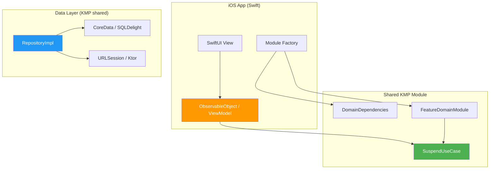

# Guía de Integración iOS

[← Volver al README](README.md)


---

## Arquitectura en iOS


---

## Paso I1 — Exportar framework KMP

**Escenario:** Tu proyecto KMP necesita exportar el módulo compartido como un framework iOS.

```kotlin
// shared/build.gradle.kts
kotlin {
    listOf(iosX64(), iosArm64(), iosSimulatorArm64()).forEach { target ->
        target.binaries.framework {
            baseName = "SharedDomain"
            isStatic = true
        }
    }
}
```

---

## Paso I2 — Providers de plataforma para iOS

**Escenario:** Proveer implementaciones específicas de iOS usando Kotlin/Native.

```kotlin
// shared/src/iosMain/kotlin/PlatformProviders.kt
import com.domain.core.provider.ClockProvider
import com.domain.core.provider.IdProvider
import platform.Foundation.NSDate
import platform.Foundation.NSUUID
import platform.Foundation.timeIntervalSince1970

val iosClock: ClockProvider = ClockProvider {
    (NSDate().timeIntervalSince1970 * 1000).toLong()
}

val iosIdProvider: IdProvider = IdProvider {
    NSUUID().UUIDString
}
```

---

## Paso I3 — Factory de módulo para Swift

**Escenario:** Swift no puede llamar constructores Kotlin con genéricos complejos directamente. Crea una función factory que Swift pueda invocar fácilmente.

```kotlin
// shared/src/iosMain/kotlin/ModuleFactory.kt
import com.domain.core.di.DomainDependencies

object SharedModuleFactory {

    private val domainDeps = DomainDependencies(
        clock = iosClock,
        idProvider = iosIdProvider,
    )

    fun createTaskModule(taskRepository: TaskRepository): TaskDomainModule =
        TaskDomainModuleImpl(
            deps = domainDeps,
            taskRepository = taskRepository,
        )
}
```

---

## Paso I4 — Repositorio SQLDelight para iOS

**Escenario:** Implementar `TaskRepository` con SQLDelight (persistencia nativa KMP).

```kotlin
// módulo data compartido
class TaskRepositoryImpl(
    private val queries: TaskQueries,
) : TaskRepository {

    override suspend fun findById(id: TaskId): DomainResult<Task?> =
        runDomainCatching(
            errorMapper = { DomainError.Infrastructure(detail = "Fallo al leer DB", cause = it) }
        ) {
            queries.findById(id.value).executeAsOneOrNull()?.toDomain()
        }

    override suspend fun save(entity: Task): DomainResult<Unit> =
        runDomainCatching(
            errorMapper = { DomainError.Infrastructure(detail = "Fallo al escribir DB", cause = it) }
        ) {
            queries.insertOrReplace(
                id = entity.id.value,
                title = entity.title,
                completed = entity.completed,
                createdAt = entity.createdAt,
            )
        }

    override suspend fun delete(entity: Task): DomainResult<Unit> =
        runDomainCatching(
            errorMapper = { DomainError.Infrastructure(detail = "Fallo al eliminar en DB", cause = it) }
        ) {
            queries.deleteById(entity.id.value)
        }
}
```

---

## Paso I5 — Llamar desde Swift

**Escenario:** Usar el módulo de dominio desde un ViewModel SwiftUI.

```swift
import SharedDomain

@MainActor
class TaskViewModel: ObservableObject {
    @Published var state: TaskState = .idle

    private let createTask: any SuspendUseCaseProtocol

    init(taskModule: TaskDomainModule) {
        self.createTask = taskModule.createTask
    }

    func onCreateTask(title: String) async {
        state = .loading

        let params = CreateTaskParams(title: title)
        let result = try? await createTask.invoke(params: params)

        if let success = result as? DomainResultSuccess<Task> {
            state = .success(success.value)
        } else if let failure = result as? DomainResultFailure {
            if let validation = failure.error as? DomainErrorValidation {
                state = .validationError(field: validation.field, detail: validation.detail)
            } else {
                state = .error(failure.error.message)
            }
        }
    }
}

enum TaskState {
    case idle
    case loading
    case success(Task)
    case validationError(field: String, detail: String)
    case error(String)
}
```

---

## Paso I6 — Vista SwiftUI

**Escenario:** Conectar el ViewModel a una vista SwiftUI.

```swift
struct CreateTaskView: View {
    @StateObject private var viewModel: TaskViewModel
    @State private var title = ""

    init(taskModule: TaskDomainModule) {
        _viewModel = StateObject(wrappedValue: TaskViewModel(taskModule: taskModule))
    }

    var body: some View {
        VStack(spacing: 16) {
            TextField("Título de la tarea", text: $title)
                .textFieldStyle(.roundedBorder)

            Button("Crear Tarea") {
                Task { await viewModel.onCreateTask(title: title) }
            }

            switch viewModel.state {
            case .idle:
                EmptyView()
            case .loading:
                ProgressView()
            case .success(let task):
                Text("Creada: \(task.title)")
            case .validationError(let field, let detail):
                Text("\(field): \(detail)")
                    .foregroundColor(.red)
            case .error(let message):
                Text(message)
                    .foregroundColor(.red)
            }
        }
        .padding()
    }
}
```

---

## Paso I7 — Wiring en el punto de entrada de la app

**Escenario:** Crear el factory del módulo al iniciar la app.

```swift
@main
struct MyApp: App {
    private let taskModule: TaskDomainModule

    init() {
        let database = /* configuración de tu driver SQLDelight */
        let taskRepo = TaskRepositoryImpl(queries: database.taskQueries)
        taskModule = SharedModuleFactory().createTaskModule(taskRepository: taskRepo)
    }

    var body: some Scene {
        WindowGroup {
            CreateTaskView(taskModule: taskModule)
        }
    }
}
```

---

## FAQ

**P: ¿Cómo maneja Kotlin/Native las funciones `suspend` en Swift?**
Kotlin 2.0+ genera funciones `async` de Swift para funciones `suspend` de Kotlin.
Las llamas con `await` en Swift. No se necesitan wrappers de callback manuales.

**P: ¿Cómo se exponen las sealed classes en Swift?**
`DomainResult.Success` y `DomainResult.Failure` se convierten en clases separadas en Swift.
Usa verificaciones `is` o casts `as?` para distinguirlas. Los subtipos de `DomainError`
similarmente se convierten en clases separadas (`DomainErrorValidation`, `DomainErrorNotFound`, etc.).

**P: ¿Puedo usar esto con Combine en lugar de async/await?**
Sí. Envuelve las llamadas `async` en publishers de Combine si tu proyecto aún usa Combine:
```swift
Future<Task, Error> { promise in
    Task { /* llama al caso de uso async aquí */ }
}
```
Sin embargo, `async/await` nativo es lo recomendado para proyectos nuevos.

**P: ¿Necesito preocuparme por el manejo de memoria con objetos KMP?**
Kotlin/Native usa conteo automático de referencias (ARC) para objetos expuestos a Swift.
No se necesita manejo manual de memoria. Evita retener objetos Kotlin en closures
de larga vida para prevenir ciclos de referencia.

**P: ¿Qué pasa con los `Flow` use cases en iOS?**
`Flow` se expone como `Kotlinx_coroutines_coreFlow` en Swift. Usa la librería
[KMP-NativeCoroutines](https://github.com/nicklockwood/KMP-NativeCoroutines)
o SKIE para obtener wrappers nativos de Swift `AsyncSequence`.

**P: ¿El framework es grande?**
El SDK de dominio es muy pequeño — solo interfaces tipadas, sealed classes y funciones puras.
La contribución típica al tamaño del binario es menor a 100KB.

**P: ¿Puedo usar SwiftUI previews con este SDK?**
Sí. Crea módulos fake con repositorios stub para previews:
```swift
#Preview {
    CreateTaskView(taskModule: FakeTaskDomainModule())
}
```

**P: ¿El SDK soporta watchOS / tvOS / macOS?**
El código de dominio es Kotlin `commonMain` puro. Agrega los targets en `build.gradle.kts`
y compilarán sin cambios:
```kotlin
watchosArm64()
tvosArm64()
macosArm64()
```

---

<details>
<summary><h2>🇺🇸 English Version</h2></summary>

## Architecture on iOS



---

## Step I1 — KMP framework export

**Scenario:** Your KMP project needs to export the shared module as an iOS framework.

```kotlin
// shared/build.gradle.kts
kotlin {
    listOf(iosX64(), iosArm64(), iosSimulatorArm64()).forEach { target ->
        target.binaries.framework {
            baseName = "SharedDomain"
            isStatic = true
        }
    }
}
```

## Step I2 — Platform providers for iOS

**Scenario:** Provide iOS-specific implementations using Kotlin/Native.

```kotlin
// shared/src/iosMain/kotlin/PlatformProviders.kt
import com.domain.core.provider.ClockProvider
import com.domain.core.provider.IdProvider
import platform.Foundation.NSDate
import platform.Foundation.NSUUID
import platform.Foundation.timeIntervalSince1970

val iosClock: ClockProvider = ClockProvider {
    (NSDate().timeIntervalSince1970 * 1000).toLong()
}

val iosIdProvider: IdProvider = IdProvider {
    NSUUID().UUIDString
}
```

## Step I3 — Module factory for Swift

**Scenario:** Swift cannot call Kotlin constructors with complex generics directly.
Create a factory function that Swift can call easily.

```kotlin
// shared/src/iosMain/kotlin/ModuleFactory.kt
import com.domain.core.di.DomainDependencies

object SharedModuleFactory {

    private val domainDeps = DomainDependencies(
        clock = iosClock,
        idProvider = iosIdProvider,
    )

    fun createTaskModule(taskRepository: TaskRepository): TaskDomainModule =
        TaskDomainModuleImpl(
            deps = domainDeps,
            taskRepository = taskRepository,
        )
}
```

## Step I4 — SQLDelight repository for iOS

**Scenario:** Implement `TaskRepository` with SQLDelight (KMP-native persistence).

```kotlin
// shared data module
class TaskRepositoryImpl(
    private val queries: TaskQueries,
) : TaskRepository {

    override suspend fun findById(id: TaskId): DomainResult<Task?> =
        runDomainCatching(
            errorMapper = { DomainError.Infrastructure(detail = "DB read failed", cause = it) }
        ) {
            queries.findById(id.value).executeAsOneOrNull()?.toDomain()
        }

    override suspend fun save(entity: Task): DomainResult<Unit> =
        runDomainCatching(
            errorMapper = { DomainError.Infrastructure(detail = "DB write failed", cause = it) }
        ) {
            queries.insertOrReplace(
                id = entity.id.value,
                title = entity.title,
                completed = entity.completed,
                createdAt = entity.createdAt,
            )
        }

    override suspend fun delete(entity: Task): DomainResult<Unit> =
        runDomainCatching(
            errorMapper = { DomainError.Infrastructure(detail = "DB delete failed", cause = it) }
        ) {
            queries.deleteById(entity.id.value)
        }
}
```

## Step I5 — Calling from Swift

**Scenario:** Use the domain module from a SwiftUI ViewModel.

```swift
import SharedDomain

@MainActor
class TaskViewModel: ObservableObject {
    @Published var state: TaskState = .idle

    private let createTask: any SuspendUseCaseProtocol

    init(taskModule: TaskDomainModule) {
        self.createTask = taskModule.createTask
    }

    func onCreateTask(title: String) async {
        state = .loading

        let params = CreateTaskParams(title: title)
        let result = try? await createTask.invoke(params: params)

        if let success = result as? DomainResultSuccess<Task> {
            state = .success(success.value)
        } else if let failure = result as? DomainResultFailure {
            if let validation = failure.error as? DomainErrorValidation {
                state = .validationError(field: validation.field, detail: validation.detail)
            } else {
                state = .error(failure.error.message)
            }
        }
    }
}

enum TaskState {
    case idle
    case loading
    case success(Task)
    case validationError(field: String, detail: String)
    case error(String)
}
```

## Step I6 — SwiftUI View

**Scenario:** Connect the ViewModel to a SwiftUI View.

```swift
struct CreateTaskView: View {
    @StateObject private var viewModel: TaskViewModel
    @State private var title = ""

    init(taskModule: TaskDomainModule) {
        _viewModel = StateObject(wrappedValue: TaskViewModel(taskModule: taskModule))
    }

    var body: some View {
        VStack(spacing: 16) {
            TextField("Task title", text: $title)
                .textFieldStyle(.roundedBorder)

            Button("Create Task") {
                Task { await viewModel.onCreateTask(title: title) }
            }

            switch viewModel.state {
            case .idle:
                EmptyView()
            case .loading:
                ProgressView()
            case .success(let task):
                Text("Created: \(task.title)")
            case .validationError(let field, let detail):
                Text("\(field): \(detail)")
                    .foregroundColor(.red)
            case .error(let message):
                Text(message)
                    .foregroundColor(.red)
            }
        }
        .padding()
    }
}
```

## Step I7 — App entry point wiring

**Scenario:** Create the module factory at app launch.

```swift
@main
struct MyApp: App {
    private let taskModule: TaskDomainModule

    init() {
        let database = /* your SQLDelight driver setup */
        let taskRepo = TaskRepositoryImpl(queries: database.taskQueries)
        taskModule = SharedModuleFactory().createTaskModule(taskRepository: taskRepo)
    }

    var body: some Scene {
        WindowGroup {
            CreateTaskView(taskModule: taskModule)
        }
    }
}
```

## FAQ

**Q: How does Kotlin/Native handle `suspend` functions in Swift?**
Kotlin 2.0+ generates Swift `async` functions for `suspend` Kotlin functions.
You call them with `await` in Swift. No manual callback wrappers needed.

**Q: How are sealed classes exposed in Swift?**
`DomainResult.Success` and `DomainResult.Failure` become separate classes in Swift.
Use `is` checks or `as?` casts to distinguish them. `DomainError` subtypes
similarly become separate classes (`DomainErrorValidation`, `DomainErrorNotFound`, etc.).

**Q: Can I use this with Combine instead of async/await?**
Yes. Wrap the `async` calls in Combine publishers if your project still uses Combine:
```swift
Future<Task, Error> { promise in
    Task { /* call the async use case here */ }
}
```
However, native `async/await` is recommended for new projects.

**Q: Do I need to worry about memory management with KMP objects?**
Kotlin/Native uses automatic reference counting (ARC) for objects exposed to Swift.
No manual memory management is needed. Avoid retaining Kotlin objects in long-lived
closures to prevent reference cycles.

**Q: What about `Flow` use cases on iOS?**
`Flow` is exposed as `Kotlinx_coroutines_coreFlow` in Swift. Use the
[KMP-NativeCoroutines](https://github.com/nicklockwood/KMP-NativeCoroutines) library
or SKIE to get native Swift `AsyncSequence` wrappers.

**Q: Is the framework size large?**
The domain SDK is very small — only typed interfaces, sealed classes, and pure functions.
Typical binary size contribution is under 100KB.

**Q: Can I use SwiftUI previews with this SDK?**
Yes. Create fake modules with stub repositories for previews:
```swift
#Preview {
    CreateTaskView(taskModule: FakeTaskDomainModule())
}
```

**Q: Does the SDK support watchOS / tvOS / macOS?**
The domain code is pure `commonMain` Kotlin. Add the targets in `build.gradle.kts`
and they will compile without changes:
```kotlin
watchosArm64()
tvosArm64()
macosArm64()
```

</details>
