# Core Domain Platform SDK


> **Idioma / Language:** 🇪🇸 [Español](#tabla-de-contenidos) (predeterminado) · 🇺🇸 [English](#english-version)

Un **SDK de capa de dominio puro** para Kotlin Multiplatform. Cero dependencias de frameworks.
Cero infraestructura. Cero UI. Solo contratos tipados, manejo funcional de errores
y Clean Architecture forzada a nivel del compilador.

```
Targets: JVM · Android · iOS (arm64, x64, simulator)
Lenguaje: Kotlin 2.0 · KMP
Dependencias: kotlinx-coroutines-core (única)
```

---

## Tabla de Contenidos

- [Vista General de Arquitectura](#vista-general-de-arquitectura)
- [Estructura de Paquetes](#estructura-de-paquetes)
- [Componentes Principales](#componentes-principales)
- [Guía de Implementación Paso a Paso](#guía-de-implementación-paso-a-paso)
- [Guía de Integración Android](#guía-de-integración-android)
- [Guía de Integración iOS](#guía-de-integración-ios)
- [Referencia de Manejo de Errores](#referencia-de-manejo-de-errores)
- [Estrategia de Testing](#estrategia-de-testing)
- [Versionado](#versionado)

---

## Vista General de Arquitectura


### Regla de Dependencia

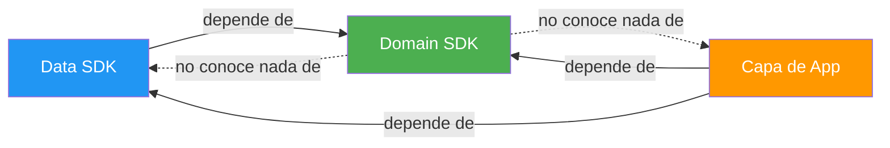

**El SDK de dominio define contratos. Las capas externas los implementan.**
El dominio nunca importa de data, UI ni ningún framework.

---

## Estructura de Paquetes

```
com.domain.core/
├── di/            → DomainDependencies, DomainModule
├── error/         → DomainError (jerarquía sealed)
├── result/        → DomainResult<T> + operadores (map, flatMap, zip, …)
├── model/         → Entity, ValueObject, AggregateRoot, EntityId
├── usecase/       → PureUseCase, SuspendUseCase, FlowUseCase, NoParams*
├── repository/    → Repository, ReadRepository, WriteRepository, ReadCollectionRepository
├── gateway/       → Gateway, SuspendGateway, CommandGateway
├── validation/    → Validator<T>, andThen, validateAll, collectValidationErrors
├── policy/        → DomainPolicy, SuspendDomainPolicy, and/or/negate
└── provider/      → ClockProvider, IdProvider
```

---

## Componentes Principales

### DomainResult

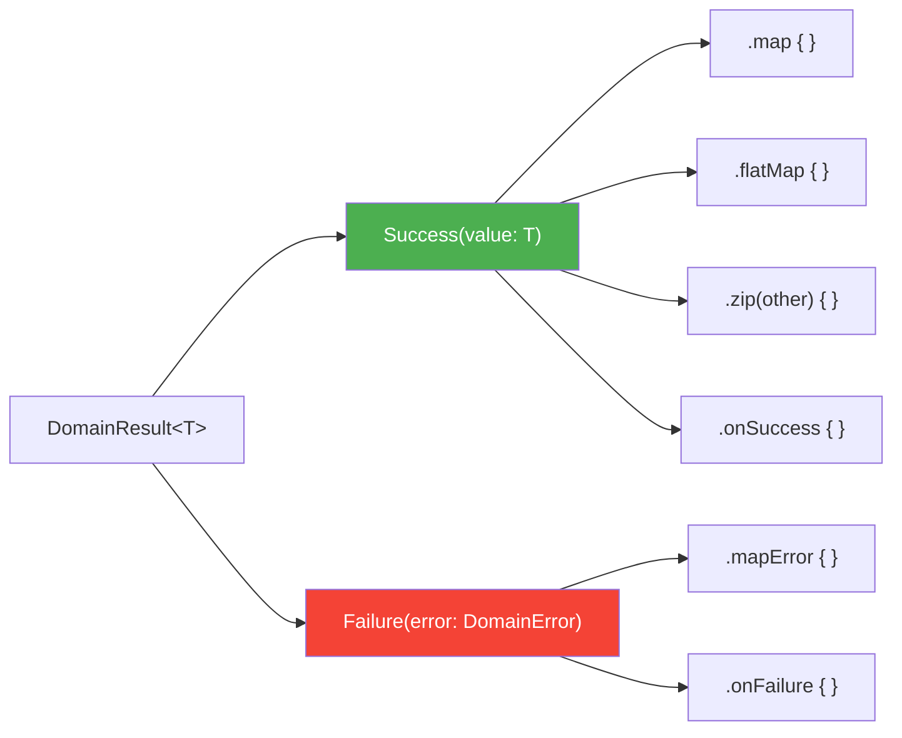

### Jerarquía de DomainError

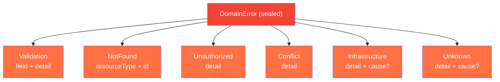

### Contratos de Casos de Uso

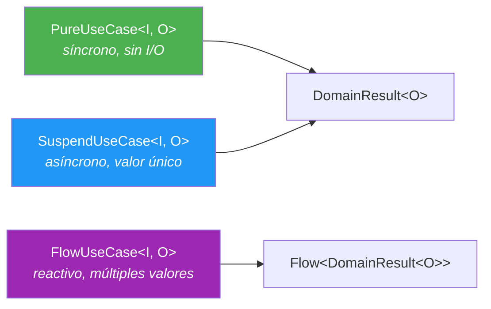

### Flujo de Composición

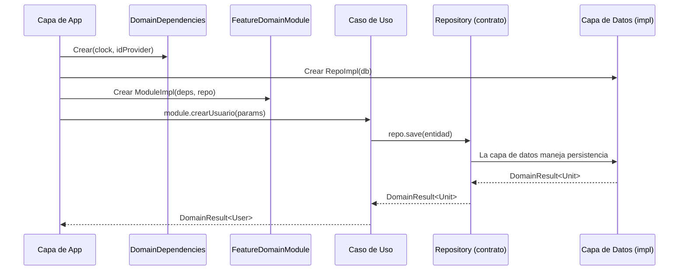

---

## Guía de Implementación Paso a Paso

Esta guía te lleva paso a paso a través de la integración del SDK en un proyecto KMP nuevo o existente.
Sigue cada paso en orden.

### Paso 1 — Agregar el SDK como dependencia

**Escenario:** Tienes un proyecto KMP y quieres usar este SDK como tu capa de dominio.

Agrega el módulo del SDK a tu proyecto. Si es un módulo local:

```kotlin
// settings.gradle.kts
include(":coredomainplatform")
project(":coredomainplatform").projectDir = file("ruta/a/coredomainplatform")
```

Luego en tu módulo de feature o app:

```kotlin
// build.gradle.kts de tu módulo app/feature
kotlin {
    sourceSets {
        val commonMain by getting {
            dependencies {
                implementation(project(":coredomainplatform"))
            }
        }
    }
}
```

### Paso 2 — Definir tus modelos de dominio

**Escenario:** Estás construyendo una feature de gestión de tareas y necesitas una entidad `Task` con un ID tipado.

```kotlin
// En el paquete de dominio de tu feature (NO en este SDK)
package com.myapp.feature.task.model

import com.domain.core.model.AggregateRoot
import com.domain.core.model.EntityId

@JvmInline
value class TaskId(override val value: String) : EntityId<String>

data class Task(
    override val id: TaskId,
    val title: String,
    val completed: Boolean,
    val createdAt: Long,
) : AggregateRoot<TaskId>
```

### Paso 3 — Definir tu contrato de repositorio

**Escenario:** Tu feature de `Task` necesita persistencia — el dominio define lo que necesita, no cómo se implementa.

```kotlin
package com.myapp.feature.task.repository

import com.domain.core.repository.ReadRepository
import com.domain.core.repository.WriteRepository
import com.myapp.feature.task.model.Task
import com.myapp.feature.task.model.TaskId

interface TaskRepository : ReadRepository<TaskId, Task>, WriteRepository<Task>
```

### Paso 4 — Crear validadores para tus reglas de dominio

**Escenario:** El título de una tarea no debe estar vacío y no debe exceder 200 caracteres.

```kotlin
package com.myapp.feature.task.validation

import com.domain.core.validation.notBlankValidator
import com.domain.core.validation.maxLengthValidator
import com.domain.core.validation.andThen

val taskTitleValidator = notBlankValidator("title")
    .andThen(maxLengthValidator("title", 200))
```

### Paso 5 — Crear políticas para reglas de negocio

**Escenario:** Una tarea solo puede ser completada si tiene un título (no vacío). Esta es una regla de negocio semántica, no solo validación de campo.

```kotlin
package com.myapp.feature.task.policy

import com.domain.core.error.DomainError
import com.domain.core.policy.DomainPolicy
import com.domain.core.result.asSuccess
import com.domain.core.result.domainFailure
import com.myapp.feature.task.model.Task

val canCompleteTask = DomainPolicy<Task> { task ->
    if (task.title.isNotBlank()) Unit.asSuccess()
    else domainFailure(DomainError.Conflict(detail = "No se puede completar una tarea sin título"))
}
```

### Paso 6 — Implementar tu caso de uso

**Escenario:** Crear una nueva tarea. El caso de uso valida input, genera un ID, timestamp, y persiste.

```kotlin
package com.myapp.feature.task.usecase

import com.domain.core.di.DomainDependencies
import com.domain.core.error.DomainError
import com.domain.core.result.DomainResult
import com.domain.core.result.asSuccess
import com.domain.core.result.domainFailure
import com.domain.core.result.flatMap
import com.domain.core.usecase.SuspendUseCase
import com.myapp.feature.task.model.Task
import com.myapp.feature.task.model.TaskId
import com.myapp.feature.task.repository.TaskRepository
import com.myapp.feature.task.validation.taskTitleValidator

data class CreateTaskParams(val title: String)

class CreateTaskUseCase(
    private val deps: DomainDependencies,
    private val repository: TaskRepository,
) : SuspendUseCase<CreateTaskParams, Task> {

    override suspend fun invoke(params: CreateTaskParams): DomainResult<Task> {
        // 1. Validar
        val validation = taskTitleValidator.validate(params.title)
        if (validation.isFailure) return validation as DomainResult<Task>

        // 2. Construir entidad
        val task = Task(
            id = TaskId(deps.idProvider.next()),
            title = params.title,
            completed = false,
            createdAt = deps.clock.nowMillis(),
        )

        // 3. Persistir y retornar
        return repository.save(task).flatMap { task.asSuccess() }
    }
}
```

### Paso 7 — Definir tu DomainModule de feature

**Escenario:** Exponer todos los casos de uso de la feature de tareas a través de un solo módulo composable.

```kotlin
package com.myapp.feature.task.di

import com.domain.core.di.DomainDependencies
import com.domain.core.di.DomainModule
import com.domain.core.usecase.SuspendUseCase
import com.myapp.feature.task.model.Task
import com.myapp.feature.task.repository.TaskRepository
import com.myapp.feature.task.usecase.CreateTaskParams
import com.myapp.feature.task.usecase.CreateTaskUseCase

interface TaskDomainModule : DomainModule {
    val createTask: SuspendUseCase<CreateTaskParams, Task>
}

class TaskDomainModuleImpl(
    deps: DomainDependencies,
    taskRepository: TaskRepository,
) : TaskDomainModule {
    override val createTask = CreateTaskUseCase(deps, taskRepository)
}
```

### Paso 8 — Conectar todo en la capa de app

**Escenario:** El arranque de tu app crea todas las dependencias y ensambla todos los módulos.

```kotlin
// Capa de app — wiring. Este es el ÚNICO lugar donde los tipos concretos se encuentran.
val domainDeps = DomainDependencies(
    clock = ClockProvider { System.currentTimeMillis() },
    idProvider = IdProvider { UUID.randomUUID().toString() },
)

val taskRepository: TaskRepository = TaskRepositoryImpl(database.taskDao())

val taskModule: TaskDomainModule = TaskDomainModuleImpl(
    deps = domainDeps,
    taskRepository = taskRepository,
)
```

### Paso 9 — Testear tu caso de uso

**Escenario:** Testear que `CreateTaskUseCase` produce una tarea con ID y timestamp deterministas.

```kotlin
class CreateTaskUseCaseTest {

    private val testDeps = DomainDependencies(
        clock = ClockProvider { 1_700_000_000_000L },
        idProvider = IdProvider { "task-001" },
    )

    private val fakeRepo = object : TaskRepository {
        override suspend fun findById(id: TaskId) = null.asSuccess()
        override suspend fun save(entity: Task) = Unit.asSuccess()
        override suspend fun delete(entity: Task) = Unit.asSuccess()
    }

    private val useCase = CreateTaskUseCase(testDeps, fakeRepo)

    @Test
    fun `crea tarea con id y timestamp inyectados`() = runTest {
        val result = useCase(CreateTaskParams("Comprar víveres"))
        val task = result.shouldBeSuccess()

        assertEquals("task-001", task.id.value)
        assertEquals(1_700_000_000_000L, task.createdAt)
        assertEquals("Comprar víveres", task.title)
        assertFalse(task.completed)
    }

    @Test
    fun `rechaza título vacío`() = runTest {
        val result = useCase(CreateTaskParams("   "))
        result.shouldFailWith<DomainError.Validation>()
    }
}
```

---

## Guía de Integración Android

### Arquitectura en Android


### Paso A1 — Configuración de Gradle

**Escenario:** Tu app Android tiene un módulo `:app` y quiere usar el SDK.

```kotlin
// app/build.gradle.kts
dependencies {
    implementation(project(":coredomainplatform"))
    implementation("org.jetbrains.kotlinx:kotlinx-coroutines-android:1.8.1")
}
```

### Paso A2 — Providers de plataforma

**Escenario:** Proveer implementaciones específicas de Android para `ClockProvider` e `IdProvider`.

```kotlin
// módulo data — AndroidProviders.kt
import com.domain.core.provider.ClockProvider
import com.domain.core.provider.IdProvider
import java.util.UUID

val androidClock: ClockProvider = ClockProvider {
    System.currentTimeMillis()
}

val androidIdProvider: IdProvider = IdProvider {
    UUID.randomUUID().toString()
}
```

### Paso A3 — Implementación de repositorio con Room

**Escenario:** Implementar `TaskRepository` respaldado por Room.

```kotlin
// módulo data — TaskRepositoryImpl.kt
class TaskRepositoryImpl(
    private val dao: TaskDao,
) : TaskRepository {

    override suspend fun findById(id: TaskId): DomainResult<Task?> =
        runDomainCatching(
            errorMapper = { DomainError.Infrastructure(detail = "Fallo al leer DB", cause = it) }
        ) {
            dao.findById(id.value)?.toDomain()
        }

    override suspend fun save(entity: Task): DomainResult<Unit> =
        runDomainCatching(
            errorMapper = { DomainError.Infrastructure(detail = "Fallo al escribir DB", cause = it) }
        ) {
            dao.insertOrReplace(entity.toEntity())
        }

    override suspend fun delete(entity: Task): DomainResult<Unit> =
        runDomainCatching(
            errorMapper = { DomainError.Infrastructure(detail = "Fallo al eliminar en DB", cause = it) }
        ) {
            dao.delete(entity.id.value)
        }
}
```

### Paso A4 — Integración con ViewModel

**Escenario:** Un ViewModel llama a un caso de uso y mapea el resultado a estado de UI.

```kotlin
class TaskViewModel(
    private val createTask: SuspendUseCase<CreateTaskParams, Task>,
) : ViewModel() {

    private val _uiState = MutableStateFlow<TaskUiState>(TaskUiState.Idle)
    val uiState: StateFlow<TaskUiState> = _uiState.asStateFlow()

    fun onCreateTask(title: String) {
        viewModelScope.launch {
            _uiState.value = TaskUiState.Loading

            createTask(CreateTaskParams(title))
                .onSuccess { task ->
                    _uiState.value = TaskUiState.Success(task)
                }
                .onFailure { error ->
                    _uiState.value = when (error) {
                        is DomainError.Validation ->
                            TaskUiState.ValidationError(error.field, error.detail)
                        is DomainError.Infrastructure ->
                            TaskUiState.Error("Algo salió mal. Intenta de nuevo.")
                        else ->
                            TaskUiState.Error(error.message)
                    }
                }
        }
    }
}

sealed interface TaskUiState {
    data object Idle : TaskUiState
    data object Loading : TaskUiState
    data class Success(val task: Task) : TaskUiState
    data class ValidationError(val field: String, val detail: String) : TaskUiState
    data class Error(val message: String) : TaskUiState
}
```

### Paso A5 — Wiring manual (sin framework DI)

**Escenario:** Conectar todo sin Koin ni Hilt.

```kotlin
// AppModule.kt — crear una vez en Application.onCreate()
class AppModule(context: Context) {

    private val database = Room.databaseBuilder(
        context, AppDatabase::class.java, "app.db"
    ).build()

    private val domainDeps = DomainDependencies(
        clock = androidClock,
        idProvider = androidIdProvider,
    )

    private val taskRepository: TaskRepository = TaskRepositoryImpl(database.taskDao())

    val taskModule: TaskDomainModule = TaskDomainModuleImpl(
        deps = domainDeps,
        taskRepository = taskRepository,
    )
}

// En tu Activity o Fragment:
val appModule = (application as MyApp).appModule
val viewModel = TaskViewModel(createTask = appModule.taskModule.createTask)
```

### Paso A6 — Wiring con Hilt (opcional)

**Escenario:** Prefieres Hilt para DI en Android.

```kotlin
@Module
@InstallIn(SingletonComponent::class)
object DomainModule {

    @Provides @Singleton
    fun provideDomainDeps(): DomainDependencies = DomainDependencies(
        clock = androidClock,
        idProvider = androidIdProvider,
    )

    @Provides @Singleton
    fun provideTaskModule(
        deps: DomainDependencies,
        taskRepository: TaskRepository,
    ): TaskDomainModule = TaskDomainModuleImpl(deps, taskRepository)

    @Provides
    fun provideCreateTask(module: TaskDomainModule): SuspendUseCase<CreateTaskParams, Task> =
        module.createTask
}
```

### Paso A7 — Wiring con Koin (opcional)

**Escenario:** Prefieres Koin para DI en Android.

```kotlin
val domainModule = module {
    single {
        DomainDependencies(
            clock = androidClock,
            idProvider = androidIdProvider,
        )
    }

    single<TaskDomainModule> {
        TaskDomainModuleImpl(
            deps = get(),
            taskRepository = get(),
        )
    }

    factory { get<TaskDomainModule>().createTask }
}
```

### FAQ Android

**P: ¿El SDK depende de alguna librería Android?**
No. El SDK es Kotlin `commonMain` puro. Compila a bytecode JVM en Android
sin ninguna dependencia específica de Android.

**P: ¿Puedo usar este SDK en un proyecto Compose Multiplatform?**
Sí. El SDK no tiene dependencia de UI. Tu capa de Compose llama a los casos
de uso exactamente como lo haría cualquier ViewModel.

**P: ¿Qué pasa si mi repositorio lanza una excepción checked (ej. `SQLiteException`)?**
Usa `runDomainCatching` en tu implementación de repositorio. Atrapa todos los
throwables excepto cancelación y los mapea a `DomainError`. Las excepciones de
cancelación siempre se re-lanzan para preservar la concurrencia estructurada.

**P: ¿Debo envolver los `Flow` use cases en `collectAsStateWithLifecycle()`?**
Sí. `FlowUseCase` retorna `Flow<DomainResult<T>>`. Colecta en tu ViewModel
o UI de Compose usando los collectors lifecycle-aware estándar.

**P: ¿Puedo llamar `PureUseCase` desde el hilo principal?**
Sí. `PureUseCase` es síncrono y puro — sin I/O, sin bloqueo. Es
explícitamente seguro para llamar desde cualquier hilo incluyendo el main thread.

**P: ¿Cómo manejo `DomainError.Unauthorized` en Android?**
Mapéalo en tu ViewModel o en un error handler compartido para disparar el flujo
de cierre de sesión o navegación a la pantalla de login:
```kotlin
.onFailure { error ->
    if (error is DomainError.Unauthorized) {
        navigator.navigateTo(LoginScreen)
    }
}
```

**P: ¿Qué hay de las reglas ProGuard/R8?**
El SDK no usa reflexión, ni anotaciones de serialización, ni carga dinámica de
clases. No se necesitan reglas de ProGuard.

**P: ¿Puedo tener múltiples instancias de `DomainDependencies`?**
No. Crea una instancia al arranque de la app y compártela entre todos los feature
modules. Es inmutable y segura para concurrencia.

---

## Guía de Integración iOS

### Arquitectura en iOS


### Paso I1 — Exportar framework KMP

**Escenario:** Tu proyecto KMP necesita exportar el módulo compartido como un framework iOS.

```kotlin
// shared/build.gradle.kts
kotlin {
    listOf(iosX64(), iosArm64(), iosSimulatorArm64()).forEach { target ->
        target.binaries.framework {
            baseName = "SharedDomain"
            isStatic = true
        }
    }
}
```

### Paso I2 — Providers de plataforma para iOS

**Escenario:** Proveer implementaciones específicas de iOS usando Kotlin/Native.

```kotlin
// shared/src/iosMain/kotlin/PlatformProviders.kt
import com.domain.core.provider.ClockProvider
import com.domain.core.provider.IdProvider
import platform.Foundation.NSDate
import platform.Foundation.NSUUID
import platform.Foundation.timeIntervalSince1970

val iosClock: ClockProvider = ClockProvider {
    (NSDate().timeIntervalSince1970 * 1000).toLong()
}

val iosIdProvider: IdProvider = IdProvider {
    NSUUID().UUIDString
}
```

### Paso I3 — Factory de módulo para Swift

**Escenario:** Swift no puede llamar constructores Kotlin con genéricos complejos directamente. Crea una función factory que Swift pueda invocar fácilmente.

```kotlin
// shared/src/iosMain/kotlin/ModuleFactory.kt
import com.domain.core.di.DomainDependencies

object SharedModuleFactory {

    private val domainDeps = DomainDependencies(
        clock = iosClock,
        idProvider = iosIdProvider,
    )

    fun createTaskModule(taskRepository: TaskRepository): TaskDomainModule =
        TaskDomainModuleImpl(
            deps = domainDeps,
            taskRepository = taskRepository,
        )
}
```

### Paso I4 — Repositorio SQLDelight para iOS

**Escenario:** Implementar `TaskRepository` con SQLDelight (persistencia nativa KMP).

```kotlin
// módulo data compartido
class TaskRepositoryImpl(
    private val queries: TaskQueries,
) : TaskRepository {

    override suspend fun findById(id: TaskId): DomainResult<Task?> =
        runDomainCatching(
            errorMapper = { DomainError.Infrastructure(detail = "Fallo al leer DB", cause = it) }
        ) {
            queries.findById(id.value).executeAsOneOrNull()?.toDomain()
        }

    override suspend fun save(entity: Task): DomainResult<Unit> =
        runDomainCatching(
            errorMapper = { DomainError.Infrastructure(detail = "Fallo al escribir DB", cause = it) }
        ) {
            queries.insertOrReplace(
                id = entity.id.value,
                title = entity.title,
                completed = entity.completed,
                createdAt = entity.createdAt,
            )
        }

    override suspend fun delete(entity: Task): DomainResult<Unit> =
        runDomainCatching(
            errorMapper = { DomainError.Infrastructure(detail = "Fallo al eliminar en DB", cause = it) }
        ) {
            queries.deleteById(entity.id.value)
        }
}
```

### Paso I5 — Llamar desde Swift

**Escenario:** Usar el módulo de dominio desde un ViewModel SwiftUI.

```swift
import SharedDomain

@MainActor
class TaskViewModel: ObservableObject {
    @Published var state: TaskState = .idle

    private let createTask: any SuspendUseCaseProtocol

    init(taskModule: TaskDomainModule) {
        self.createTask = taskModule.createTask
    }

    func onCreateTask(title: String) async {
        state = .loading

        let params = CreateTaskParams(title: title)
        let result = try? await createTask.invoke(params: params)

        if let success = result as? DomainResultSuccess<Task> {
            state = .success(success.value)
        } else if let failure = result as? DomainResultFailure {
            if let validation = failure.error as? DomainErrorValidation {
                state = .validationError(field: validation.field, detail: validation.detail)
            } else {
                state = .error(failure.error.message)
            }
        }
    }
}

enum TaskState {
    case idle
    case loading
    case success(Task)
    case validationError(field: String, detail: String)
    case error(String)
}
```

### Paso I6 — Vista SwiftUI

**Escenario:** Conectar el ViewModel a una vista SwiftUI.

```swift
struct CreateTaskView: View {
    @StateObject private var viewModel: TaskViewModel
    @State private var title = ""

    init(taskModule: TaskDomainModule) {
        _viewModel = StateObject(wrappedValue: TaskViewModel(taskModule: taskModule))
    }

    var body: some View {
        VStack(spacing: 16) {
            TextField("Título de la tarea", text: $title)
                .textFieldStyle(.roundedBorder)

            Button("Crear Tarea") {
                Task { await viewModel.onCreateTask(title: title) }
            }

            switch viewModel.state {
            case .idle:
                EmptyView()
            case .loading:
                ProgressView()
            case .success(let task):
                Text("Creada: \(task.title)")
            case .validationError(let field, let detail):
                Text("\(field): \(detail)")
                    .foregroundColor(.red)
            case .error(let message):
                Text(message)
                    .foregroundColor(.red)
            }
        }
        .padding()
    }
}
```

### Paso I7 — Wiring en el punto de entrada de la app

**Escenario:** Crear el factory del módulo al iniciar la app.

```swift
@main
struct MyApp: App {
    private let taskModule: TaskDomainModule

    init() {
        let database = /* configuración de tu driver SQLDelight */
        let taskRepo = TaskRepositoryImpl(queries: database.taskQueries)
        taskModule = SharedModuleFactory().createTaskModule(taskRepository: taskRepo)
    }

    var body: some Scene {
        WindowGroup {
            CreateTaskView(taskModule: taskModule)
        }
    }
}
```

### FAQ iOS

**P: ¿Cómo maneja Kotlin/Native las funciones `suspend` en Swift?**
Kotlin 2.0+ genera funciones `async` de Swift para funciones `suspend` de Kotlin.
Las llamas con `await` en Swift. No se necesitan wrappers de callback manuales.

**P: ¿Cómo se exponen las sealed classes en Swift?**
`DomainResult.Success` y `DomainResult.Failure` se convierten en clases separadas en Swift.
Usa verificaciones `is` o casts `as?` para distinguirlas. Los subtipos de `DomainError`
similarmente se convierten en clases separadas (`DomainErrorValidation`, `DomainErrorNotFound`, etc.).

**P: ¿Puedo usar esto con Combine en lugar de async/await?**
Sí. Envuelve las llamadas `async` en publishers de Combine si tu proyecto aún usa Combine:
```swift
Future<Task, Error> { promise in
    Task { /* llama al caso de uso async aquí */ }
}
```
Sin embargo, `async/await` nativo es lo recomendado para proyectos nuevos.

**P: ¿Necesito preocuparme por el manejo de memoria con objetos KMP?**
Kotlin/Native usa conteo automático de referencias (ARC) para objetos expuestos a Swift.
No se necesita manejo manual de memoria. Evita retener objetos Kotlin en closures
de larga vida para prevenir ciclos de referencia.

**P: ¿Qué pasa con los `Flow` use cases en iOS?**
`Flow` se expone como `Kotlinx_coroutines_coreFlow` en Swift. Usa la librería
[KMP-NativeCoroutines](https://github.com/nicklockwood/KMP-NativeCoroutines)
o SKIE para obtener wrappers nativos de Swift `AsyncSequence`.

**P: ¿El framework es grande?**
El SDK de dominio es muy pequeño — solo interfaces tipadas, sealed classes y funciones puras.
La contribución típica al tamaño del binario es menor a 100KB.

**P: ¿Puedo usar SwiftUI previews con este SDK?**
Sí. Crea módulos fake con repositorios stub para previews:
```swift
#Preview {
    CreateTaskView(taskModule: FakeTaskDomainModule())
}
```

**P: ¿El SDK soporta watchOS / tvOS / macOS?**
El código de dominio es Kotlin `commonMain` puro. Agrega los targets en `build.gradle.kts`
y compilarán sin cambios:
```kotlin
watchosArm64()
tvosArm64()
macosArm64()
```

---

## Referencia de Manejo de Errores

### Flujo completo de mapeo de errores

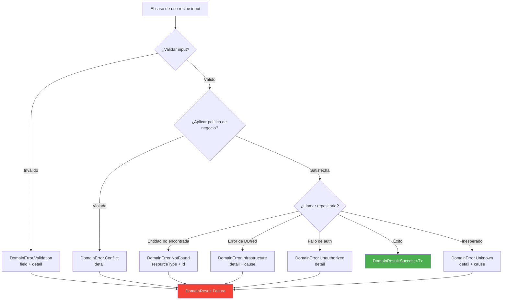

### Cuándo usar cada tipo de error

| Error | Cuándo usarlo | Ejemplo |
|---|---|---|
| `Validation` | El input falla un invariante del dominio | Formato de email inválido, título muy largo |
| `NotFound` | La entidad solicitada no existe | Usuario con ID "xyz" no está en la base de datos |
| `Unauthorized` | El llamador no tiene permiso | Un no-admin intenta eliminar un usuario |
| `Conflict` | La operación conflictúa con el estado actual | Email duplicado, transición de estado inválida |
| `Infrastructure` | Una dependencia externa falló | Timeout de base de datos, error de red |
| `Unknown` | Condición inesperada (debería ser raro) | Fallback para errores no clasificados |

---

## Estrategia de Testing

### Árbol de decisión de test doubles

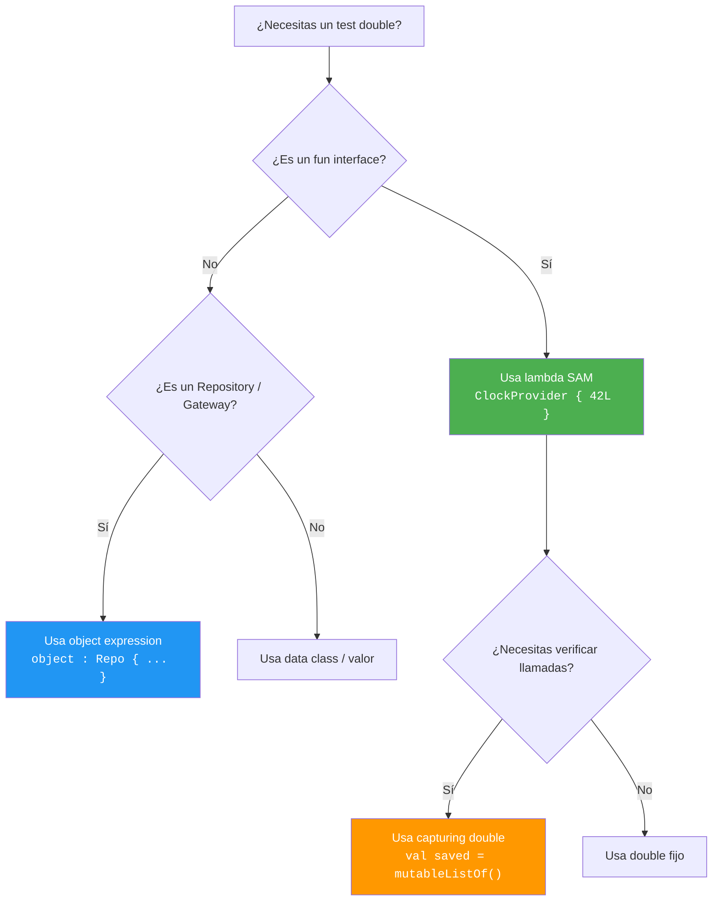

### Helpers de test disponibles

Importar desde `com.domain.core.testing.TestDoubles` (solo en `commonTest`):

| Helper | Descripción |
|---|---|
| `testDeps` | `DomainDependencies` con clock fijo + ID fijo |
| `fixedClock` / `clockAt(ms)` | `ClockProvider` determinista |
| `fixedId` / `idOf(s)` | `IdProvider` determinista |
| `sequentialIds(prefix)` | `IdProvider` que retorna "prefix-1", "prefix-2", … |
| `advancingClock(start, step)` | `ClockProvider` que avanza por step en cada llamada |
| `validationError(field, detail)` | Builder rápido de `DomainError.Validation` |
| `notFoundError(type, id)` | Builder rápido de `DomainError.NotFound` |
| `shouldBeSuccess()` | Extrae el valor o lanza un `AssertionError` descriptivo |
| `shouldBeFailure()` | Extrae el error o lanza un `AssertionError` descriptivo |
| `shouldFailWith<E>()` | Extrae y castea al subtipo de error esperado |

Consulta [TESTING.md](TESTING.md) para la guía completa de testing, convenciones
de nombres y anti-patrones.

---

## Versionado

Este SDK sigue [Versionado Semántico](https://semver.org/lang/es/):

| Tipo de cambio | Bump de versión | Impacto al consumidor |
|---|---|---|
| Corrección de bug, actualización de docs | **PATCH** | Seguro de actualizar |
| Nuevos contratos añadidos | **MINOR** | Seguro de actualizar |
| Cambios breaking en la API `public` | **MAJOR** | Se esperan errores de compilación |

Consulta [ARCHITECTURE.md](ARCHITECTURE.md) para principios de diseño e
[INTEGRATION.md](INTEGRATION.md) para reglas de frontera con la capa de datos.

---

## Licencia

Repositorio privado. Todos los derechos reservados.

---

<details>
<summary><h2 id="english-version">🇺🇸 English Version</h2></summary>

A **pure domain layer SDK** for Kotlin Multiplatform. Zero framework dependencies.
Zero infrastructure. Zero UI. Just typed contracts, functional error handling,
and Clean Architecture enforced at the compiler level.

```
Targets: JVM · Android · iOS (arm64, x64, simulator)
Language: Kotlin 2.0 · KMP
Dependencies: kotlinx-coroutines-core (only)
```

---

## Architecture Overview

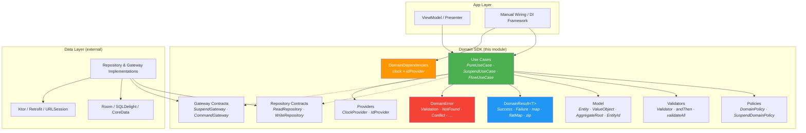

### Dependency Rule

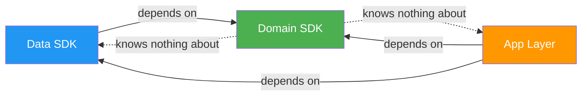

**The domain SDK defines contracts. External layers implement them.**
The domain never imports from data, UI, or any framework.

---

## Package Structure

```
com.domain.core/
├── di/            → DomainDependencies, DomainModule
├── error/         → DomainError (sealed hierarchy)
├── result/        → DomainResult<T> + operators (map, flatMap, zip, …)
├── model/         → Entity, ValueObject, AggregateRoot, EntityId
├── usecase/       → PureUseCase, SuspendUseCase, FlowUseCase, NoParams*
├── repository/    → Repository, ReadRepository, WriteRepository, ReadCollectionRepository
├── gateway/       → Gateway, SuspendGateway, CommandGateway
├── validation/    → Validator<T>, andThen, validateAll, collectValidationErrors
├── policy/        → DomainPolicy, SuspendDomainPolicy, and/or/negate
└── provider/      → ClockProvider, IdProvider
```

---

## Core Components

### DomainResult


### DomainError Hierarchy


### Use Case Contracts

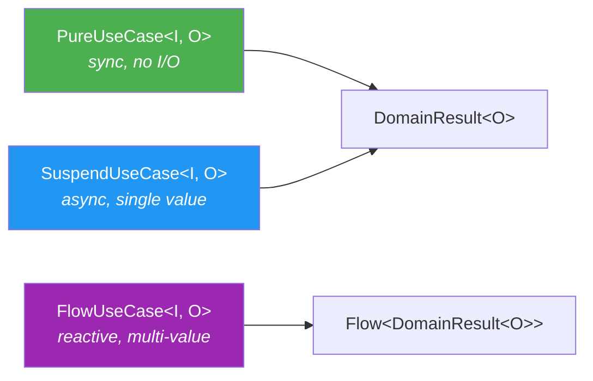

### Composition Flow

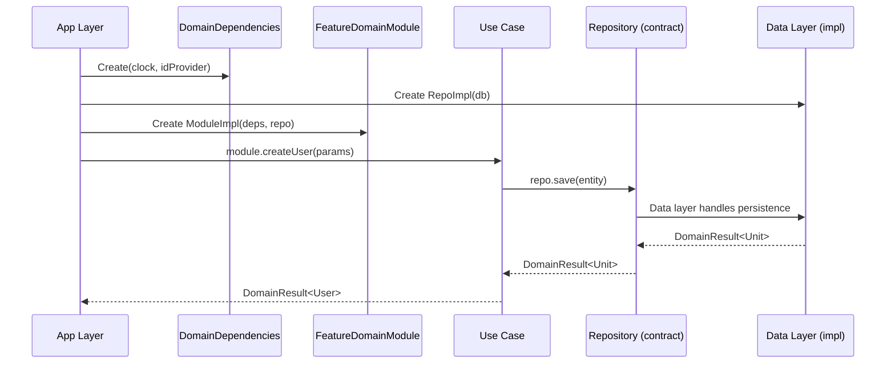

---

## Step-by-Step Implementation Guide

This guide walks you through integrating the SDK into a new or existing KMP project.
Follow each step in order.

### Step 1 — Add the SDK as a dependency

**Scenario:** You have a KMP project and want to use this SDK as your domain layer.

Add the SDK module to your project. If it's a local module:

```kotlin
// settings.gradle.kts
include(":coredomainplatform")
project(":coredomainplatform").projectDir = file("path/to/coredomainplatform")
```

Then in your feature or app module:

```kotlin
// build.gradle.kts of your app/feature module
kotlin {
    sourceSets {
        val commonMain by getting {
            dependencies {
                implementation(project(":coredomainplatform"))
            }
        }
    }
}
```

### Step 2 — Define your domain models

**Scenario:** You're building a task management feature and need a `Task` entity with a typed ID.

```kotlin
// In your feature's domain package (NOT in this SDK)
package com.myapp.feature.task.model

import com.domain.core.model.AggregateRoot
import com.domain.core.model.EntityId

@JvmInline
value class TaskId(override val value: String) : EntityId<String>

data class Task(
    override val id: TaskId,
    val title: String,
    val completed: Boolean,
    val createdAt: Long,
) : AggregateRoot<TaskId>
```

### Step 3 — Define your repository contract

**Scenario:** Your `Task` feature needs persistence — the domain defines what it needs, not how.

```kotlin
package com.myapp.feature.task.repository

import com.domain.core.repository.ReadRepository
import com.domain.core.repository.WriteRepository
import com.myapp.feature.task.model.Task
import com.myapp.feature.task.model.TaskId

interface TaskRepository : ReadRepository<TaskId, Task>, WriteRepository<Task>
```

### Step 4 — Create validators for your domain rules

**Scenario:** A task title must not be blank and must not exceed 200 characters.

```kotlin
package com.myapp.feature.task.validation

import com.domain.core.validation.notBlankValidator
import com.domain.core.validation.maxLengthValidator
import com.domain.core.validation.andThen

val taskTitleValidator = notBlankValidator("title")
    .andThen(maxLengthValidator("title", 200))
```

### Step 5 — Create policies for business rules

**Scenario:** A task can only be completed if it has a title (not blank). This is a semantic business rule, not just field validation.

```kotlin
package com.myapp.feature.task.policy

import com.domain.core.error.DomainError
import com.domain.core.policy.DomainPolicy
import com.domain.core.result.asSuccess
import com.domain.core.result.domainFailure
import com.myapp.feature.task.model.Task

val canCompleteTask = DomainPolicy<Task> { task ->
    if (task.title.isNotBlank()) Unit.asSuccess()
    else domainFailure(DomainError.Conflict(detail = "Cannot complete a task without a title"))
}
```

### Step 6 — Implement your use case

**Scenario:** Create a new task. The use case validates input, generates an ID, timestamps, and persists.

```kotlin
package com.myapp.feature.task.usecase

import com.domain.core.di.DomainDependencies
import com.domain.core.error.DomainError
import com.domain.core.result.DomainResult
import com.domain.core.result.asSuccess
import com.domain.core.result.domainFailure
import com.domain.core.result.flatMap
import com.domain.core.usecase.SuspendUseCase
import com.myapp.feature.task.model.Task
import com.myapp.feature.task.model.TaskId
import com.myapp.feature.task.repository.TaskRepository
import com.myapp.feature.task.validation.taskTitleValidator

data class CreateTaskParams(val title: String)

class CreateTaskUseCase(
    private val deps: DomainDependencies,
    private val repository: TaskRepository,
) : SuspendUseCase<CreateTaskParams, Task> {

    override suspend fun invoke(params: CreateTaskParams): DomainResult<Task> {
        // 1. Validate
        val validation = taskTitleValidator.validate(params.title)
        if (validation.isFailure) return validation as DomainResult<Task>

        // 2. Build entity
        val task = Task(
            id = TaskId(deps.idProvider.next()),
            title = params.title,
            completed = false,
            createdAt = deps.clock.nowMillis(),
        )

        // 3. Persist and return
        return repository.save(task).flatMap { task.asSuccess() }
    }
}
```

### Step 7 — Define your feature DomainModule

**Scenario:** Expose all use cases for the task feature through a single composable module.

```kotlin
package com.myapp.feature.task.di

import com.domain.core.di.DomainDependencies
import com.domain.core.di.DomainModule
import com.domain.core.usecase.SuspendUseCase
import com.myapp.feature.task.model.Task
import com.myapp.feature.task.repository.TaskRepository
import com.myapp.feature.task.usecase.CreateTaskParams
import com.myapp.feature.task.usecase.CreateTaskUseCase

interface TaskDomainModule : DomainModule {
    val createTask: SuspendUseCase<CreateTaskParams, Task>
}

class TaskDomainModuleImpl(
    deps: DomainDependencies,
    taskRepository: TaskRepository,
) : TaskDomainModule {
    override val createTask = CreateTaskUseCase(deps, taskRepository)
}
```

### Step 8 — Wire everything in the app layer

**Scenario:** Your app startup creates all dependencies and assembles all modules.

```kotlin
// App layer — wiring. This is the ONLY place where concrete types meet.
val domainDeps = DomainDependencies(
    clock = ClockProvider { System.currentTimeMillis() },
    idProvider = IdProvider { UUID.randomUUID().toString() },
)

val taskRepository: TaskRepository = TaskRepositoryImpl(database.taskDao())

val taskModule: TaskDomainModule = TaskDomainModuleImpl(
    deps = domainDeps,
    taskRepository = taskRepository,
)
```

### Step 9 — Test your use case

**Scenario:** Test that `CreateTaskUseCase` produces a task with deterministic ID and timestamp.

```kotlin
class CreateTaskUseCaseTest {

    private val testDeps = DomainDependencies(
        clock = ClockProvider { 1_700_000_000_000L },
        idProvider = IdProvider { "task-001" },
    )

    private val fakeRepo = object : TaskRepository {
        override suspend fun findById(id: TaskId) = null.asSuccess()
        override suspend fun save(entity: Task) = Unit.asSuccess()
        override suspend fun delete(entity: Task) = Unit.asSuccess()
    }

    private val useCase = CreateTaskUseCase(testDeps, fakeRepo)

    @Test
    fun `creates task with injected id and timestamp`() = runTest {
        val result = useCase(CreateTaskParams("Buy groceries"))
        val task = result.shouldBeSuccess()

        assertEquals("task-001", task.id.value)
        assertEquals(1_700_000_000_000L, task.createdAt)
        assertEquals("Buy groceries", task.title)
        assertFalse(task.completed)
    }

    @Test
    fun `rejects blank title`() = runTest {
        val result = useCase(CreateTaskParams("   "))
        result.shouldFailWith<DomainError.Validation>()
    }
}
```

---

## Android Integration Guide

### Architecture on Android

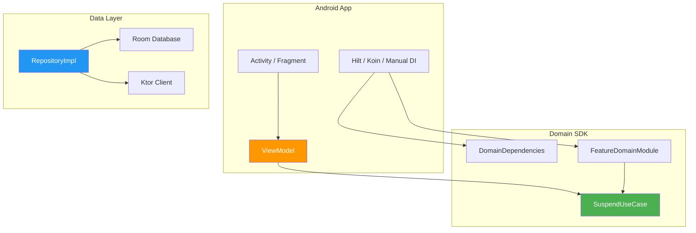

### Step A1 — Gradle setup

**Scenario:** Your Android app has a `:app` module and wants to use the SDK.

```kotlin
// app/build.gradle.kts
dependencies {
    implementation(project(":coredomainplatform"))
    implementation("org.jetbrains.kotlinx:kotlinx-coroutines-android:1.8.1")
}
```

### Step A2 — Platform providers

**Scenario:** Provide Android-specific implementations for `ClockProvider` and `IdProvider`.

```kotlin
// data module — AndroidProviders.kt
import com.domain.core.provider.ClockProvider
import com.domain.core.provider.IdProvider
import java.util.UUID

val androidClock: ClockProvider = ClockProvider {
    System.currentTimeMillis()
}

val androidIdProvider: IdProvider = IdProvider {
    UUID.randomUUID().toString()
}
```

### Step A3 — Room repository implementation

**Scenario:** Implement `TaskRepository` backed by Room.

```kotlin
// data module — TaskRepositoryImpl.kt
class TaskRepositoryImpl(
    private val dao: TaskDao,
) : TaskRepository {

    override suspend fun findById(id: TaskId): DomainResult<Task?> =
        runDomainCatching(
            errorMapper = { DomainError.Infrastructure(detail = "DB read failed", cause = it) }
        ) {
            dao.findById(id.value)?.toDomain()
        }

    override suspend fun save(entity: Task): DomainResult<Unit> =
        runDomainCatching(
            errorMapper = { DomainError.Infrastructure(detail = "DB write failed", cause = it) }
        ) {
            dao.insertOrReplace(entity.toEntity())
        }

    override suspend fun delete(entity: Task): DomainResult<Unit> =
        runDomainCatching(
            errorMapper = { DomainError.Infrastructure(detail = "DB delete failed", cause = it) }
        ) {
            dao.delete(entity.id.value)
        }
}
```

### Step A4 — ViewModel integration

**Scenario:** A ViewModel calls a use case and maps the result to UI state.

```kotlin
class TaskViewModel(
    private val createTask: SuspendUseCase<CreateTaskParams, Task>,
) : ViewModel() {

    private val _uiState = MutableStateFlow<TaskUiState>(TaskUiState.Idle)
    val uiState: StateFlow<TaskUiState> = _uiState.asStateFlow()

    fun onCreateTask(title: String) {
        viewModelScope.launch {
            _uiState.value = TaskUiState.Loading

            createTask(CreateTaskParams(title))
                .onSuccess { task ->
                    _uiState.value = TaskUiState.Success(task)
                }
                .onFailure { error ->
                    _uiState.value = when (error) {
                        is DomainError.Validation ->
                            TaskUiState.ValidationError(error.field, error.detail)
                        is DomainError.Infrastructure ->
                            TaskUiState.Error("Something went wrong. Please try again.")
                        else ->
                            TaskUiState.Error(error.message)
                    }
                }
        }
    }
}

sealed interface TaskUiState {
    data object Idle : TaskUiState
    data object Loading : TaskUiState
    data class Success(val task: Task) : TaskUiState
    data class ValidationError(val field: String, val detail: String) : TaskUiState
    data class Error(val message: String) : TaskUiState
}
```

### Step A5 — Manual wiring (no DI framework)

**Scenario:** Wire everything without Koin or Hilt.

```kotlin
// AppModule.kt — create once at Application.onCreate()
class AppModule(context: Context) {

    private val database = Room.databaseBuilder(
        context, AppDatabase::class.java, "app.db"
    ).build()

    private val domainDeps = DomainDependencies(
        clock = androidClock,
        idProvider = androidIdProvider,
    )

    private val taskRepository: TaskRepository = TaskRepositoryImpl(database.taskDao())

    val taskModule: TaskDomainModule = TaskDomainModuleImpl(
        deps = domainDeps,
        taskRepository = taskRepository,
    )
}

// In your Activity or Fragment:
val appModule = (application as MyApp).appModule
val viewModel = TaskViewModel(createTask = appModule.taskModule.createTask)
```

### Step A6 — Wiring with Hilt (optional)

**Scenario:** You prefer Hilt for DI on Android.

```kotlin
@Module
@InstallIn(SingletonComponent::class)
object DomainModule {

    @Provides @Singleton
    fun provideDomainDeps(): DomainDependencies = DomainDependencies(
        clock = androidClock,
        idProvider = androidIdProvider,
    )

    @Provides @Singleton
    fun provideTaskModule(
        deps: DomainDependencies,
        taskRepository: TaskRepository,
    ): TaskDomainModule = TaskDomainModuleImpl(deps, taskRepository)

    @Provides
    fun provideCreateTask(module: TaskDomainModule): SuspendUseCase<CreateTaskParams, Task> =
        module.createTask
}
```

### Step A7 — Wiring with Koin (optional)

**Scenario:** You prefer Koin for DI on Android.

```kotlin
val domainModule = module {
    single {
        DomainDependencies(
            clock = androidClock,
            idProvider = androidIdProvider,
        )
    }

    single<TaskDomainModule> {
        TaskDomainModuleImpl(
            deps = get(),
            taskRepository = get(),
        )
    }

    factory { get<TaskDomainModule>().createTask }
}
```

### Android FAQ

**Q: Does the SDK depend on any Android library?**
No. The SDK is pure `commonMain` Kotlin. It compiles to JVM bytecode on Android
without any Android-specific dependency.

**Q: Can I use this SDK in a Compose Multiplatform project?**
Yes. The SDK has no UI dependency. Your Compose layer calls use cases exactly
like any ViewModel would.

**Q: What if my repository throws a checked exception (e.g., `SQLiteException`)?**
Use `runDomainCatching` in your repository implementation. It catches all
non-cancellation throwables and maps them to `DomainError`. Cancellation
exceptions are always rethrown to preserve structured concurrency.

**Q: Should I wrap `Flow` use cases in `collectAsStateWithLifecycle()`?**
Yes. `FlowUseCase` returns `Flow<DomainResult<T>>`. Collect it in your ViewModel
or Compose UI using the standard lifecycle-aware collectors.

**Q: Can I call `PureUseCase` from the UI thread?**
Yes. `PureUseCase` is synchronous and pure — no I/O, no blocking. It is
explicitly safe to call from any thread including the main thread.

**Q: How do I handle `DomainError.Unauthorized` on Android?**
Map it in your ViewModel or a shared error handler to trigger a sign-out flow
or navigation to the login screen:
```kotlin
.onFailure { error ->
    if (error is DomainError.Unauthorized) {
        navigator.navigateTo(LoginScreen)
    }
}
```

**Q: What about ProGuard/R8 rules?**
The SDK uses no reflection, no serialization annotations, and no dynamic class
loading. No ProGuard rules are needed.

**Q: Can I have multiple `DomainDependencies` instances?**
No. Create one instance at app startup and share it across all feature modules.
It is immutable and concurrency-safe.

---

## iOS Integration Guide

### Architecture on iOS

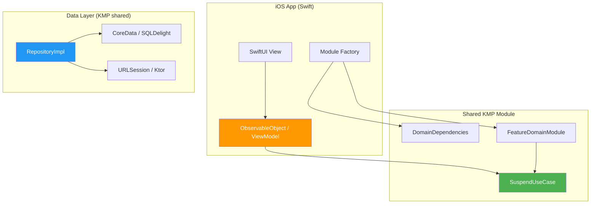

### Step I1 — KMP framework export

**Scenario:** Your KMP project needs to export the shared module as an iOS framework.

```kotlin
// shared/build.gradle.kts
kotlin {
    listOf(iosX64(), iosArm64(), iosSimulatorArm64()).forEach { target ->
        target.binaries.framework {
            baseName = "SharedDomain"
            isStatic = true
        }
    }
}
```

### Step I2 — Platform providers for iOS

**Scenario:** Provide iOS-specific implementations using Kotlin/Native.

```kotlin
// shared/src/iosMain/kotlin/PlatformProviders.kt
import com.domain.core.provider.ClockProvider
import com.domain.core.provider.IdProvider
import platform.Foundation.NSDate
import platform.Foundation.NSUUID
import platform.Foundation.timeIntervalSince1970

val iosClock: ClockProvider = ClockProvider {
    (NSDate().timeIntervalSince1970 * 1000).toLong()
}

val iosIdProvider: IdProvider = IdProvider {
    NSUUID().UUIDString
}
```

### Step I3 — Module factory for Swift

**Scenario:** Swift cannot call Kotlin constructors with complex generics directly.
Create a factory function that Swift can call easily.

```kotlin
// shared/src/iosMain/kotlin/ModuleFactory.kt
import com.domain.core.di.DomainDependencies

object SharedModuleFactory {

    private val domainDeps = DomainDependencies(
        clock = iosClock,
        idProvider = iosIdProvider,
    )

    fun createTaskModule(taskRepository: TaskRepository): TaskDomainModule =
        TaskDomainModuleImpl(
            deps = domainDeps,
            taskRepository = taskRepository,
        )
}
```

### Step I4 — SQLDelight repository for iOS

**Scenario:** Implement `TaskRepository` with SQLDelight (KMP-native persistence).

```kotlin
// shared data module
class TaskRepositoryImpl(
    private val queries: TaskQueries,
) : TaskRepository {

    override suspend fun findById(id: TaskId): DomainResult<Task?> =
        runDomainCatching(
            errorMapper = { DomainError.Infrastructure(detail = "DB read failed", cause = it) }
        ) {
            queries.findById(id.value).executeAsOneOrNull()?.toDomain()
        }

    override suspend fun save(entity: Task): DomainResult<Unit> =
        runDomainCatching(
            errorMapper = { DomainError.Infrastructure(detail = "DB write failed", cause = it) }
        ) {
            queries.insertOrReplace(
                id = entity.id.value,
                title = entity.title,
                completed = entity.completed,
                createdAt = entity.createdAt,
            )
        }

    override suspend fun delete(entity: Task): DomainResult<Unit> =
        runDomainCatching(
            errorMapper = { DomainError.Infrastructure(detail = "DB delete failed", cause = it) }
        ) {
            queries.deleteById(entity.id.value)
        }
}
```

### Step I5 — Calling from Swift

**Scenario:** Use the domain module from a SwiftUI ViewModel.

```swift
import SharedDomain

@MainActor
class TaskViewModel: ObservableObject {
    @Published var state: TaskState = .idle

    private let createTask: any SuspendUseCaseProtocol

    init(taskModule: TaskDomainModule) {
        self.createTask = taskModule.createTask
    }

    func onCreateTask(title: String) async {
        state = .loading

        let params = CreateTaskParams(title: title)
        let result = try? await createTask.invoke(params: params)

        if let success = result as? DomainResultSuccess<Task> {
            state = .success(success.value)
        } else if let failure = result as? DomainResultFailure {
            if let validation = failure.error as? DomainErrorValidation {
                state = .validationError(field: validation.field, detail: validation.detail)
            } else {
                state = .error(failure.error.message)
            }
        }
    }
}

enum TaskState {
    case idle
    case loading
    case success(Task)
    case validationError(field: String, detail: String)
    case error(String)
}
```

### Step I6 — SwiftUI View

**Scenario:** Connect the ViewModel to a SwiftUI View.

```swift
struct CreateTaskView: View {
    @StateObject private var viewModel: TaskViewModel
    @State private var title = ""

    init(taskModule: TaskDomainModule) {
        _viewModel = StateObject(wrappedValue: TaskViewModel(taskModule: taskModule))
    }

    var body: some View {
        VStack(spacing: 16) {
            TextField("Task title", text: $title)
                .textFieldStyle(.roundedBorder)

            Button("Create Task") {
                Task { await viewModel.onCreateTask(title: title) }
            }

            switch viewModel.state {
            case .idle:
                EmptyView()
            case .loading:
                ProgressView()
            case .success(let task):
                Text("Created: \(task.title)")
            case .validationError(let field, let detail):
                Text("\(field): \(detail)")
                    .foregroundColor(.red)
            case .error(let message):
                Text(message)
                    .foregroundColor(.red)
            }
        }
        .padding()
    }
}
```

### Step I7 — App entry point wiring

**Scenario:** Create the module factory at app launch.

```swift
@main
struct MyApp: App {
    private let taskModule: TaskDomainModule

    init() {
        let database = /* your SQLDelight driver setup */
        let taskRepo = TaskRepositoryImpl(queries: database.taskQueries)
        taskModule = SharedModuleFactory().createTaskModule(taskRepository: taskRepo)
    }

    var body: some Scene {
        WindowGroup {
            CreateTaskView(taskModule: taskModule)
        }
    }
}
```

### iOS FAQ

**Q: How does Kotlin/Native handle `suspend` functions in Swift?**
Kotlin 2.0+ generates Swift `async` functions for `suspend` Kotlin functions.
You call them with `await` in Swift. No manual callback wrappers needed.

**Q: How are sealed classes exposed in Swift?**
`DomainResult.Success` and `DomainResult.Failure` become separate classes in Swift.
Use `is` checks or `as?` casts to distinguish them. `DomainError` subtypes
similarly become separate classes (`DomainErrorValidation`, `DomainErrorNotFound`, etc.).

**Q: Can I use this with Combine instead of async/await?**
Yes. Wrap the `async` calls in Combine publishers if your project still uses Combine:
```swift
Future<Task, Error> { promise in
    Task { /* call the async use case here */ }
}
```
However, native `async/await` is recommended for new projects.

**Q: Do I need to worry about memory management with KMP objects?**
Kotlin/Native uses automatic reference counting (ARC) for objects exposed to Swift.
No manual memory management is needed. Avoid retaining Kotlin objects in long-lived
closures to prevent reference cycles.

**Q: What about `Flow` use cases on iOS?**
`Flow` is exposed as `Kotlinx_coroutines_coreFlow` in Swift. Use the
[KMP-NativeCoroutines](https://github.com/nicklockwood/KMP-NativeCoroutines) library
or SKIE to get native Swift `AsyncSequence` wrappers.

**Q: Is the framework size large?**
The domain SDK is very small — only typed interfaces, sealed classes, and pure functions.
Typical binary size contribution is under 100KB.

**Q: Can I use SwiftUI previews with this SDK?**
Yes. Create fake modules with stub repositories for previews:
```swift
#Preview {
    CreateTaskView(taskModule: FakeTaskDomainModule())
}
```

**Q: Does the SDK support watchOS / tvOS / macOS?**
The domain code is pure `commonMain` Kotlin. Add the targets in `build.gradle.kts`
and they will compile without changes:
```kotlin
watchosArm64()
tvosArm64()
macosArm64()
```

---

## Error Handling Reference

### Complete error mapping flow

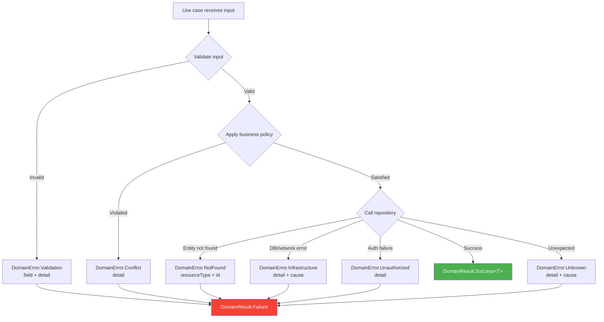

### When to use each error type

| Error | When to use | Example |
|---|---|---|
| `Validation` | Input fails a domain invariant | Email format invalid, title too long |
| `NotFound` | Requested entity does not exist | User with ID "xyz" not in database |
| `Unauthorized` | Caller lacks permission | Non-admin tries to delete a user |
| `Conflict` | Operation conflicts with current state | Duplicate email, invalid state transition |
| `Infrastructure` | External dependency failed | Database timeout, network error |
| `Unknown` | Unexpected condition (should be rare) | Fallback for unclassified errors |

---

## Testing Strategy

### Test double decision tree

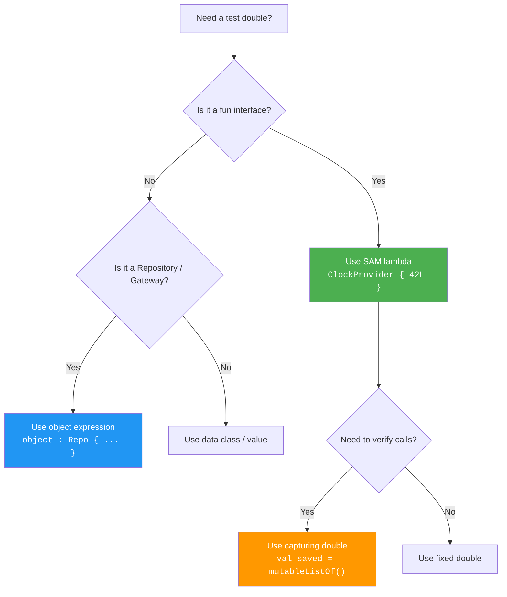

### Available test helpers

Import from `com.domain.core.testing.TestDoubles` (in `commonTest` only):

| Helper | Description |
|---|---|
| `testDeps` | `DomainDependencies` with fixed clock + fixed ID |
| `fixedClock` / `clockAt(ms)` | Deterministic `ClockProvider` |
| `fixedId` / `idOf(s)` | Deterministic `IdProvider` |
| `sequentialIds(prefix)` | `IdProvider` that returns "prefix-1", "prefix-2", … |
| `advancingClock(start, step)` | `ClockProvider` that advances by step on each call |
| `validationError(field, detail)` | Quick `DomainError.Validation` builder |
| `notFoundError(type, id)` | Quick `DomainError.NotFound` builder |
| `shouldBeSuccess()` | Extracts value or throws clear `AssertionError` |
| `shouldBeFailure()` | Extracts error or throws clear `AssertionError` |
| `shouldFailWith<E>()` | Extracts and casts to expected error subtype |

See [TESTING.md](TESTING.md) for the full testing guide, naming conventions,
and anti-patterns.

---

## Versioning

This SDK follows [Semantic Versioning](https://semver.org/):

| Change type | Version bump | Consumer impact |
|---|---|---|
| Bug fix, doc update | **PATCH** | Safe to update |
| New contracts added | **MINOR** | Safe to update |
| Breaking changes to `public` API | **MAJOR** | Compile-time errors expected |

See [ARCHITECTURE.md](ARCHITECTURE.md) for design principles and
[INTEGRATION.md](INTEGRATION.md) for data-layer boundary rules.

---

## License

Private repository. All rights reserved.

</details>
