# Core Domain Platform SDK


> **Idioma / Language:** 🇪🇸 [Español](#tabla-de-contenidos) (predeterminado) · 🇺🇸 [English](#english-version)

Un **SDK de capa de dominio puro** para Kotlin Multiplatform. Cero dependencias de frameworks.
Cero infraestructura. Cero UI. Solo contratos tipados, manejo funcional de errores
y Clean Architecture forzada a nivel del compilador.

```
Targets: JVM · Android · iOS (arm64, x64, simulator)
Lenguaje: Kotlin 2.0 · KMP
Dependencias: kotlinx-coroutines-core (única)
```

---

## Tabla de Contenidos

- [¿Por qué este SDK?](#por-qué-este-sdk)
- [Vista General de Arquitectura](#vista-general-de-arquitectura)
- [Estructura de Paquetes](#estructura-de-paquetes)
- [Componentes Principales](#componentes-principales)
- [Referencia Completa de Casos de Uso](#referencia-completa-de-casos-de-uso)
- [Guía de Implementación Paso a Paso](#guía-de-implementación-paso-a-paso)
- [Guía de Integración Android](#guía-de-integración-android)
- [Guía de Integración iOS](#guía-de-integración-ios)
- [Referencia de Manejo de Errores](#referencia-de-manejo-de-errores)
- [Estrategia de Testing](#estrategia-de-testing)
- [Versionado](#versionado)

---

## ¿Por qué este SDK?

| Ventaja | Detalle |
|---|---|
| **Dominio puro** | Tu lógica de negocio no depende de Room, Retrofit, Ktor, CoreData, SwiftUI ni Compose. Si mañana cambias de base de datos, el dominio no se entera. |
| **Sin excepciones** | Todos los contratos retornan `DomainResult<T>`. El error es un valor explícito y tipado, nunca una excepción que se propaga silenciosamente. |
| **Testeable sin mocking** | Todos los contratos son `fun interface`. En tests creas stubs con una lambda de una línea. Cero Mockito, cero MockK. |
| **Determinista** | El tiempo (`ClockProvider`) y la generación de IDs (`IdProvider`) son dependencias inyectadas. En tests pasas valores fijos → resultados 100% reproducibles. |
| **Composable** | Validadores se encadenan con `andThen`. Políticas se componen con `and` / `or` / `negate`. Results se combinan con `zip`. |
| **Multiplataforma** | Un solo módulo de dominio para Android + iOS + Desktop. El mismo código, las mismas reglas de negocio. |
| **Clean Architecture forzada** | El compilador impide que el dominio importe de data o UI. La dirección de dependencias se garantiza en tiempo de compilación. |

---

## Vista General de Arquitectura


### Regla de Dependencia

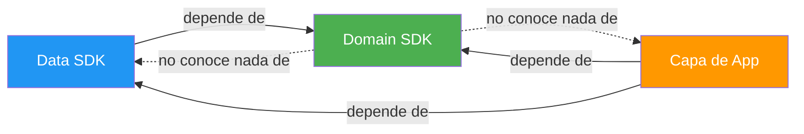

**El SDK de dominio define contratos. Las capas externas los implementan.**
El dominio nunca importa de data, UI ni ningún framework.

---

## Estructura de Paquetes

```
com.domain.core/
├── di/            → DomainDependencies, DomainModule
├── error/         → DomainError (jerarquía sealed)
├── result/        → DomainResult<T> + operadores (map, flatMap, zip, …)
├── model/         → Entity, ValueObject, AggregateRoot, EntityId
├── usecase/       → PureUseCase, SuspendUseCase, FlowUseCase, NoParams*
├── repository/    → Repository, ReadRepository, WriteRepository, ReadCollectionRepository
├── gateway/       → Gateway, SuspendGateway, CommandGateway
├── validation/    → Validator<T>, andThen, validateAll, collectValidationErrors
├── policy/        → DomainPolicy, SuspendDomainPolicy, and/or/negate
└── provider/      → ClockProvider, IdProvider
```

---

## Componentes Principales

### DomainResult

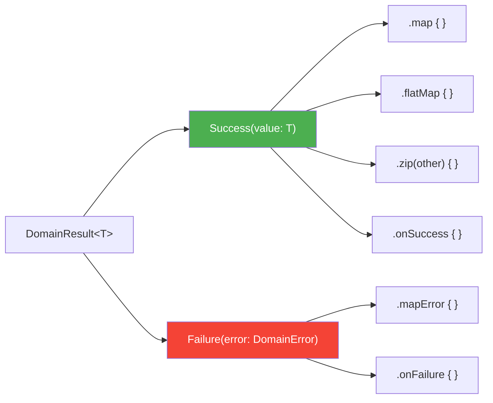

### Jerarquía de DomainError

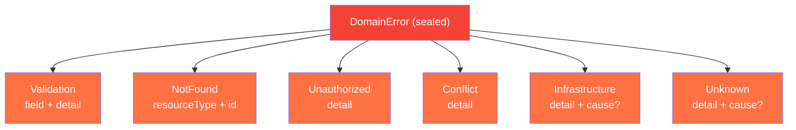

### Contratos de Casos de Uso

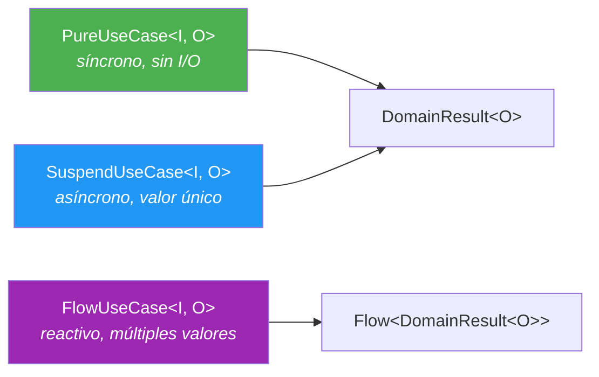

### Flujo de Composición

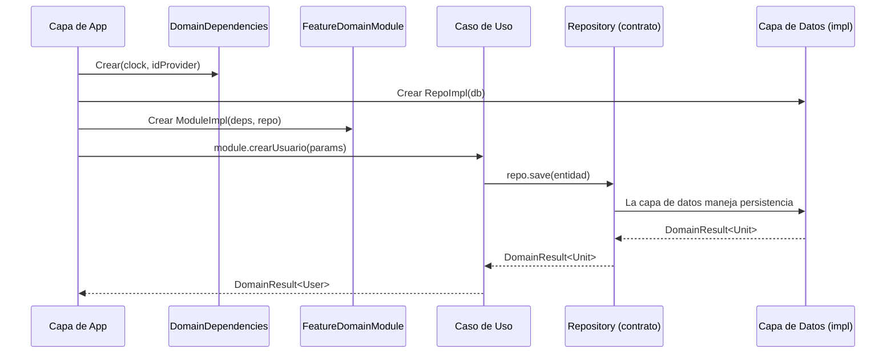

---

## Referencia Completa de Casos de Uso

El SDK provee **5 contratos de caso de uso**. Todos son `fun interface` (SAM), lo que permite
implementarlos como lambdas o como clases:

| Contrato | Firma | Cuándo usar |
|---|---|---|
| `PureUseCase<I, O>` | `(I) → DomainResult<O>` | Lógica síncrona y pura. Sin I/O. Seguro desde main thread |
| `SuspendUseCase<I, O>` | `suspend (I) → DomainResult<O>` | Operaciones async de resultado único (crear, actualizar, buscar) |
| `FlowUseCase<I, O>` | `(I) → Flow<DomainResult<O>>` | Observar cambios en el tiempo (streams reactivos) |
| `NoParamsUseCase<O>` | `suspend () → DomainResult<O>` | Variante sin parámetros de `SuspendUseCase` |
| `NoParamsFlowUseCase<O>` | `() → Flow<DomainResult<O>>` | Variante sin parámetros de `FlowUseCase` |

> Todos retornan `DomainResult<T>`. Nunca lanzan excepciones al consumidor.

### 1. PureUseCase — Lógica síncrona y pura

Para cálculos, transformaciones, reglas de negocio que **no tocan red ni disco**.
Seguro desde cualquier hilo, incluyendo el main thread.

**Escenario real:** Un banco necesita evaluar si un cliente califica para un préstamo
personal. Las reglas dependen del ingreso mensual, el porcentaje de endeudamiento
y el score crediticio. No hay I/O — son reglas de negocio puras.

```kotlin
data class LoanEligibilityParams(
    val monthlyIncome: Double,
    val currentDebtPercent: Double,
    val creditScore: Int,
    val requestedAmount: Double,
)

data class LoanEligibilityResult(
    val approved: Boolean,
    val maxApprovedAmount: Double,
    val interestRate: Double,
    val reason: String,
)

class EvaluateLoanEligibility : PureUseCase<LoanEligibilityParams, LoanEligibilityResult> {

    override fun invoke(params: LoanEligibilityParams): DomainResult<LoanEligibilityResult> {
        // Validar input
        if (params.monthlyIncome <= 0)
            return domainFailure(DomainError.Validation("monthlyIncome", "debe ser positivo"))
        if (params.creditScore !in 300..850)
            return domainFailure(DomainError.Validation("creditScore", "debe estar entre 300 y 850"))

        // Regla 1: No prestar si el endeudamiento supera el 40%
        if (params.currentDebtPercent > 40.0) {
            return LoanEligibilityResult(
                approved = false,
                maxApprovedAmount = 0.0,
                interestRate = 0.0,
                reason = "Endeudamiento actual supera el 40%",
            ).asSuccess()
        }

        // Regla 2: Determinar tasa de interés según score crediticio
        val interestRate = when {
            params.creditScore >= 750 -> 8.5
            params.creditScore >= 650 -> 12.0
            params.creditScore >= 550 -> 18.5
            else -> return LoanEligibilityResult(
                approved = false,
                maxApprovedAmount = 0.0,
                interestRate = 0.0,
                reason = "Score crediticio insuficiente (mínimo 550)",
            ).asSuccess()
        }

        // Regla 3: Monto máximo = 5x ingreso mensual
        val maxAmount = params.monthlyIncome * 5
        val approved = params.requestedAmount <= maxAmount

        return LoanEligibilityResult(
            approved = approved,
            maxApprovedAmount = maxAmount,
            interestRate = interestRate,
            reason = if (approved) "Aprobado" else "Monto solicitado excede el máximo permitido",
        ).asSuccess()
    }
}

// Uso — síncrono, se puede llamar desde el main thread sin problema:
val result = evaluateLoanEligibility(
    LoanEligibilityParams(
        monthlyIncome = 45_000.0,
        currentDebtPercent = 25.0,
        creditScore = 720,
        requestedAmount = 150_000.0,
    )
)
// → Success(LoanEligibilityResult(approved=true, maxApprovedAmount=225000.0, interestRate=12.0, ...))
```

### 2. SuspendUseCase — Operación async de resultado único

Para operaciones que requieren I/O (persistir, consultar, llamar API) y producen **un solo valor**.

**Escenario real:** Un e-commerce necesita procesar una orden de compra. El caso de uso
valida el carrito, verifica el inventario, calcula el total con impuestos, reserva el stock
y persiste la orden. Todo en una sola transacción lógica.

```kotlin
data class PlaceOrderParams(
    val cartId: CartId,
    val shippingAddressId: AddressId,
    val paymentMethodId: PaymentMethodId,
)

class PlaceOrderUseCase(
    private val deps: DomainDependencies,
    private val cartRepository: CartRepository,
    private val inventoryGateway: SuspendGateway<List<CartItem>, InventoryCheckResult>,
    private val orderRepository: OrderRepository,
    private val taxCalculator: PureUseCase<TaxParams, TaxResult>,
) : SuspendUseCase<PlaceOrderParams, Order> {

    override suspend fun invoke(params: PlaceOrderParams): DomainResult<Order> {
        // 1. Obtener el carrito
        val cart = cartRepository.findById(params.cartId).getOrElse { return domainFailure(it) }
            ?: return domainFailure(DomainError.NotFound("Cart", params.cartId.value))

        if (cart.items.isEmpty())
            return domainFailure(DomainError.Validation("cart", "El carrito está vacío"))

        // 2. Verificar inventario disponible
        val inventoryCheck = inventoryGateway.execute(cart.items).getOrElse { return domainFailure(it) }
        if (!inventoryCheck.allAvailable)
            return domainFailure(DomainError.Conflict(
                detail = "Sin stock: ${inventoryCheck.unavailableItems.joinToString { it.name }}"
            ))

        // 3. Calcular impuestos (lógica pura — PureUseCase)
        val tax = taxCalculator(TaxParams(cart.subtotal, cart.shippingState))
            .getOrElse { return domainFailure(it) }

        // 4. Crear la orden
        val order = Order(
            id = OrderId(deps.idProvider.next()),
            items = cart.items,
            subtotal = cart.subtotal,
            tax = tax.amount,
            total = cart.subtotal + tax.amount,
            status = OrderStatus.CONFIRMED,
            createdAt = deps.clock.nowMillis(),
        )

        // 5. Persistir
        return orderRepository.save(order).map { order }
    }
}

// Uso:
viewModelScope.launch {
    placeOrder(PlaceOrderParams(cartId, addressId, paymentId))
        .onSuccess { order -> navigateToConfirmation(order.id) }
        .onFailure { error ->
            when (error) {
                is DomainError.Conflict -> showOutOfStockDialog(error.detail)
                is DomainError.Validation -> showCartError(error.detail)
                else -> showGenericError(error.message)
            }
        }
}
```

### 3. FlowUseCase — Observar datos que cambian en el tiempo

Para streams reactivos: datos que se actualizan, notificaciones en tiempo real, cambios de estado.
Cada emisión puede ser éxito o fallo individualmente sin cancelar el stream.

**Escenario real:** Un dashboard de logística donde un operador observa los envíos
filtrados por estado (pendiente, en tránsito, entregado). Cada vez que un envío
cambia de estado, la lista se actualiza automáticamente.

```kotlin
data class ShipmentFilterParams(
    val status: ShipmentStatus,
    val warehouseId: WarehouseId,
)

class ObserveShipmentsByStatus(
    private val shipmentRepository: ShipmentRepository,
) : FlowUseCase<ShipmentFilterParams, List<Shipment>> {

    override fun invoke(params: ShipmentFilterParams): Flow<DomainResult<List<Shipment>>> {
        return shipmentRepository
            .observeByWarehouseAndStatus(params.warehouseId, params.status)
    }
}

// Uso — en el ViewModel:
init {
    viewModelScope.launch {
        observeShipmentsByStatus(
            ShipmentFilterParams(
                status = ShipmentStatus.IN_TRANSIT,
                warehouseId = currentWarehouseId,
            )
        ).collect { result ->
            result
                .onSuccess { shipments ->
                    _uiState.value = DashboardState.Loaded(
                        shipments = shipments,
                        count = shipments.size,
                    )
                }
                .onFailure { error ->
                    _uiState.value = DashboardState.Error(error.message)
                }
        }
    }
}
```

### 4. NoParamsUseCase — Async sin parámetros

Igual que `SuspendUseCase` pero cuando **no necesitas parámetros**. Evita pasar `Unit`.

**Escenario real:** Una app de salud necesita cerrar la sesión del usuario. Esto implica
invalidar el token en el servidor, limpiar la caché local y registrar el evento de logout.
No necesita parámetros — la sesión activa determina todo.

```kotlin
class LogoutUseCase(
    private val sessionGateway: CommandGateway<LogoutCommand>,
    private val localCacheGateway: CommandGateway<ClearCacheCommand>,
    private val auditRepository: WriteRepository<AuditEvent>,
    private val deps: DomainDependencies,
) : NoParamsUseCase<Unit> {

    override suspend fun invoke(): DomainResult<Unit> {
        // 1. Invalidar token en el servidor
        sessionGateway.dispatch(LogoutCommand).getOrElse { return domainFailure(it) }

        // 2. Limpiar datos locales sensibles
        localCacheGateway.dispatch(ClearCacheCommand).getOrElse { return domainFailure(it) }

        // 3. Registrar evento de auditoría
        val event = AuditEvent(
            id = AuditEventId(deps.idProvider.next()),
            type = "LOGOUT",
            timestamp = deps.clock.nowMillis(),
        )
        return auditRepository.save(event)
    }
}

// Uso — sin parámetros:
viewModelScope.launch {
    logout()
        .onSuccess { navigateToLogin() }
        .onFailure { error -> showError("No se pudo cerrar sesión: ${error.message}") }
}
```

### 5. NoParamsFlowUseCase — Stream reactivo sin parámetros

Ideal para observar datos globales que no requieren filtro.

**Escenario real:** Una app de fintech necesita mostrar el valor total del portafolio
de inversiones del usuario actualizado en tiempo real. El valor cambia conforme
fluctúan los precios de los activos. No necesita parámetros — el usuario autenticado
determina qué portafolio observar.

```kotlin
class ObservePortfolioValue(
    private val portfolioRepository: PortfolioRepository,
) : NoParamsFlowUseCase<PortfolioSummary> {

    override fun invoke(): Flow<DomainResult<PortfolioSummary>> {
        return portfolioRepository.observeCurrentUserPortfolio()
        // Emite cada vez que cambia un precio o se ejecuta una transacción
    }
}

data class PortfolioSummary(
    val totalValue: Double,
    val dailyChange: Double,
    val dailyChangePercent: Double,
    val holdings: List<Holding>,
)

// Uso — en el ViewModel de la pantalla principal:
init {
    viewModelScope.launch {
        observePortfolioValue()
            .collect { result ->
                result
                    .onSuccess { summary ->
                        _uiState.value = HomeState.Loaded(
                            totalValue = summary.totalValue,
                            changePercent = summary.dailyChangePercent,
                            isPositive = summary.dailyChange >= 0,
                        )
                    }
                    .onFailure { error ->
                        _uiState.value = HomeState.Error(error.message)
                    }
            }
    }
}
```

### Diagrama de decisión

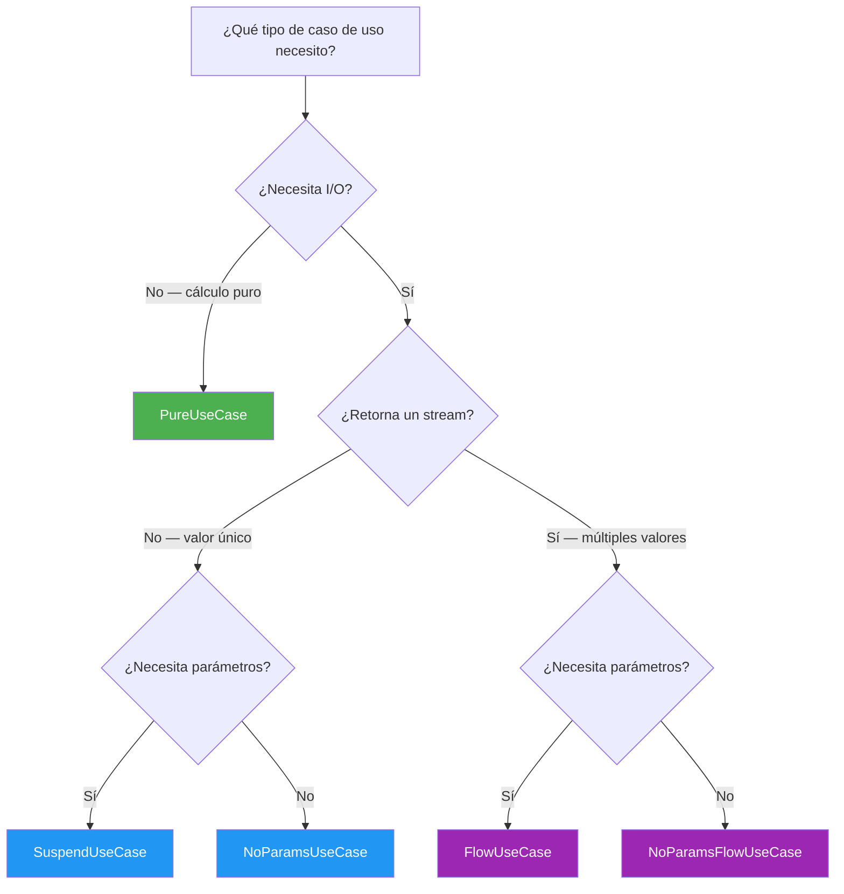

---

## Guía de Implementación Paso a Paso

Esta guía te lleva paso a paso a través de la integración del SDK en un proyecto KMP nuevo o existente.
Sigue cada paso en orden.

### Paso 1 — Agregar el SDK como dependencia

**Escenario:** Tienes un proyecto KMP y quieres usar este SDK como tu capa de dominio.

Agrega el módulo del SDK a tu proyecto. Si es un módulo local:

```kotlin
// settings.gradle.kts
include(":coredomainplatform")
project(":coredomainplatform").projectDir = file("ruta/a/coredomainplatform")
```

Luego en tu módulo de feature o app:

```kotlin
// build.gradle.kts de tu módulo app/feature
kotlin {
    sourceSets {
        val commonMain by getting {
            dependencies {
                implementation(project(":coredomainplatform"))
            }
        }
    }
}
```

### Paso 2 — Definir tus modelos de dominio

**Escenario:** Estás construyendo una feature de gestión de tareas y necesitas una entidad `Task` con un ID tipado.

```kotlin
// En el paquete de dominio de tu feature (NO en este SDK)
package com.myapp.feature.task.model

import com.domain.core.model.AggregateRoot
import com.domain.core.model.EntityId

@JvmInline
value class TaskId(override val value: String) : EntityId<String>

data class Task(
    override val id: TaskId,
    val title: String,
    val completed: Boolean,
    val createdAt: Long,
) : AggregateRoot<TaskId>
```

### Paso 3 — Definir tu contrato de repositorio

**Escenario:** Tu feature de `Task` necesita persistencia — el dominio define lo que necesita, no cómo se implementa.

```kotlin
package com.myapp.feature.task.repository

import com.domain.core.repository.ReadRepository
import com.domain.core.repository.WriteRepository
import com.myapp.feature.task.model.Task
import com.myapp.feature.task.model.TaskId

interface TaskRepository : ReadRepository<TaskId, Task>, WriteRepository<Task>
```

### Paso 4 — Crear validadores para tus reglas de dominio

**Escenario:** El título de una tarea no debe estar vacío y no debe exceder 200 caracteres.

```kotlin
package com.myapp.feature.task.validation

import com.domain.core.validation.notBlankValidator
import com.domain.core.validation.maxLengthValidator
import com.domain.core.validation.andThen

val taskTitleValidator = notBlankValidator("title")
    .andThen(maxLengthValidator("title", 200))
```

### Paso 5 — Crear políticas para reglas de negocio

**Escenario:** Una tarea solo puede ser completada si tiene un título (no vacío). Esta es una regla de negocio semántica, no solo validación de campo.

```kotlin
package com.myapp.feature.task.policy

import com.domain.core.error.DomainError
import com.domain.core.policy.DomainPolicy
import com.domain.core.result.asSuccess
import com.domain.core.result.domainFailure
import com.myapp.feature.task.model.Task

val canCompleteTask = DomainPolicy<Task> { task ->
    if (task.title.isNotBlank()) Unit.asSuccess()
    else domainFailure(DomainError.Conflict(detail = "No se puede completar una tarea sin título"))
}
```

### Paso 6 — Implementar tu caso de uso

**Escenario:** Crear una nueva tarea. El caso de uso valida input, genera un ID, timestamp, y persiste.

```kotlin
package com.myapp.feature.task.usecase

import com.domain.core.di.DomainDependencies
import com.domain.core.error.DomainError
import com.domain.core.result.DomainResult
import com.domain.core.result.asSuccess
import com.domain.core.result.domainFailure
import com.domain.core.result.flatMap
import com.domain.core.usecase.SuspendUseCase
import com.myapp.feature.task.model.Task
import com.myapp.feature.task.model.TaskId
import com.myapp.feature.task.repository.TaskRepository
import com.myapp.feature.task.validation.taskTitleValidator

data class CreateTaskParams(val title: String)

class CreateTaskUseCase(
    private val deps: DomainDependencies,
    private val repository: TaskRepository,
) : SuspendUseCase<CreateTaskParams, Task> {

    override suspend fun invoke(params: CreateTaskParams): DomainResult<Task> {
        // 1. Validar
        val validation = taskTitleValidator.validate(params.title)
        if (validation.isFailure) return validation as DomainResult<Task>

        // 2. Construir entidad
        val task = Task(
            id = TaskId(deps.idProvider.next()),
            title = params.title,
            completed = false,
            createdAt = deps.clock.nowMillis(),
        )

        // 3. Persistir y retornar
        return repository.save(task).flatMap { task.asSuccess() }
    }
}
```

### Paso 7 — Definir tu DomainModule de feature

**Escenario:** Exponer todos los casos de uso de la feature de tareas a través de un solo módulo composable.

```kotlin
package com.myapp.feature.task.di

import com.domain.core.di.DomainDependencies
import com.domain.core.di.DomainModule
import com.domain.core.usecase.SuspendUseCase
import com.myapp.feature.task.model.Task
import com.myapp.feature.task.repository.TaskRepository
import com.myapp.feature.task.usecase.CreateTaskParams
import com.myapp.feature.task.usecase.CreateTaskUseCase

interface TaskDomainModule : DomainModule {
    val createTask: SuspendUseCase<CreateTaskParams, Task>
}

class TaskDomainModuleImpl(
    deps: DomainDependencies,
    taskRepository: TaskRepository,
) : TaskDomainModule {
    override val createTask = CreateTaskUseCase(deps, taskRepository)
}
```

### Paso 8 — Conectar todo en la capa de app

**Escenario:** El arranque de tu app crea todas las dependencias y ensambla todos los módulos.

```kotlin
// Capa de app — wiring. Este es el ÚNICO lugar donde los tipos concretos se encuentran.
val domainDeps = DomainDependencies(
    clock = ClockProvider { System.currentTimeMillis() },
    idProvider = IdProvider { UUID.randomUUID().toString() },
)

val taskRepository: TaskRepository = TaskRepositoryImpl(database.taskDao())

val taskModule: TaskDomainModule = TaskDomainModuleImpl(
    deps = domainDeps,
    taskRepository = taskRepository,
)
```

### Paso 9 — Testear tu caso de uso

**Escenario:** Testear que `CreateTaskUseCase` produce una tarea con ID y timestamp deterministas.

```kotlin
class CreateTaskUseCaseTest {

    private val testDeps = DomainDependencies(
        clock = ClockProvider { 1_700_000_000_000L },
        idProvider = IdProvider { "task-001" },
    )

    private val fakeRepo = object : TaskRepository {
        override suspend fun findById(id: TaskId) = null.asSuccess()
        override suspend fun save(entity: Task) = Unit.asSuccess()
        override suspend fun delete(entity: Task) = Unit.asSuccess()
    }

    private val useCase = CreateTaskUseCase(testDeps, fakeRepo)

    @Test
    fun `crea tarea con id y timestamp inyectados`() = runTest {
        val result = useCase(CreateTaskParams("Comprar víveres"))
        val task = result.shouldBeSuccess()

        assertEquals("task-001", task.id.value)
        assertEquals(1_700_000_000_000L, task.createdAt)
        assertEquals("Comprar víveres", task.title)
        assertFalse(task.completed)
    }

    @Test
    fun `rechaza título vacío`() = runTest {
        val result = useCase(CreateTaskParams("   "))
        result.shouldFailWith<DomainError.Validation>()
    }
}
```

---

## Guía de Integración Android

> **Guía completa:** [GUIDE_ANDROID.md](GUIDE_ANDROID.md)

Documenta en detalle todos los contratos del SDK (Use Cases, DomainResult, DomainError,
Model, Repository, Gateway, Validators, Policies, Providers) y cómo inyectar los
casos de uso en tu ViewModel. Incluye ejemplos de implementación, validación, testing y FAQ.

---

## Guía de Integración iOS

> **Guía completa:** [GUIDE_IOS.md](GUIDE_IOS.md)

Documenta todos los contratos del SDK, cómo se exponen los tipos Kotlin en Swift
(tabla de mapeo Kotlin→Swift), cómo cablear DomainDependencies para iOS, y cómo
inyectar los casos de uso en el ViewModel Swift. Incluye ejemplos, testing y FAQ.

---

## Referencia de Manejo de Errores

### Flujo completo de mapeo de errores

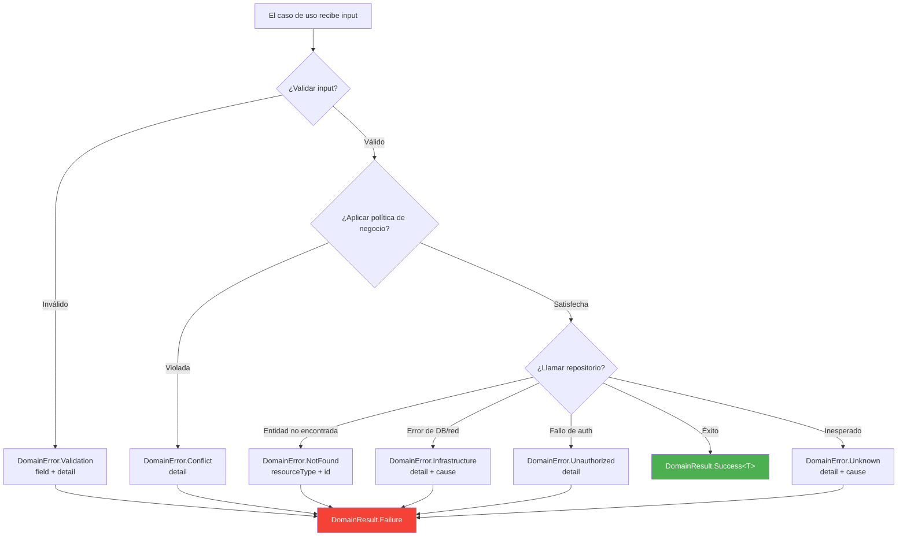

### Cuándo usar cada tipo de error

| Error | Cuándo usarlo | Ejemplo |
|---|---|---|
| `Validation` | El input falla un invariante del dominio | Formato de email inválido, título muy largo |
| `NotFound` | La entidad solicitada no existe | Usuario con ID "xyz" no está en la base de datos |
| `Unauthorized` | El llamador no tiene permiso | Un no-admin intenta eliminar un usuario |
| `Conflict` | La operación conflictúa con el estado actual | Email duplicado, transición de estado inválida |
| `Infrastructure` | Una dependencia externa falló | Timeout de base de datos, error de red |
| `Unknown` | Condición inesperada (debería ser raro) | Fallback para errores no clasificados |

---

## Estrategia de Testing

### Árbol de decisión de test doubles

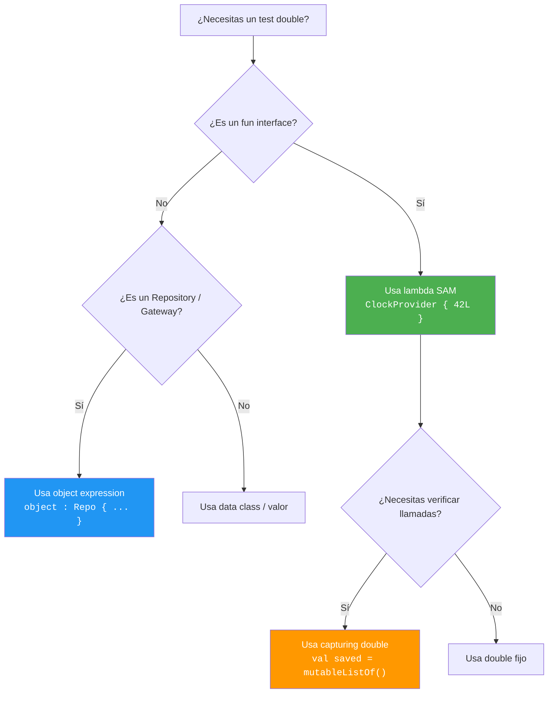

### Helpers de test disponibles

Importar desde `com.domain.core.testing.TestDoubles` (solo en `commonTest`):

| Helper | Descripción |
|---|---|
| `testDeps` | `DomainDependencies` con clock fijo + ID fijo |
| `fixedClock` / `clockAt(ms)` | `ClockProvider` determinista |
| `fixedId` / `idOf(s)` | `IdProvider` determinista |
| `sequentialIds(prefix)` | `IdProvider` que retorna "prefix-1", "prefix-2", … |
| `advancingClock(start, step)` | `ClockProvider` que avanza por step en cada llamada |
| `validationError(field, detail)` | Builder rápido de `DomainError.Validation` |
| `notFoundError(type, id)` | Builder rápido de `DomainError.NotFound` |
| `shouldBeSuccess()` | Extrae el valor o lanza un `AssertionError` descriptivo |
| `shouldBeFailure()` | Extrae el error o lanza un `AssertionError` descriptivo |
| `shouldFailWith<E>()` | Extrae y castea al subtipo de error esperado |

Consulta [TESTING.md](TESTING.md) para la guía completa de testing, convenciones
de nombres y anti-patrones.

---

## Versionado

Este SDK sigue [Versionado Semántico](https://semver.org/lang/es/):

| Tipo de cambio | Bump de versión | Impacto al consumidor |
|---|---|---|
| Corrección de bug, actualización de docs | **PATCH** | Seguro de actualizar |
| Nuevos contratos añadidos | **MINOR** | Seguro de actualizar |
| Cambios breaking en la API `public` | **MAJOR** | Se esperan errores de compilación |

Consulta [ARCHITECTURE.md](ARCHITECTURE.md) para principios de diseño e
[INTEGRATION.md](INTEGRATION.md) para reglas de frontera con la capa de datos.

---

## Licencia

Repositorio privado. Todos los derechos reservados.

---

<details>
<summary><h2 id="english-version">🇺🇸 English Version</h2></summary>

A **pure domain layer SDK** for Kotlin Multiplatform. Zero framework dependencies.
Zero infrastructure. Zero UI. Just typed contracts, functional error handling,
and Clean Architecture enforced at the compiler level.

```
Targets: JVM · Android · iOS (arm64, x64, simulator)
Language: Kotlin 2.0 · KMP
Dependencies: kotlinx-coroutines-core (only)
```

---

## Why this SDK?

| Advantage | Detail |
|---|---|
| **Pure domain** | Your business logic does not depend on Room, Retrofit, Ktor, CoreData, SwiftUI or Compose. If you swap databases tomorrow, the domain doesn't know or care. |
| **No exceptions** | All contracts return `DomainResult<T>`. Errors are explicit, typed values — never silently propagating exceptions. |
| **Testable without mocking** | All contracts are `fun interface`. In tests, create stubs with a one-line lambda. Zero Mockito, zero MockK. |
| **Deterministic** | Time (`ClockProvider`) and ID generation (`IdProvider`) are injected dependencies. In tests, pass fixed values → 100% reproducible results. |
| **Composable** | Validators chain with `andThen`. Policies compose with `and` / `or` / `negate`. Results combine with `zip`. |
| **Multiplatform** | A single domain module for Android + iOS + Desktop. Same code, same business rules. |
| **Enforced Clean Architecture** | The compiler prevents the domain from importing data or UI. Dependency direction is guaranteed at compile time. |

---

## Architecture Overview

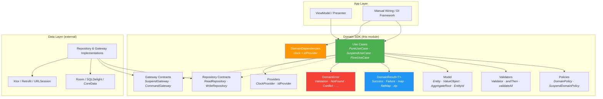

### Dependency Rule

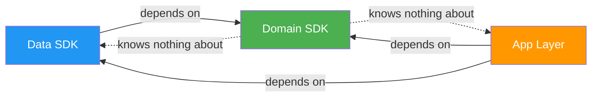

**The domain SDK defines contracts. External layers implement them.**
The domain never imports from data, UI, or any framework.

---

## Package Structure

```
com.domain.core/
├── di/            → DomainDependencies, DomainModule
├── error/         → DomainError (sealed hierarchy)
├── result/        → DomainResult<T> + operators (map, flatMap, zip, …)
├── model/         → Entity, ValueObject, AggregateRoot, EntityId
├── usecase/       → PureUseCase, SuspendUseCase, FlowUseCase, NoParams*
├── repository/    → Repository, ReadRepository, WriteRepository, ReadCollectionRepository
├── gateway/       → Gateway, SuspendGateway, CommandGateway
├── validation/    → Validator<T>, andThen, validateAll, collectValidationErrors
├── policy/        → DomainPolicy, SuspendDomainPolicy, and/or/negate
└── provider/      → ClockProvider, IdProvider
```

---

## Core Components

### DomainResult


### DomainError Hierarchy


### Use Case Contracts

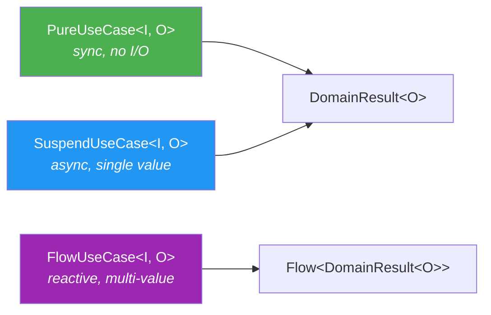

### Composition Flow

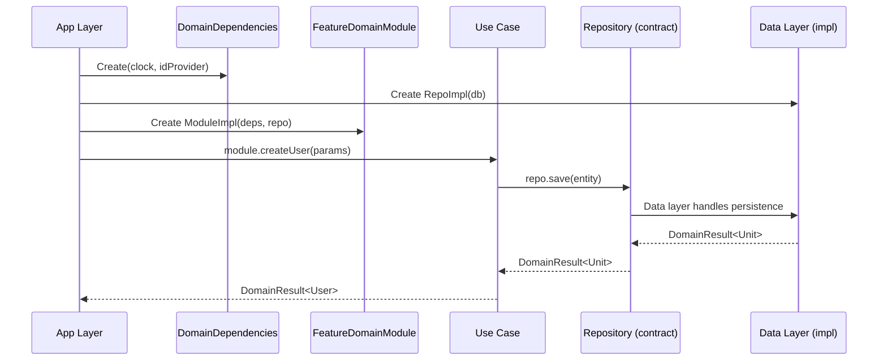

---

## Complete Use Case Reference

The SDK provides **5 use case contracts**. All are `fun interface` (SAM), allowing
implementation as lambdas or classes:

| Contract | Signature | When to use |
|---|---|---|
| `PureUseCase<I, O>` | `(I) → DomainResult<O>` | Synchronous, pure logic. No I/O. Safe from main thread |
| `SuspendUseCase<I, O>` | `suspend (I) → DomainResult<O>` | Async single-result operations (create, update, fetch) |
| `FlowUseCase<I, O>` | `(I) → Flow<DomainResult<O>>` | Observe changes over time (reactive streams) |
| `NoParamsUseCase<O>` | `suspend () → DomainResult<O>` | No-params variant of `SuspendUseCase` |
| `NoParamsFlowUseCase<O>` | `() → Flow<DomainResult<O>>` | No-params variant of `FlowUseCase` |

> All return `DomainResult<T>`. They never throw exceptions to the consumer.

### 1. PureUseCase — Synchronous, pure logic

For calculations, transformations, business rules that **don't touch network or disk**.
Safe from any thread, including the main thread.

**Real-world scenario:** A bank needs to evaluate whether a client qualifies for a
personal loan. Rules depend on monthly income, debt-to-income ratio, and credit score.
No I/O — pure business rules.

```kotlin
data class LoanEligibilityParams(
    val monthlyIncome: Double,
    val currentDebtPercent: Double,
    val creditScore: Int,
    val requestedAmount: Double,
)

data class LoanEligibilityResult(
    val approved: Boolean,
    val maxApprovedAmount: Double,
    val interestRate: Double,
    val reason: String,
)

class EvaluateLoanEligibility : PureUseCase<LoanEligibilityParams, LoanEligibilityResult> {

    override fun invoke(params: LoanEligibilityParams): DomainResult<LoanEligibilityResult> {
        if (params.monthlyIncome <= 0)
            return domainFailure(DomainError.Validation("monthlyIncome", "must be positive"))
        if (params.creditScore !in 300..850)
            return domainFailure(DomainError.Validation("creditScore", "must be between 300 and 850"))

        // Rule 1: Deny if debt exceeds 40%
        if (params.currentDebtPercent > 40.0) {
            return LoanEligibilityResult(
                approved = false, maxApprovedAmount = 0.0, interestRate = 0.0,
                reason = "Current debt exceeds 40%",
            ).asSuccess()
        }

        // Rule 2: Interest rate based on credit score
        val interestRate = when {
            params.creditScore >= 750 -> 8.5
            params.creditScore >= 650 -> 12.0
            params.creditScore >= 550 -> 18.5
            else -> return LoanEligibilityResult(
                approved = false, maxApprovedAmount = 0.0, interestRate = 0.0,
                reason = "Insufficient credit score (minimum 550)",
            ).asSuccess()
        }

        // Rule 3: Max amount = 5x monthly income
        val maxAmount = params.monthlyIncome * 5
        val approved = params.requestedAmount <= maxAmount

        return LoanEligibilityResult(
            approved = approved, maxApprovedAmount = maxAmount, interestRate = interestRate,
            reason = if (approved) "Approved" else "Requested amount exceeds maximum allowed",
        ).asSuccess()
    }
}

// Usage — synchronous, safe from main thread:
val result = evaluateLoanEligibility(
    LoanEligibilityParams(monthlyIncome = 45_000.0, currentDebtPercent = 25.0, creditScore = 720, requestedAmount = 150_000.0)
)
// → Success(LoanEligibilityResult(approved=true, maxApprovedAmount=225000.0, interestRate=12.0, ...))
```

### 2. SuspendUseCase — Async single-result

For operations requiring I/O (persist, query, call API) that produce **one value**.

**Real-world scenario:** An e-commerce app needs to place an order. The use case validates
the cart, checks inventory, calculates taxes, and persists the order — all in one logical
transaction.

```kotlin
data class PlaceOrderParams(
    val cartId: CartId,
    val shippingAddressId: AddressId,
    val paymentMethodId: PaymentMethodId,
)

class PlaceOrderUseCase(
    private val deps: DomainDependencies,
    private val cartRepository: CartRepository,
    private val inventoryGateway: SuspendGateway<List<CartItem>, InventoryCheckResult>,
    private val orderRepository: OrderRepository,
    private val taxCalculator: PureUseCase<TaxParams, TaxResult>,
) : SuspendUseCase<PlaceOrderParams, Order> {

    override suspend fun invoke(params: PlaceOrderParams): DomainResult<Order> {
        // 1. Fetch cart
        val cart = cartRepository.findById(params.cartId).getOrElse { return domainFailure(it) }
            ?: return domainFailure(DomainError.NotFound("Cart", params.cartId.value))

        if (cart.items.isEmpty())
            return domainFailure(DomainError.Validation("cart", "Cart is empty"))

        // 2. Check inventory
        val inventoryCheck = inventoryGateway.execute(cart.items).getOrElse { return domainFailure(it) }
        if (!inventoryCheck.allAvailable)
            return domainFailure(DomainError.Conflict(
                detail = "Out of stock: ${inventoryCheck.unavailableItems.joinToString { it.name }}"
            ))

        // 3. Calculate tax (pure logic — PureUseCase)
        val tax = taxCalculator(TaxParams(cart.subtotal, cart.shippingState))
            .getOrElse { return domainFailure(it) }

        // 4. Build order
        val order = Order(
            id = OrderId(deps.idProvider.next()),
            items = cart.items,
            subtotal = cart.subtotal,
            tax = tax.amount,
            total = cart.subtotal + tax.amount,
            status = OrderStatus.CONFIRMED,
            createdAt = deps.clock.nowMillis(),
        )

        // 5. Persist
        return orderRepository.save(order).map { order }
    }
}

// Usage:
viewModelScope.launch {
    placeOrder(PlaceOrderParams(cartId, addressId, paymentId))
        .onSuccess { order -> navigateToConfirmation(order.id) }
        .onFailure { error ->
            when (error) {
                is DomainError.Conflict -> showOutOfStockDialog(error.detail)
                is DomainError.Validation -> showCartError(error.detail)
                else -> showGenericError(error.message)
            }
        }
}
```

### 3. FlowUseCase — Observe data over time

For reactive streams: self-updating data, real-time notifications, state changes.
Each emission can be success or failure individually without cancelling the stream.

**Real-world scenario:** A logistics dashboard where an operator observes shipments
filtered by status (pending, in transit, delivered). Whenever a shipment changes
status, the list updates automatically.

```kotlin
data class ShipmentFilterParams(
    val status: ShipmentStatus,
    val warehouseId: WarehouseId,
)

class ObserveShipmentsByStatus(
    private val shipmentRepository: ShipmentRepository,
) : FlowUseCase<ShipmentFilterParams, List<Shipment>> {

    override fun invoke(params: ShipmentFilterParams): Flow<DomainResult<List<Shipment>>> {
        return shipmentRepository
            .observeByWarehouseAndStatus(params.warehouseId, params.status)
    }
}

// Usage — in the ViewModel:
init {
    viewModelScope.launch {
        observeShipmentsByStatus(
            ShipmentFilterParams(status = ShipmentStatus.IN_TRANSIT, warehouseId = currentWarehouseId)
        ).collect { result ->
            result
                .onSuccess { shipments ->
                    _uiState.value = DashboardState.Loaded(shipments = shipments, count = shipments.size)
                }
                .onFailure { error -> _uiState.value = DashboardState.Error(error.message) }
        }
    }
}
```

### 4. NoParamsUseCase — Async without parameters

Same as `SuspendUseCase` but when **no parameters are needed**. Avoids passing `Unit`.

**Real-world scenario:** A healthcare app needs to log the user out. This involves
invalidating the token on the server, clearing the local cache, and recording an
audit event. No parameters needed — the active session determines everything.

```kotlin
class LogoutUseCase(
    private val sessionGateway: CommandGateway<LogoutCommand>,
    private val localCacheGateway: CommandGateway<ClearCacheCommand>,
    private val auditRepository: WriteRepository<AuditEvent>,
    private val deps: DomainDependencies,
) : NoParamsUseCase<Unit> {

    override suspend fun invoke(): DomainResult<Unit> {
        // 1. Invalidate token on the server
        sessionGateway.dispatch(LogoutCommand).getOrElse { return domainFailure(it) }

        // 2. Clear sensitive local data
        localCacheGateway.dispatch(ClearCacheCommand).getOrElse { return domainFailure(it) }

        // 3. Record audit event
        val event = AuditEvent(
            id = AuditEventId(deps.idProvider.next()),
            type = "LOGOUT",
            timestamp = deps.clock.nowMillis(),
        )
        return auditRepository.save(event)
    }
}

// Usage — no parameters:
viewModelScope.launch {
    logout()
        .onSuccess { navigateToLogin() }
        .onFailure { error -> showError("Could not log out: ${error.message}") }
}
```

### 5. NoParamsFlowUseCase — Reactive stream without parameters

Ideal for observing global data that requires no filter.

**Real-world scenario:** A fintech app needs to display the user's investment portfolio
total value updated in real time. The value changes as asset prices fluctuate. No
parameters needed — the authenticated user determines which portfolio to observe.

```kotlin
class ObservePortfolioValue(
    private val portfolioRepository: PortfolioRepository,
) : NoParamsFlowUseCase<PortfolioSummary> {

    override fun invoke(): Flow<DomainResult<PortfolioSummary>> {
        return portfolioRepository.observeCurrentUserPortfolio()
        // Emits every time a price changes or a transaction is executed
    }
}

data class PortfolioSummary(
    val totalValue: Double,
    val dailyChange: Double,
    val dailyChangePercent: Double,
    val holdings: List<Holding>,
)

// Usage — in the home screen ViewModel:
init {
    viewModelScope.launch {
        observePortfolioValue()
            .collect { result ->
                result
                    .onSuccess { summary ->
                        _uiState.value = HomeState.Loaded(
                            totalValue = summary.totalValue,
                            changePercent = summary.dailyChangePercent,
                            isPositive = summary.dailyChange >= 0,
                        )
                    }
                    .onFailure { error -> _uiState.value = HomeState.Error(error.message) }
            }
    }
}
```

### Decision diagram

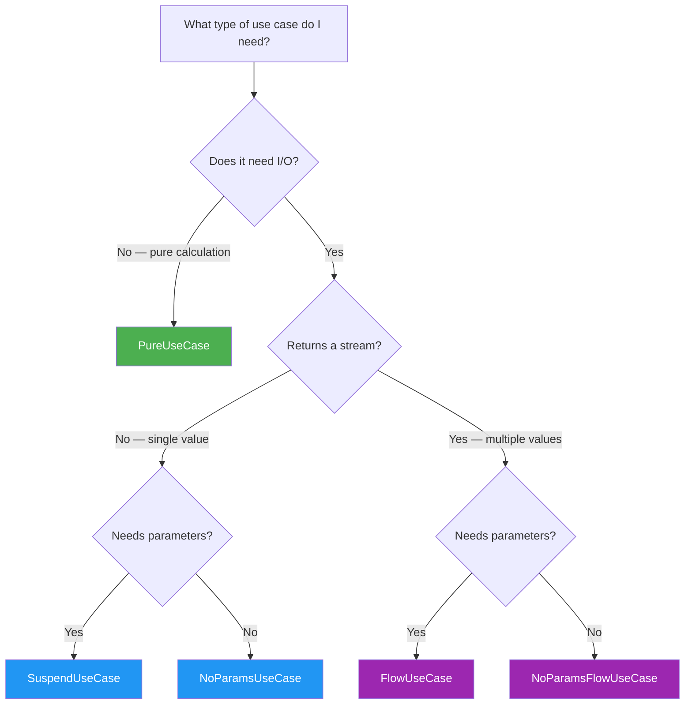

---

## Step-by-Step Implementation Guide

This guide walks you through integrating the SDK into a new or existing KMP project.
Follow each step in order.

### Step 1 — Add the SDK as a dependency

**Scenario:** You have a KMP project and want to use this SDK as your domain layer.

Add the SDK module to your project. If it's a local module:

```kotlin
// settings.gradle.kts
include(":coredomainplatform")
project(":coredomainplatform").projectDir = file("path/to/coredomainplatform")
```

Then in your feature or app module:

```kotlin
// build.gradle.kts of your app/feature module
kotlin {
    sourceSets {
        val commonMain by getting {
            dependencies {
                implementation(project(":coredomainplatform"))
            }
        }
    }
}
```

### Step 2 — Define your domain models

**Scenario:** You're building a task management feature and need a `Task` entity with a typed ID.

```kotlin
// In your feature's domain package (NOT in this SDK)
package com.myapp.feature.task.model

import com.domain.core.model.AggregateRoot
import com.domain.core.model.EntityId

@JvmInline
value class TaskId(override val value: String) : EntityId<String>

data class Task(
    override val id: TaskId,
    val title: String,
    val completed: Boolean,
    val createdAt: Long,
) : AggregateRoot<TaskId>
```

### Step 3 — Define your repository contract

**Scenario:** Your `Task` feature needs persistence — the domain defines what it needs, not how.

```kotlin
package com.myapp.feature.task.repository

import com.domain.core.repository.ReadRepository
import com.domain.core.repository.WriteRepository
import com.myapp.feature.task.model.Task
import com.myapp.feature.task.model.TaskId

interface TaskRepository : ReadRepository<TaskId, Task>, WriteRepository<Task>
```

### Step 4 — Create validators for your domain rules

**Scenario:** A task title must not be blank and must not exceed 200 characters.

```kotlin
package com.myapp.feature.task.validation

import com.domain.core.validation.notBlankValidator
import com.domain.core.validation.maxLengthValidator
import com.domain.core.validation.andThen

val taskTitleValidator = notBlankValidator("title")
    .andThen(maxLengthValidator("title", 200))
```

### Step 5 — Create policies for business rules

**Scenario:** A task can only be completed if it has a title (not blank). This is a semantic business rule, not just field validation.

```kotlin
package com.myapp.feature.task.policy

import com.domain.core.error.DomainError
import com.domain.core.policy.DomainPolicy
import com.domain.core.result.asSuccess
import com.domain.core.result.domainFailure
import com.myapp.feature.task.model.Task

val canCompleteTask = DomainPolicy<Task> { task ->
    if (task.title.isNotBlank()) Unit.asSuccess()
    else domainFailure(DomainError.Conflict(detail = "Cannot complete a task without a title"))
}
```

### Step 6 — Implement your use case

**Scenario:** Create a new task. The use case validates input, generates an ID, timestamps, and persists.

```kotlin
package com.myapp.feature.task.usecase

import com.domain.core.di.DomainDependencies
import com.domain.core.error.DomainError
import com.domain.core.result.DomainResult
import com.domain.core.result.asSuccess
import com.domain.core.result.domainFailure
import com.domain.core.result.flatMap
import com.domain.core.usecase.SuspendUseCase
import com.myapp.feature.task.model.Task
import com.myapp.feature.task.model.TaskId
import com.myapp.feature.task.repository.TaskRepository
import com.myapp.feature.task.validation.taskTitleValidator

data class CreateTaskParams(val title: String)

class CreateTaskUseCase(
    private val deps: DomainDependencies,
    private val repository: TaskRepository,
) : SuspendUseCase<CreateTaskParams, Task> {

    override suspend fun invoke(params: CreateTaskParams): DomainResult<Task> {
        // 1. Validate
        val validation = taskTitleValidator.validate(params.title)
        if (validation.isFailure) return validation as DomainResult<Task>

        // 2. Build entity
        val task = Task(
            id = TaskId(deps.idProvider.next()),
            title = params.title,
            completed = false,
            createdAt = deps.clock.nowMillis(),
        )

        // 3. Persist and return
        return repository.save(task).flatMap { task.asSuccess() }
    }
}
```

### Step 7 — Define your feature DomainModule

**Scenario:** Expose all use cases for the task feature through a single composable module.

```kotlin
package com.myapp.feature.task.di

import com.domain.core.di.DomainDependencies
import com.domain.core.di.DomainModule
import com.domain.core.usecase.SuspendUseCase
import com.myapp.feature.task.model.Task
import com.myapp.feature.task.repository.TaskRepository
import com.myapp.feature.task.usecase.CreateTaskParams
import com.myapp.feature.task.usecase.CreateTaskUseCase

interface TaskDomainModule : DomainModule {
    val createTask: SuspendUseCase<CreateTaskParams, Task>
}

class TaskDomainModuleImpl(
    deps: DomainDependencies,
    taskRepository: TaskRepository,
) : TaskDomainModule {
    override val createTask = CreateTaskUseCase(deps, taskRepository)
}
```

### Step 8 — Wire everything in the app layer

**Scenario:** Your app startup creates all dependencies and assembles all modules.

```kotlin
// App layer — wiring. This is the ONLY place where concrete types meet.
val domainDeps = DomainDependencies(
    clock = ClockProvider { System.currentTimeMillis() },
    idProvider = IdProvider { UUID.randomUUID().toString() },
)

val taskRepository: TaskRepository = TaskRepositoryImpl(database.taskDao())

val taskModule: TaskDomainModule = TaskDomainModuleImpl(
    deps = domainDeps,
    taskRepository = taskRepository,
)
```

### Step 9 — Test your use case

**Scenario:** Test that `CreateTaskUseCase` produces a task with deterministic ID and timestamp.

```kotlin
class CreateTaskUseCaseTest {

    private val testDeps = DomainDependencies(
        clock = ClockProvider { 1_700_000_000_000L },
        idProvider = IdProvider { "task-001" },
    )

    private val fakeRepo = object : TaskRepository {
        override suspend fun findById(id: TaskId) = null.asSuccess()
        override suspend fun save(entity: Task) = Unit.asSuccess()
        override suspend fun delete(entity: Task) = Unit.asSuccess()
    }

    private val useCase = CreateTaskUseCase(testDeps, fakeRepo)

    @Test
    fun `creates task with injected id and timestamp`() = runTest {
        val result = useCase(CreateTaskParams("Buy groceries"))
        val task = result.shouldBeSuccess()

        assertEquals("task-001", task.id.value)
        assertEquals(1_700_000_000_000L, task.createdAt)
        assertEquals("Buy groceries", task.title)
        assertFalse(task.completed)
    }

    @Test
    fun `rejects blank title`() = runTest {
        val result = useCase(CreateTaskParams("   "))
        result.shouldFailWith<DomainError.Validation>()
    }
}
```

---

## Android Integration Guide

> **Full guide:** [GUIDE_ANDROID.md](GUIDE_ANDROID.md)

Documents all SDK contracts (Use Cases, DomainResult, DomainError, Model, Repository,
Gateway, Validators, Policies, Providers) and how to inject use cases into your ViewModel.
Includes implementation examples, validation, testing, and FAQ.

---

## iOS Integration Guide

> **Full guide:** [GUIDE_IOS.md](GUIDE_IOS.md)

Documents all SDK contracts, how Kotlin types are exposed in Swift (Kotlin→Swift
mapping table), how to wire DomainDependencies for iOS, and how to inject use cases
into the Swift ViewModel. Includes examples, testing, and FAQ.

---

## Error Handling Reference

### Complete error mapping flow

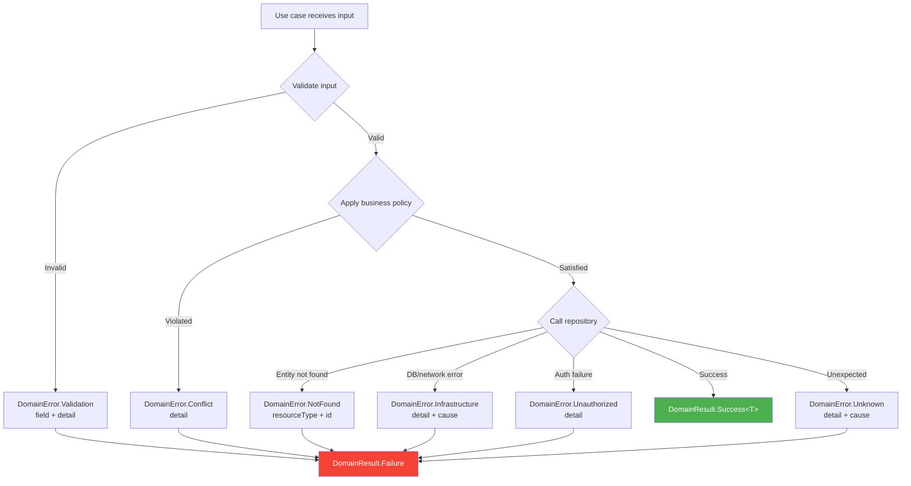

### When to use each error type

| Error | When to use | Example |
|---|---|---|
| `Validation` | Input fails a domain invariant | Email format invalid, title too long |
| `NotFound` | Requested entity does not exist | User with ID "xyz" not in database |
| `Unauthorized` | Caller lacks permission | Non-admin tries to delete a user |
| `Conflict` | Operation conflicts with current state | Duplicate email, invalid state transition |
| `Infrastructure` | External dependency failed | Database timeout, network error |
| `Unknown` | Unexpected condition (should be rare) | Fallback for unclassified errors |

---

## Testing Strategy

### Test double decision tree

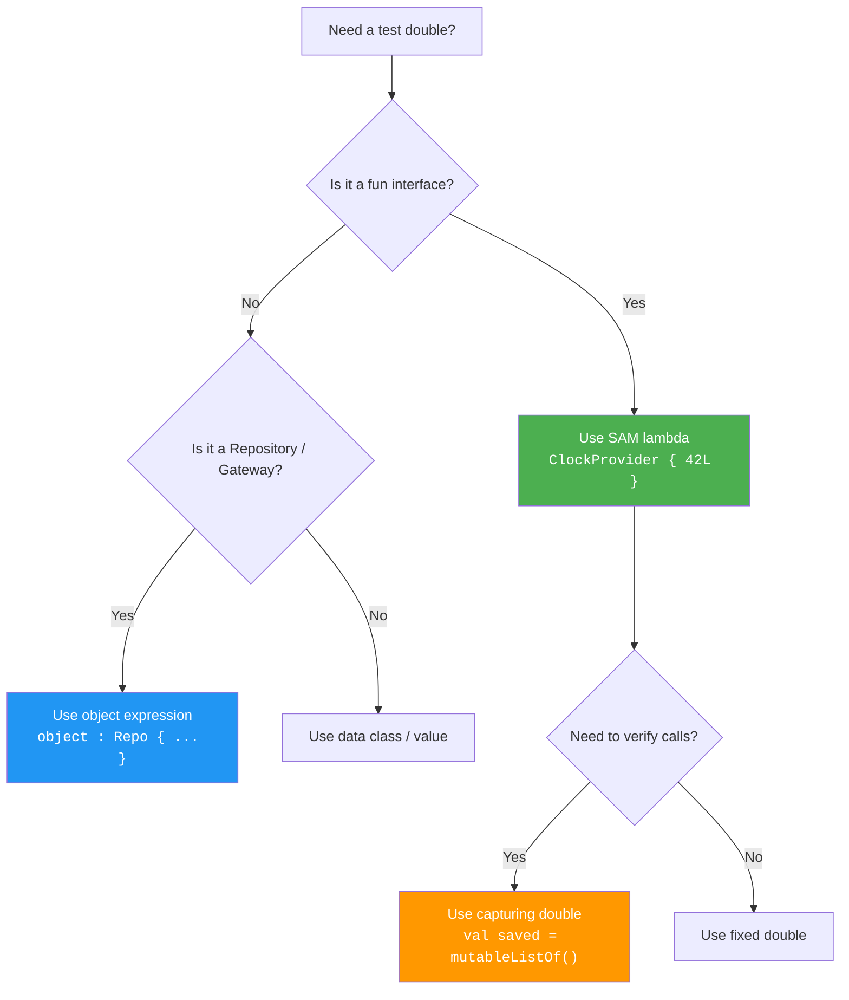

### Available test helpers

Import from `com.domain.core.testing.TestDoubles` (in `commonTest` only):

| Helper | Description |
|---|---|
| `testDeps` | `DomainDependencies` with fixed clock + fixed ID |
| `fixedClock` / `clockAt(ms)` | Deterministic `ClockProvider` |
| `fixedId` / `idOf(s)` | Deterministic `IdProvider` |
| `sequentialIds(prefix)` | `IdProvider` that returns "prefix-1", "prefix-2", … |
| `advancingClock(start, step)` | `ClockProvider` that advances by step on each call |
| `validationError(field, detail)` | Quick `DomainError.Validation` builder |
| `notFoundError(type, id)` | Quick `DomainError.NotFound` builder |
| `shouldBeSuccess()` | Extracts value or throws clear `AssertionError` |
| `shouldBeFailure()` | Extracts error or throws clear `AssertionError` |
| `shouldFailWith<E>()` | Extracts and casts to expected error subtype |

See [TESTING.md](TESTING.md) for the full testing guide, naming conventions,
and anti-patterns.

---

## Versioning

This SDK follows [Semantic Versioning](https://semver.org/):

| Change type | Version bump | Consumer impact |
|---|---|---|
| Bug fix, doc update | **PATCH** | Safe to update |
| New contracts added | **MINOR** | Safe to update |
| Breaking changes to `public` API | **MAJOR** | Compile-time errors expected |

See [ARCHITECTURE.md](ARCHITECTURE.md) for design principles and
[INTEGRATION.md](INTEGRATION.md) for data-layer boundary rules.

---

## License

Private repository. All rights reserved.

</details>
