# Core Domain Platform SDK


> **Idioma / Language:** 🇪🇸 [Español](#tabla-de-contenidos) (predeterminado) · 🇺🇸 [English](#english-version)

Un **SDK de capa de dominio puro** para Kotlin Multiplatform. Cero dependencias de frameworks.
Cero infraestructura. Cero UI. Solo contratos tipados, manejo funcional de errores
y Clean Architecture forzada a nivel del compilador.

```
Targets: JVM · Android · iOS (arm64, x64, simulator)
Lenguaje: Kotlin 2.1.20 · KMP
Dependencias: kotlinx-coroutines-core 1.10.1 (única)
```

---

## Tabla de Contenidos

- [Instalación](#instalación)
- [¿Por qué este SDK?](#por-qué-este-sdk)
- [Vista General de Arquitectura](#vista-general-de-arquitectura)
- [Estructura de Paquetes](#estructura-de-paquetes)
- [Componentes Principales](#componentes-principales)
- [DomainDependencies](#domaindependencies--el-contenedor-de-infraestructura-del-dominio)
- [Referencia Completa de Casos de Uso](#referencia-completa-de-casos-de-uso)
- [Integración con Core Data Platform](#integración-con-core-data-platform)
- [Guía de Implementación Paso a Paso](#guía-de-implementación-paso-a-paso)
- [Guía de Integración Android](#guía-de-integración-android)
- [Guía de Integración iOS](#guía-de-integración-ios)
- [Referencia de Manejo de Errores](#referencia-de-manejo-de-errores)
- [Estrategia de Testing](#estrategia-de-testing)
- [Versionado](#versionado)

---

## Instalación

### Kotlin DSL (build.gradle.kts)

```kotlin
dependencies {
    implementation("io.github.dancrrdz93:coredomainplatform:1.0.2")
}
```

### Groovy DSL (build.gradle)

```groovy
dependencies {
    implementation 'io.github.dancrrdz93:coredomainplatform:1.0.2'
}
```

### Version Catalog (libs.versions.toml)

```toml
[versions]
coreDomainPlatform = "1.0.2"

[libraries]
core-domain-platform = { group = "io.github.dancrrdz93", name = "coredomainplatform", version.ref = "coreDomainPlatform" }
```

```kotlin
// build.gradle.kts
dependencies {
    implementation(libs.core.domain.platform)
}
```

---

## ¿Por qué este SDK?

| Ventaja | Detalle |
|---|---|
| **Dominio puro** | Tu lógica de negocio no depende de Room, Retrofit, Ktor, CoreData, SwiftUI ni Compose. Si mañana cambias de base de datos, el dominio no se entera. |
| **Sin excepciones** | Todos los contratos retornan `DomainResult<T>`. El error es un valor explícito y tipado, nunca una excepción que se propaga silenciosamente. |
| **Testeable sin mocking** | Todos los contratos son `fun interface`. En tests creas stubs con una lambda de una línea. Cero Mockito, cero MockK. |
| **Determinista** | El tiempo (`ClockProvider`) y la generación de IDs (`IdProvider`) son dependencias inyectadas. En tests pasas valores fijos → resultados 100% reproducibles. |
| **Composable** | Validadores se encadenan con `andThen`. Políticas se componen con `and` / `or` / `negate`. Results se combinan con `zip`. |
| **Multiplataforma** | Un solo módulo de dominio para Android + iOS + Desktop. El mismo código, las mismas reglas de negocio. |
| **Clean Architecture forzada** | El compilador impide que el dominio importe de data o UI. La dirección de dependencias se garantiza en tiempo de compilación. |

---

## Vista General de Arquitectura


### Regla de Dependencia

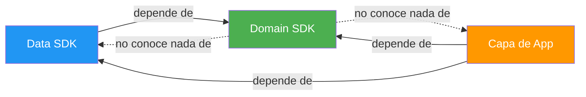

**El SDK de dominio define contratos. Las capas externas los implementan.**
El dominio nunca importa de data, UI ni ningún framework.

---

## Estructura de Paquetes

```
com.domain.core/
├── di/            → DomainDependencies, DomainModule
├── error/         → DomainError (jerarquía sealed)
├── result/        → DomainResult<T> + operadores (map, flatMap, zip, …)
├── model/         → Entity, ValueObject, AggregateRoot, EntityId
├── usecase/       → PureUseCase, SuspendUseCase, FlowUseCase, NoParams*
├── repository/    → Repository, ReadRepository, WriteRepository, ReadCollectionRepository
├── gateway/       → Gateway, SuspendGateway, CommandGateway
├── streaming/     → ConnectionState, StreamingConnection, StreamingGateway
├── validation/    → Validator<T>, andThen, validateAll, collectValidationErrors
├── policy/        → DomainPolicy, SuspendDomainPolicy, and/or/negate
└── provider/      → ClockProvider, IdProvider
```

---

## Componentes Principales

### DomainResult

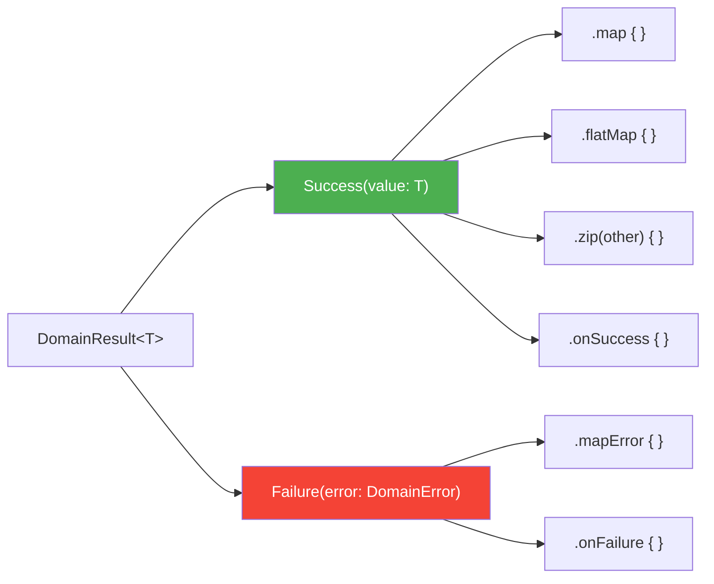

### Jerarquía de DomainError

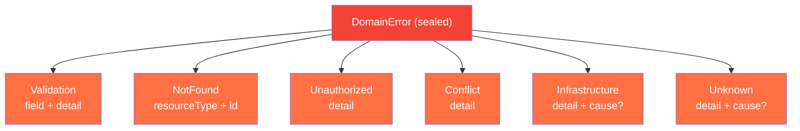

### Contratos de Casos de Uso

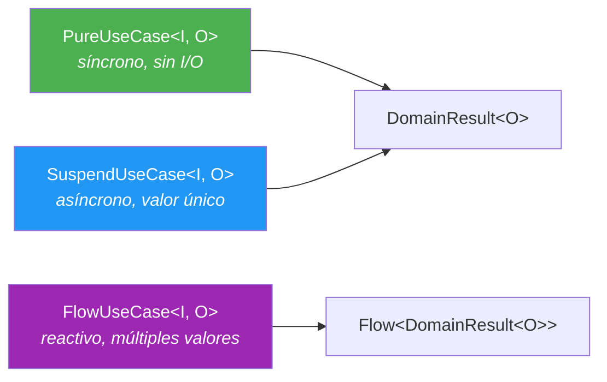

### Flujo de Composición

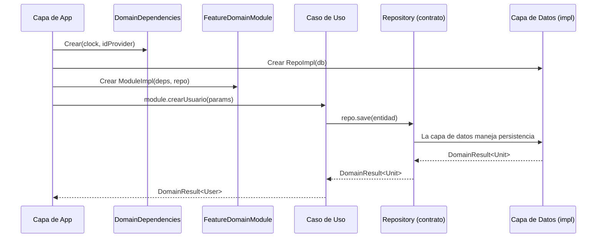

---

## DomainDependencies — El Contenedor de Infraestructura del Dominio

`DomainDependencies` es un `data class` inmutable que agrupa las **dos únicas dependencias de infraestructura** que el dominio necesita universalmente:

```kotlin
public data class DomainDependencies(
    val clock: ClockProvider,    // ¿Qué hora es?
    val idProvider: IdProvider,  // Dame un ID único
)
```

### El problema que resuelve

Cada vez que un caso de uso crea una entidad necesita un **ID** y un **timestamp**. Sin `DomainDependencies`:

```kotlin
// ❌ Impuro — side-effects directos dentro del dominio
val task = Task(
    id = TaskId(UUID.randomUUID().toString()),   // acoplado a JVM, no compila en iOS
    createdAt = System.currentTimeMillis(),        // resultado distinto en cada ejecución
)
```

**Problemas:** No testeable (cada ejecución genera valores distintos → imposible `assertEquals`), acoplado a plataforma (no compila en iOS), y no reproducible.

Con `DomainDependencies`:

```kotlin
// ✅ Determinista — el dominio no sabe de dónde vienen los valores
val task = Task(
    id = TaskId(deps.idProvider.next()),
    createdAt = deps.clock.nowMillis(),
)
```

### Cómo se configura

**En producción** — la app crea una sola instancia y la pasa a todos los use cases:

```kotlin
// Android (Application.onCreate) o iOS (AppDelegate)
val domainDeps = DomainDependencies(
    clock = ClockProvider { System.currentTimeMillis() },
    idProvider = IdProvider { UUID.randomUUID().toString() },
)
```

**En tests** — valores fijos, resultados 100% reproducibles:

```kotlin
val testDeps = DomainDependencies(
    clock = ClockProvider { 1_700_000_000_000L },
    idProvider = IdProvider { "fixed-id-123" },
)

// Ahora puedes verificar con exactitud:
val result = createTask(CreateTaskParams("Comprar leche"))
val task = result.getOrNull()!!
assertEquals("fixed-id-123", task.id.value)          // ✅ siempre pasa
assertEquals(1_700_000_000_000L, task.createdAt)     // ✅ siempre pasa
```

### ¿Por qué agruparlos en un solo objeto?

Si tienes 20 use cases que crean entidades, sin `DomainDependencies` pasarías `clock` + `idProvider` como **40 parámetros individuales**. Con el contenedor, son **20 parámetros** (`deps`).

### ¿Qué NO va aquí?

Repositorios y gateways de features se inyectan **directamente** en cada use case. Solo va aquí lo **cross-cutting** (que prácticamente todos los use cases necesitan):

```kotlin
class PlaceOrderUseCase(
    private val deps: DomainDependencies,          // ✅ cross-cutting: clock + id
    private val orderRepository: OrderRepository,  // ✅ específico de esta feature
    private val inventoryGateway: SuspendGateway<...>,
) : SuspendUseCase<PlaceOrderParams, Order> { ... }
```

---

## Referencia Completa de Casos de Uso

El SDK provee **5 contratos de caso de uso**. Todos son `fun interface` (SAM), lo que permite
implementarlos como lambdas o como clases:

| Contrato | Firma | Cuándo usar |
|---|---|---|
| `PureUseCase<I, O>` | `(I) → DomainResult<O>` | Lógica síncrona y pura. Sin I/O. Seguro desde main thread |
| `SuspendUseCase<I, O>` | `suspend (I) → DomainResult<O>` | Operaciones async de resultado único (crear, actualizar, buscar) |
| `FlowUseCase<I, O>` | `(I) → Flow<DomainResult<O>>` | Observar cambios en el tiempo (streams reactivos) |
| `NoParamsUseCase<O>` | `suspend () → DomainResult<O>` | Variante sin parámetros de `SuspendUseCase` |
| `NoParamsFlowUseCase<O>` | `() → Flow<DomainResult<O>>` | Variante sin parámetros de `FlowUseCase` |

> Todos retornan `DomainResult<T>`. Nunca lanzan excepciones al consumidor.

### 1. PureUseCase — Lógica síncrona y pura

Para cálculos, transformaciones, reglas de negocio que **no tocan red ni disco**.
Seguro desde cualquier hilo, incluyendo el main thread.

**Escenario real:** Un banco necesita evaluar si un cliente califica para un préstamo
personal. Las reglas dependen del ingreso mensual, el porcentaje de endeudamiento
y el score crediticio. No hay I/O — son reglas de negocio puras.

```kotlin
data class LoanEligibilityParams(
    val monthlyIncome: Double,
    val currentDebtPercent: Double,
    val creditScore: Int,
    val requestedAmount: Double,
)

data class LoanEligibilityResult(
    val approved: Boolean,
    val maxApprovedAmount: Double,
    val interestRate: Double,
    val reason: String,
)

class EvaluateLoanEligibility : PureUseCase<LoanEligibilityParams, LoanEligibilityResult> {

    override fun invoke(params: LoanEligibilityParams): DomainResult<LoanEligibilityResult> {
        // Validar input
        if (params.monthlyIncome <= 0)
            return domainFailure(DomainError.Validation("monthlyIncome", "debe ser positivo"))
        if (params.creditScore !in 300..850)
            return domainFailure(DomainError.Validation("creditScore", "debe estar entre 300 y 850"))

        // Regla 1: No prestar si el endeudamiento supera el 40%
        if (params.currentDebtPercent > 40.0) {
            return LoanEligibilityResult(
                approved = false,
                maxApprovedAmount = 0.0,
                interestRate = 0.0,
                reason = "Endeudamiento actual supera el 40%",
            ).asSuccess()
        }

        // Regla 2: Determinar tasa de interés según score crediticio
        val interestRate = when {
            params.creditScore >= 750 -> 8.5
            params.creditScore >= 650 -> 12.0
            params.creditScore >= 550 -> 18.5
            else -> return LoanEligibilityResult(
                approved = false,
                maxApprovedAmount = 0.0,
                interestRate = 0.0,
                reason = "Score crediticio insuficiente (mínimo 550)",
            ).asSuccess()
        }

        // Regla 3: Monto máximo = 5x ingreso mensual
        val maxAmount = params.monthlyIncome * 5
        val approved = params.requestedAmount <= maxAmount

        return LoanEligibilityResult(
            approved = approved,
            maxApprovedAmount = maxAmount,
            interestRate = interestRate,
            reason = if (approved) "Aprobado" else "Monto solicitado excede el máximo permitido",
        ).asSuccess()
    }
}

// Uso — síncrono, se puede llamar desde el main thread sin problema:
val result = evaluateLoanEligibility(
    LoanEligibilityParams(
        monthlyIncome = 45_000.0,
        currentDebtPercent = 25.0,
        creditScore = 720,
        requestedAmount = 150_000.0,
    )
)
// → Success(LoanEligibilityResult(approved=true, maxApprovedAmount=225000.0, interestRate=12.0, ...))
```

### 2. SuspendUseCase — Operación async de resultado único

Para operaciones que requieren I/O (persistir, consultar, llamar API) y producen **un solo valor**.

**Escenario real:** Un e-commerce necesita procesar una orden de compra. El caso de uso
valida el carrito, verifica el inventario, calcula el total con impuestos, reserva el stock
y persiste la orden. Todo en una sola transacción lógica.

```kotlin
data class PlaceOrderParams(
    val cartId: CartId,
    val shippingAddressId: AddressId,
    val paymentMethodId: PaymentMethodId,
)

class PlaceOrderUseCase(
    private val deps: DomainDependencies,
    private val cartRepository: CartRepository,
    private val inventoryGateway: SuspendGateway<List<CartItem>, InventoryCheckResult>,
    private val orderRepository: OrderRepository,
    private val taxCalculator: PureUseCase<TaxParams, TaxResult>,
) : SuspendUseCase<PlaceOrderParams, Order> {

    override suspend fun invoke(params: PlaceOrderParams): DomainResult<Order> {
        // 1. Obtener el carrito
        val cart = cartRepository.findById(params.cartId).getOrElse { return domainFailure(it) }
            ?: return domainFailure(DomainError.NotFound("Cart", params.cartId.value))

        if (cart.items.isEmpty())
            return domainFailure(DomainError.Validation("cart", "El carrito está vacío"))

        // 2. Verificar inventario disponible
        val inventoryCheck = inventoryGateway.execute(cart.items).getOrElse { return domainFailure(it) }
        if (!inventoryCheck.allAvailable)
            return domainFailure(DomainError.Conflict(
                detail = "Sin stock: ${inventoryCheck.unavailableItems.joinToString { it.name }}"
            ))

        // 3. Calcular impuestos (lógica pura — PureUseCase)
        val tax = taxCalculator(TaxParams(cart.subtotal, cart.shippingState))
            .getOrElse { return domainFailure(it) }

        // 4. Crear la orden
        val order = Order(
            id = OrderId(deps.idProvider.next()),
            items = cart.items,
            subtotal = cart.subtotal,
            tax = tax.amount,
            total = cart.subtotal + tax.amount,
            status = OrderStatus.CONFIRMED,
            createdAt = deps.clock.nowMillis(),
        )

        // 5. Persistir
        return orderRepository.save(order).map { order }
    }
}

// Uso:
viewModelScope.launch {
    placeOrder(PlaceOrderParams(cartId, addressId, paymentId))
        .onSuccess { order -> navigateToConfirmation(order.id) }
        .onFailure { error ->
            when (error) {
                is DomainError.Conflict -> showOutOfStockDialog(error.detail)
                is DomainError.Validation -> showCartError(error.detail)
                else -> showGenericError(error.message)
            }
        }
}
```

### 3. FlowUseCase — Observar datos que cambian en el tiempo

Para streams reactivos: datos que se actualizan, notificaciones en tiempo real, cambios de estado.
Cada emisión puede ser éxito o fallo individualmente sin cancelar el stream.

**Escenario real:** Un dashboard de logística donde un operador observa los envíos
filtrados por estado (pendiente, en tránsito, entregado). Cada vez que un envío
cambia de estado, la lista se actualiza automáticamente.

```kotlin
data class ShipmentFilterParams(
    val status: ShipmentStatus,
    val warehouseId: WarehouseId,
)

class ObserveShipmentsByStatus(
    private val shipmentRepository: ShipmentRepository,
) : FlowUseCase<ShipmentFilterParams, List<Shipment>> {

    override fun invoke(params: ShipmentFilterParams): Flow<DomainResult<List<Shipment>>> {
        return shipmentRepository
            .observeByWarehouseAndStatus(params.warehouseId, params.status)
    }
}

// Uso — en el ViewModel:
init {
    viewModelScope.launch {
        observeShipmentsByStatus(
            ShipmentFilterParams(
                status = ShipmentStatus.IN_TRANSIT,
                warehouseId = currentWarehouseId,
            )
        ).collect { result ->
            result
                .onSuccess { shipments ->
                    _uiState.value = DashboardState.Loaded(
                        shipments = shipments,
                        count = shipments.size,
                    )
                }
                .onFailure { error ->
                    _uiState.value = DashboardState.Error(error.message)
                }
        }
    }
}
```

### 4. NoParamsUseCase — Async sin parámetros

Igual que `SuspendUseCase` pero cuando **no necesitas parámetros**. Evita pasar `Unit`.

**Escenario real:** Una app de salud necesita cerrar la sesión del usuario. Esto implica
invalidar el token en el servidor, limpiar la caché local y registrar el evento de logout.
No necesita parámetros — la sesión activa determina todo.

```kotlin
class LogoutUseCase(
    private val sessionGateway: CommandGateway<LogoutCommand>,
    private val localCacheGateway: CommandGateway<ClearCacheCommand>,
    private val auditRepository: WriteRepository<AuditEvent>,
    private val deps: DomainDependencies,
) : NoParamsUseCase<Unit> {

    override suspend fun invoke(): DomainResult<Unit> {
        // 1. Invalidar token en el servidor
        sessionGateway.dispatch(LogoutCommand).getOrElse { return domainFailure(it) }

        // 2. Limpiar datos locales sensibles
        localCacheGateway.dispatch(ClearCacheCommand).getOrElse { return domainFailure(it) }

        // 3. Registrar evento de auditoría
        val event = AuditEvent(
            id = AuditEventId(deps.idProvider.next()),
            type = "LOGOUT",
            timestamp = deps.clock.nowMillis(),
        )
        return auditRepository.save(event)
    }
}

// Uso — sin parámetros:
viewModelScope.launch {
    logout()
        .onSuccess { navigateToLogin() }
        .onFailure { error -> showError("No se pudo cerrar sesión: ${error.message}") }
}
```

### 5. NoParamsFlowUseCase — Stream reactivo sin parámetros

Ideal para observar datos globales que no requieren filtro.

**Escenario real:** Una app de fintech necesita mostrar el valor total del portafolio
de inversiones del usuario actualizado en tiempo real. El valor cambia conforme
fluctúan los precios de los activos. No necesita parámetros — el usuario autenticado
determina qué portafolio observar.

```kotlin
class ObservePortfolioValue(
    private val portfolioRepository: PortfolioRepository,
) : NoParamsFlowUseCase<PortfolioSummary> {

    override fun invoke(): Flow<DomainResult<PortfolioSummary>> {
        return portfolioRepository.observeCurrentUserPortfolio()
        // Emite cada vez que cambia un precio o se ejecuta una transacción
    }
}

data class PortfolioSummary(
    val totalValue: Double,
    val dailyChange: Double,
    val dailyChangePercent: Double,
    val holdings: List<Holding>,
)

// Uso — en el ViewModel de la pantalla principal:
init {
    viewModelScope.launch {
        observePortfolioValue()
            .collect { result ->
                result
                    .onSuccess { summary ->
                        _uiState.value = HomeState.Loaded(
                            totalValue = summary.totalValue,
                            changePercent = summary.dailyChangePercent,
                            isPositive = summary.dailyChange >= 0,
                        )
                    }
                    .onFailure { error ->
                        _uiState.value = HomeState.Error(error.message)
                    }
            }
    }
}
```

### Diagrama de decisión

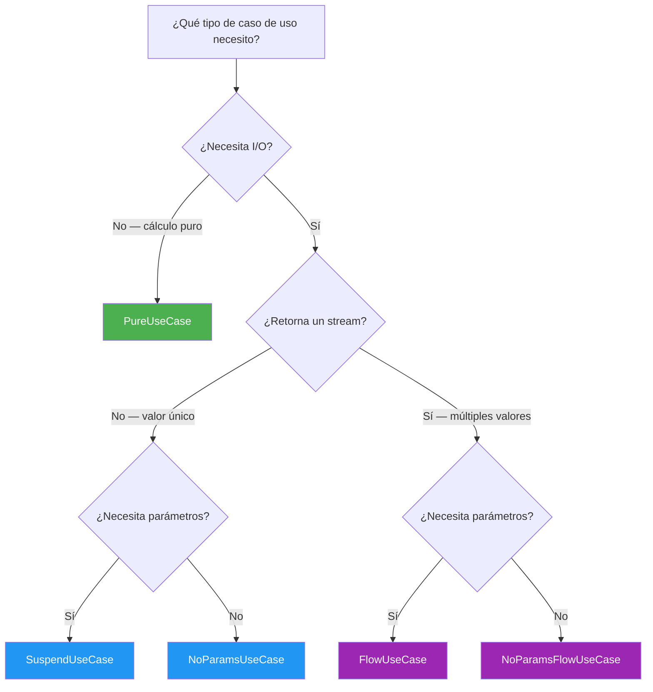

---

## Integración con Core Data Platform

El **Core Domain Platform** (este SDK) define los contratos del dominio. El **[Core Data Platform](https://github.com/DanCrRdz93/core-data-platform)** implementa el acceso a datos remotos (HTTP, seguridad, sesiones). Ambos son KMP y están **100% alineados** en versiones:

| | Domain SDK | Data SDK |
|---|---|---|
| Kotlin | 2.1.20 | 2.1.20 |
| Coroutines | 1.10.1 | 1.10.1 |
| Gradle | 9.3.1 | 9.3.1 |

### Arquitectura completa

```
┌─────────────────────────────────────────────────────────────────────────┐
│                          TU APP (Android/iOS)                           │
│                                                                         │
│  ┌──────────┐  ┌──────────┐  ┌──────────┐                              │
│  │Feature A │  │Feature B │  │Feature C │  ← ViewModels                 │
│  └────┬─────┘  └────┬─────┘  └────┬─────┘                              │
│       │              │              │                                    │
│  ┌────▼──────────────▼──────────────▼────────────────┐                  │
│  │     Domain Use Cases (este SDK)                   │                  │
│  │  PureUseCase · SuspendUseCase · FlowUseCase       │                  │
│  │  (genera operationId, decide retryPolicyOverride)  │                  │
│  └────┬──────────────┬──────────────┬────────────────┘                  │
│       │              │              │                                    │
│  ┌────▼──────────────▼──────────────▼────────────────┐                  │
│  │   Repository / Gateway Implementations            │  ← TÚ LOS       │
│  │   (puente entre ambos SDKs)                       │    ESCRIBES      │
│  │   Propaga: RequestContext, ResultMetadata          │                  │
│  └────┬──────────────┬──────────┬────────────────────┘                  │
│       │              │          │                                        │
│  ┌────▼────┐  ┌──────▼────┐  ┌─▼───────────────────────────────────┐   │
│  │network  │  │ network   │  │  security-core                      │   │
│  │ -core   │  │  -ktor    │  │  SessionController · CredentialProv │   │
│  │         │  │           │  │  SecretStore · TrustPolicy          │   │
│  └─────────┘  └───────────┘  └─────────────────────────────────────┘   │
│                 ↑ Data SDK                                              │
│  Observability: LoggingObserver · MetricsObserver · TracingObserver     │
└─────────────────────────────────────────────────────────────────────────┘
```

### 1. Mapeo de errores: `NetworkError` → `DomainError`

#### El problema

Cuando un request HTTP falla, el Data SDK retorna un `NetworkResult.Failure` con un `NetworkError`
(10 subtipos: `Connectivity`, `Timeout`, `Cancelled`, `Authentication`, `Authorization`,
`ClientError`, `ServerError`, `Serialization`, `ResponseValidation`, `Unknown`).

El dominio no conoce ni debe conocer `NetworkError`. Solo entiende `DomainError` (7 subtipos).
Necesitas una función **puente** que traduzca cada `NetworkError` al `DomainError` correcto.

#### Detalle técnico importante

`NetworkError` **no** es `Throwable`. Internamente tiene `diagnostic: Diagnostic?` donde
`Diagnostic.cause: Throwable?` guarda la excepción original. El mapeo debe extraer
`diagnostic?.cause` para pasarlo a `DomainError.Infrastructure.cause`:

```
NetworkError.Connectivity
    ├── message: "Sin conexión"          → va al detail de DomainError
    ├── diagnostic: Diagnostic?
    │       ├── description: "DNS failed" → info para logs (no llega al dominio)
    │       └── cause: Throwable?         → VA a DomainError.Infrastructure.cause
    └── isRetryable: true                 → info para infra (no llega al dominio)
```

#### El flujo paso a paso

```
1. DataSource hace un request HTTP
        │
        ▼
2. Request falla → NetworkResult.Failure(NetworkError.Connectivity(...))
        │
        ▼
3. Repository (puente) llama: error.toDomainError()
   │
   │  NetworkError.Connectivity → DomainError.Infrastructure
   │  NetworkError.Timeout      → DomainError.Infrastructure
   │  NetworkError.Cancelled    → DomainError.Cancelled        ← ¡NO es Infrastructure!
   │  NetworkError.Authentication → DomainError.Unauthorized
   │  NetworkError.ClientError(404) → DomainError.NotFound
   │  NetworkError.ClientError(409) → DomainError.Conflict
   │  NetworkError.ClientError(422) → DomainError.Validation
   │  NetworkError.ServerError  → DomainError.Infrastructure
   │  NetworkError.Unknown      → DomainError.Unknown
        │
        ▼
4. Use case recibe DomainResult.Failure(DomainError.Infrastructure("Sin conexión"))
   │  Nunca vio NetworkError — solo DomainError
        │
        ▼
5. ViewModel hace `when(error)` exhaustivo sobre DomainError
   │  Muestra mensaje apropiado al usuario
```

#### Implementación

```kotlin
// Extensión que vive en tu capa de datos (NO en ninguno de los dos SDKs)
fun NetworkError.toDomainError(): DomainError = when (this) {
    // ── Transporte ──
    is NetworkError.Connectivity -> DomainError.Infrastructure(
        detail = "Sin conexión a internet",
        cause = diagnostic?.cause,     // ← Throwable? del Data SDK, NO `this`
    )
    is NetworkError.Timeout -> DomainError.Infrastructure(
        detail = "Tiempo de espera agotado",
        cause = diagnostic?.cause,
    )
    is NetworkError.Cancelled -> DomainError.Cancelled(
        detail = "Solicitud cancelada",  // ← Intencional, no falla de infra
    )

    // ── HTTP semántico ──
    is NetworkError.Authentication -> DomainError.Unauthorized("Autenticación requerida")
    is NetworkError.Authorization  -> DomainError.Unauthorized("Acceso denegado")
    is NetworkError.ClientError -> when (statusCode) {
        404  -> DomainError.NotFound("Recurso", diagnostic?.description ?: "")
        409  -> DomainError.Conflict(message)
        422  -> DomainError.Validation("request", diagnostic?.description ?: message)
        else -> DomainError.Infrastructure("Error HTTP $statusCode", diagnostic?.cause)
    }
    is NetworkError.ServerError -> DomainError.Infrastructure(
        detail = "Error del servidor ($statusCode)",
        cause = diagnostic?.cause,
    )

    // ── Procesamiento de datos ──
    is NetworkError.Serialization -> DomainError.Infrastructure(
        detail = "Error al procesar respuesta",
        cause = diagnostic?.cause,
    )
    is NetworkError.ResponseValidation -> DomainError.Infrastructure(
        detail = reason,
        cause = diagnostic?.cause,
    )

    // ── Catch-all ──
    is NetworkError.Unknown -> DomainError.Unknown(
        detail = message,
        cause = diagnostic?.cause,
    )
}
```

#### ¿Por qué `Cancelled` no es `Infrastructure`?

Una cancelación es **intencional** (el usuario navegó fuera, el scope de coroutine se canceló).
Si la mapeas como `Infrastructure`, en el ViewModel el `when` no puede distinguirla de una
caída de servidor:

```kotlin
// ❌ Sin DomainError.Cancelled — ambos son Infrastructure
when (error) {
    is DomainError.Infrastructure -> showErrorDialog(error.message)
    // "Solicitud cancelada" muestra un diálogo de error innecesario
}

// ✅ Con DomainError.Cancelled — el ViewModel decide correctamente
when (error) {
    is DomainError.Cancelled -> { /* no-op, el usuario ya se fue */ }
    is DomainError.Infrastructure -> showErrorDialog(error.message)
}
```

### 2. Implementación de un Repository (el puente)

#### El problema

El use case `GetUserUseCase` necesita un `ReadRepository<UserId, User>` — un contrato de dominio
puro. Pero los datos vienen de una API HTTP vía el Data SDK, que retorna `NetworkResult<UserDto>`.

Necesitas una clase **puente** que:
1. Reciba una llamada de dominio (`findById(UserId)`)
2. La traduzca a una llamada de infraestructura (`dataSource.getUser(id.value)`)
3. Convierta el resultado: `UserDto` → `User` (con un `Mapper`) y `NetworkError` → `DomainError`

#### El flujo paso a paso

```
1. GetUserUseCase llama: userRepo.findById(UserId("abc-123"))
        │
        ▼
2. UserRepositoryImpl.findById(UserId("abc-123"))
   │  Extrae el valor crudo: id.value → "abc-123"
   │  Llama al Data SDK: dataSource.getUser("abc-123")
        │
        ▼
3. Data SDK ejecuta el HTTP request (GET /users/abc-123)
   │  Retorna: NetworkResult<UserDto>
        │
        ├── Éxito: NetworkResult.Success(UserDto(id="abc-123", name="Ana", email="..."))
        │       │
        │       ▼
        │   mapper.map(dto) → User(id=UserId("abc-123"), name="Ana", email="...")
        │   Retorna: DomainResult.Success(User(...))
        │
        └── Fallo: NetworkResult.Failure(NetworkError.Connectivity(...))
                │
                ▼
            error.toDomainError() → DomainError.Infrastructure("Sin conexión")
            Retorna: DomainResult.Failure(DomainError.Infrastructure(...))
        │
        ▼
4. GetUserUseCase recibe DomainResult<User?>
   │  Nunca vio UserDto, NetworkResult, ni NetworkError
```

#### Qué hace cada pieza

- **`ReadRepository<UserId, User>`** — contrato del Domain SDK, define `findById`
- **`UserRemoteDataSource`** — del Data SDK, ejecuta HTTP y retorna `NetworkResult<UserDto>`
- **`Mapper<UserDto, User>`** — del Domain SDK, transforma DTOs a modelos de dominio puros
- **`networkResult.fold`** — del Data SDK, manejo exhaustivo de éxito/fallo (equivalente al `fold` de `DomainResult`)

#### Implementación

```kotlin
class UserRepositoryImpl(
    private val dataSource: UserRemoteDataSource,      // ← Data SDK
    private val mapper: Mapper<UserDto, User>,          // ← Domain SDK contrato
) : ReadRepository<UserId, User> {                      // ← Domain SDK contrato

    override suspend fun findById(id: UserId): DomainResult<User?> {
        val networkResult = dataSource.getUser(id.value)  // NetworkResult<UserDto>
        return networkResult.fold(
            onSuccess = { dto -> mapper.map(dto).asSuccess() },   // UserDto → User
            onFailure = { error -> domainFailure(error.toDomainError()) }, // NetworkError → DomainError
        )
    }
}
```

#### ¿Dónde vive esta clase?

```
tu-app/
├── domain/          ← Define interfaces (ReadRepository, Mapper)
├── data/            ← ★ UserRepositoryImpl vive AQUÍ ★
│   ├── dto/         ← UserDto (@Serializable)
│   ├── mapper/      ← UserDtoMapper : Mapper<UserDto, User>
│   └── repository/  ← UserRepositoryImpl : ReadRepository<UserId, User>
└── di/              ← Wiring: conecta la implementación con el contrato
```

El dominio **nunca** importa clases del Data SDK. Solo el módulo `data/` (que tú escribes)
conoce ambos SDKs.

### 3. Propagación de `ResponseMetadata` al dominio

#### El problema

Cuando un request HTTP tiene éxito, el Data SDK retorna `NetworkResult.Success<T>` que además
del dato (`T`) trae **metadata de transporte**:

```
NetworkResult.Success<UserDto>
    ├── data: UserDto                        ← el dato que el dominio necesita
    └── metadata: ResponseMetadata
            ├── statusCode: 200
            ├── headers: Map<String, List<String>>
            ├── durationMs: 342              ← ¿cuánto tardó?
            ├── requestId: "req-abc-123"     ← ¿cuál fue el request?
            └── attemptCount: 2              ← ¿cuántos reintentos hubo?
```

En la mayoría de use cases no necesitas esta metadata — `findById` retorna el modelo y ya.
Pero hay escenarios donde **sí importa**:

- **Soporte**: el usuario reporta un error → el ViewModel muestra el `requestId` para que
  soporte pueda rastrear el request en los logs del servidor
- **Observabilidad**: quieres medir latencia percibida (`durationMs`) desde el ViewModel
- **Debugging**: quieres saber si el dato vino del primer intento o de un retry (`attemptCount`)

#### El flujo paso a paso

```
1. ViewModel llama: userRepo.findByIdWithMeta(userId)
        │
        ▼
2. UserRepositoryWithMeta.findByIdWithMeta(UserId("abc-123"))
   │  Llama: dataSource.getUser("abc-123")
        │
        ▼
3. Data SDK ejecuta HTTP → retorna NetworkResult.Success(dto, metadata)
   │  metadata = ResponseMetadata(statusCode=200, durationMs=342, requestId="req-abc-123", attemptCount=2)
        │
        ▼
4. Repository convierte AMBOS:
   │  dto → User (con mapper)
   │  metadata → ResultMetadata (con toDomainMeta())
   │
   │  Retorna: DomainResultWithMeta(
   │      result = DomainResult.Success(User(...)),
   │      metadata = ResultMetadata(requestId="req-abc-123", durationMs=342, attemptCount=2)
   │  )
        │
        ▼
5. ViewModel recibe DomainResultWithMeta<User?>
   │  val (result, meta) = userRepo.findByIdWithMeta(userId)
   │  result.fold(onSuccess = { showUser(it) }, onFailure = { showError(it, meta.requestId) })
```

#### Qué hace cada pieza

- **`ResponseMetadata`** (Data SDK) — metadata HTTP cruda (statusCode, headers, durationMs, requestId, attemptCount)
- **`ResultMetadata`** (Domain SDK) — metadata de dominio agnóstica al transporte (requestId, durationMs, attemptCount, extra)
- **`DomainResultWithMeta<T>`** (Domain SDK) — wrapper que combina `DomainResult<T>` + `ResultMetadata`
- **`toDomainMeta()`** — extensión puente que convierte `ResponseMetadata` → `ResultMetadata`

#### Implementación

```kotlin
class UserRepositoryWithMeta(
    private val dataSource: UserRemoteDataSource,
    private val mapper: Mapper<UserDto, User>,
) : ReadRepository<UserId, User> {

    // Retorna DomainResultWithMeta para que el ViewModel acceda a metadata
    suspend fun findByIdWithMeta(id: UserId): DomainResultWithMeta<User?> {
        val networkResult = dataSource.getUser(id.value)
        return when (networkResult) {
            is NetworkResult.Success -> DomainResultWithMeta(
                result = mapper.map(networkResult.data).asSuccess(),
                metadata = networkResult.metadata.toDomainMeta(),
            )
            is NetworkResult.Failure -> DomainResultWithMeta(
                result = domainFailure(networkResult.error.toDomainError()),
                // En failure también puedes propagar metadata si la tienes
            )
        }
    }

    // Contrato estándar (sin metadata) sigue disponible
    override suspend fun findById(id: UserId): DomainResult<User?> =
        findByIdWithMeta(id).result
}

// Extensión en tu capa de datos — convierte metadata HTTP → metadata de dominio
fun ResponseMetadata.toDomainMeta(): ResultMetadata = ResultMetadata(
    requestId = requestId,
    durationMs = durationMs,
    attemptCount = attemptCount,
    extra = buildMap {
        headers["X-RateLimit-Remaining"]?.firstOrNull()?.let { put("rateLimitRemaining", it) }
        headers["ETag"]?.firstOrNull()?.let { put("etag", it) }
    },
)
```

#### Uso en el ViewModel

```kotlin
val (result, meta) = userRepo.findByIdWithMeta(userId)
result.fold(
    onSuccess = { user -> showUser(user) },
    onFailure = { error ->
        showError(error.message)
        // El usuario puede reportar el requestId al soporte
        analytics.logError(requestId = meta.requestId, duration = meta.durationMs)
    },
)
```

> **Nota:** `findByIdWithMeta` es un método **adicional**, no reemplaza a `findById`.
> Si el use case no necesita metadata, usa `findById` directamente y no pagas el costo
> de crear `DomainResultWithMeta`.

### 4. `RequestContext` — correlación dominio → HTTP

#### El problema

Tu app tiene 20 use cases, cada uno genera requests HTTP. En el dashboard de Datadog (o cualquier
herramienta de observabilidad) ves miles de requests a `/api/orders`, `/api/inventory`, etc.
Pero **no puedes saber qué use case generó cada request**.

El Data SDK soporta `RequestContext` — un objeto que viaja con cada request HTTP y puede incluir:

```
RequestContext
    ├── operationId: "place-order"        ← nombre del use case
    ├── tags: {"orderId": "abc-123"}      ← contexto de negocio
    ├── parentSpanId: "span-xyz"          ← correlación con tracing distribuido
    ├── retryPolicyOverride: RetryPolicy? ← override de retry (ver Gap 5)
    └── requiresAuth: true                ← ¿necesita credenciales?
```

El `operationId` y los `tags` llegan como headers HTTP al servidor. En Datadog puedes filtrar:
`operation_id=place-order AND orderId=abc-123` → ves exactamente la traza del pedido.

#### El flujo paso a paso

```
1. PlaceOrderUseCase.invoke(input)
   │  Genera: operationId = "place-order"
   │  Llama: orderRepo.placeOrder(order, operationId = "place-order")
        │
        ▼
2. OrderRepositoryImpl.placeOrder(order, "place-order")
   │  Crea RequestContext:
   │    operationId = "place-order"        ← del use case
   │    tags = {"orderId": "abc-123"}      ← del modelo de dominio
   │    requiresAuth = true
   │
   │  Llama: dataSource.createOrder(orderDto, context)
        │
        ▼
3. Data SDK ejecuta HTTP con el context:
   │  POST /api/orders
   │  Headers:
   │    X-Operation-Id: place-order
   │    X-Tags: orderId=abc-123
   │    Authorization: Bearer <token>
        │
        ▼
4. En Datadog / Grafana / tu APM:
   │  Filtrar por: operation_id=place-order
   │  Ver: latencia, status code, retries, errores
   │  Correlacionar: "este request de 342ms fue del pedido abc-123 del use case place-order"
```

#### Qué hace cada pieza

- **`operationId`** — el use case sabe cómo se llama ("place-order", "get-user-profile", etc.). El repository no inventa nombres, solo propaga
- **`tags`** — contexto de negocio que el use case o el repository agregan (orderId, userId, etc.)
- **`requiresAuth`** — indica al Data SDK que este request necesita inyectar el Bearer token vía `CredentialProvider`

#### Implementación

```kotlin
// ── Contrato en tu capa de dominio (interface del repository) ──
interface OrderRepository : WriteRepository<Order> {
    suspend fun placeOrder(order: Order, operationId: String): DomainResult<Unit>
}

// ── Implementación en tu capa de datos (puente) ──
class OrderRepositoryImpl(
    private val dataSource: OrderRemoteDataSource,
) : OrderRepository {

    override suspend fun placeOrder(order: Order, operationId: String): DomainResult<Unit> {
        val context = RequestContext(
            operationId = operationId,              // ← Viene del use case
            tags = mapOf("orderId" to order.id),    // ← Contexto de negocio
            requiresAuth = true,
        )
        val result = dataSource.createOrder(order.toDto(), context)
        return result.fold(
            onSuccess = { Unit.asSuccess() },
            onFailure = { error -> domainFailure(error.toDomainError()) },
        )
    }

    // save/delete estándar para WriteRepository
    override suspend fun save(entity: Order) = placeOrder(entity, "save-order")
    override suspend fun delete(entity: Order): DomainResult<Unit> { /* ... */ }
}

// ── Use case genera el operationId ──
class PlaceOrderUseCase(
    private val orderRepo: OrderRepository,
    private val deps: DomainDependencies,
) : SuspendUseCase<PlaceOrderInput, Unit> {

    override suspend fun invoke(input: PlaceOrderInput): DomainResult<Unit> {
        val order = Order(id = deps.idProvider.generate(), /* ... */)
        return orderRepo.placeOrder(order, operationId = "place-order")
    }
}
```

#### ¿Por qué el operationId viene del use case y no del repository?

Porque el **mismo repository** puede ser llamado desde **diferentes use cases**:

```kotlin
// Mismo OrderRepository, diferentes operationIds
class PlaceOrderUseCase(...)   { orderRepo.placeOrder(order, "place-order") }
class ReorderUseCase(...)      { orderRepo.placeOrder(order, "reorder") }
class AdminCreateOrder(...)    { orderRepo.placeOrder(order, "admin-create-order") }
```

Si el operationId viviera en el repository, todos los requests se verían iguales en Datadog.

### 5. `RetryPolicy` override desde el dominio

#### El problema

El Data SDK reintenta automáticamente requests fallidos (configurado en `NetworkConfig.retryPolicy`,
por ejemplo `ExponentialBackoff(maxRetries = 3)`). Esto es útil para la mayoría de operaciones:
si un GET falla por timeout, reintentar es seguro.

**Pero un pago NO debe reintentarse.** Ejemplo:

```
1. Usuario presiona "Pagar $500"
2. POST /payments → el servidor procesa el pago ✅
3. La RESPUESTA se pierde (timeout de red)
4. Data SDK ve "timeout" → reintenta automáticamente
5. POST /payments → el servidor procesa OTRO pago ✅
6. Resultado: al usuario le cobraron $1,000 💀
```

El dominio (el use case) es quien sabe qué operaciones son **idempotentes** (seguras de reintentar)
y cuáles no. La infraestructura solo ve "request falló, reintento".

#### El flujo paso a paso

```
1. ProcessPaymentUseCase.invoke(payment)
   │  El USE CASE sabe: "pagos = sin retry"
   │  Llama: paymentRepo.processPayment(payment, allowRetry = false)
        │
        ▼
2. PaymentRepositoryImpl.processPayment(payment, allowRetry = false)
   │  El PUENTE traduce la decisión de dominio a infraestructura:
   │
   │  allowRetry = false  →  retryPolicyOverride = RetryPolicy.None
   │  allowRetry = true   →  retryPolicyOverride = null (usa el default del config)
   │
   │  Crea RequestContext:
   │    operationId = "process-payment"
   │    retryPolicyOverride = RetryPolicy.None  ← "NO reintentar"
   │    requiresAuth = true
   │
   │  Llama: dataSource.charge(paymentDto, context)
        │
        ▼
3. Data SDK ve RetryPolicy.None en el context
   │  POST /payments → timeout de red
   │  NORMALMENTE reintentaría, pero el override dice "NO"
   │  Retorna: NetworkResult.Failure(NetworkError.Timeout(...))
        │
        ▼
4. Repository mapea: NetworkError.Timeout → DomainError.Infrastructure("Tiempo agotado")
   │  Retorna: DomainResult.Failure(DomainError.Infrastructure(...))
        │
        ▼
5. ViewModel muestra: "El pago falló. ¿Desea intentar de nuevo?"
   │  La decisión de reintentar es del USUARIO, no automática
```

#### Qué hace cada pieza

- **`allowRetry: Boolean`** — lenguaje de **negocio** en el contrato del repository. El dominio no sabe qué es `RetryPolicy`
- **`retryPolicyOverride`** — lenguaje de **infraestructura** en el `RequestContext`. El puente traduce `false` → `RetryPolicy.None`
- **`null` como override** — significa "usa el default del config" (no sobreescribas nada)

#### Implementación

```kotlin
// ── Contrato del repository (dominio) — habla lenguaje de negocio ──
interface PaymentRepository : Repository {
    suspend fun processPayment(payment: Payment, allowRetry: Boolean = false): DomainResult<PaymentResult>
}

// ── Implementación (puente) — traduce negocio → infraestructura ──
class PaymentRepositoryImpl(
    private val dataSource: PaymentRemoteDataSource,
) : PaymentRepository {

    override suspend fun processPayment(
        payment: Payment,
        allowRetry: Boolean,
    ): DomainResult<PaymentResult> {
        val context = RequestContext(
            operationId = "process-payment",
            retryPolicyOverride = if (!allowRetry) RetryPolicy.None else null,
            requiresAuth = true,
        )
        val result = dataSource.charge(payment.toDto(), context)
        return result.fold(
            onSuccess = { dto -> PaymentResult(dto.transactionId).asSuccess() },
            onFailure = { error -> domainFailure(error.toDomainError()) },
        )
    }
}

// ── Use case — decide la regla de negocio ──
class ProcessPaymentUseCase(
    private val paymentRepo: PaymentRepository,
) : SuspendUseCase<Payment, PaymentResult> {

    override suspend fun invoke(input: Payment): DomainResult<PaymentResult> =
        paymentRepo.processPayment(input, allowRetry = false) // ← NUNCA reintentar pagos
}
```

#### ¿No es más fácil poner `RetryPolicy.None` en el `NetworkConfig` de pagos?

Sí, y de hecho en el Gap 7 (multi-API) se muestra `paymentsConfig` con `RetryPolicy.None` por
defecto. Pero este patrón es útil cuando:

- **Un mismo DataSource tiene operaciones con diferentes reglas** — consultar saldo SÍ puede
  reintentarse, pagar NO. Ambos usan el mismo `PaymentRemoteDataSource`
- **La decisión es del dominio** — el use case sabe que pagos son no-idempotentes

Son complementarios: `NetworkConfig` pone el default, `RequestContext.retryPolicyOverride` lo
sobreescribe por operación individual.

### 6. Ciclo de vida completo de sesión

#### El problema

El Data SDK tiene un `SessionController` que gestiona la sesión de autenticación:

```
SessionController (Data SDK)
    ├── startSession(credentials)    → inicia sesión (login)
    ├── endSession()                 → cierra sesión (logout voluntario)
    ├── invalidate()                 → fuerza cierre (401, seguridad comprometida)
    ├── refreshSession()             → renueva token → RefreshOutcome (Refreshed/NotNeeded/Failed)
    ├── state: StateFlow<SessionState>  → Active / Idle / Expired
    └── events: Flow<SessionEvent>      → Started / Refreshed / Ended / Invalidated / RefreshFailed
```

El dominio necesita usar estas operaciones, pero **no puede depender de `SessionController`
directamente** (sería acoplar el dominio a la infraestructura). Necesitas **adapters** que
envuelvan cada operación en un contrato del Domain SDK.

#### Mapeo de contratos

| Operación del Data SDK | Contrato del Domain SDK | ¿Por qué? |
|---|---|---|
| `startSession(credentials)` | `CommandGateway<SessionCredentials>` | Fire-and-forget con input |
| `endSession()` | `CommandGateway<Unit>` | Fire-and-forget sin input |
| `invalidate()` | `CommandGateway<Unit>` | Fire-and-forget sin input |
| `refreshSession()` | `SuspendGateway<Unit, RefreshOutcome>` | Retorna resultado (Refreshed/NotNeeded/Failed) |
| `state` (StateFlow) | `NoParamsFlowGateway<Boolean>` | Stream reactivo sin input |
| `events` (Flow) | `NoParamsFlowGateway<SessionEvent>` | Stream reactivo sin input |

#### El flujo paso a paso (ejemplo: login)

```
1. LoginUseCase.invoke(LoginInput("user@mail.com", "password123"))
   │  Crea SessionCredentials a partir del input
   │  Llama: loginGateway.dispatch(credentials)
        │
        ▼
2. LoginGateway.dispatch(credentials)
   │  Envuelve la llamada en runDomainCatching:
   │    - Si session.startSession(credentials) completa → DomainResult.Success(Unit)
   │    - Si lanza excepción → DomainResult.Failure(DomainError.Unknown(...))
        │
        ▼
3. SessionController.startSession(credentials)  ← Data SDK
   │  Valida credenciales contra el servidor
   │  Almacena tokens en SecretStore (Keychain/Keystore)
   │  Emite SessionState.Active + SessionEvent.Started
        │
        ▼
4. SessionStateGateway.observe() emite: DomainResult.Success(true)
   │  El ViewModel actualiza la UI: muestra pantalla principal
```

#### Implementación

```kotlin
// ── Adapter: login ──
class LoginGateway(
    private val session: SessionController,
) : CommandGateway<SessionCredentials> {

    override suspend fun dispatch(input: SessionCredentials): DomainResult<Unit> =
        runDomainCatching { session.startSession(input) }
}

// ── Adapter: logout voluntario ──
// El usuario presiona "Cerrar sesión" — acción voluntaria
class LogoutGateway(
    private val session: SessionController,
) : CommandGateway<Unit> {

    override suspend fun dispatch(input: Unit): DomainResult<Unit> =
        runDomainCatching { session.endSession() }
}

// ── Adapter: force-logout ──
// Diferente de logout: esto se dispara automáticamente cuando:
// - El servidor retorna 401 (token inválido)
// - Se detecta seguridad comprometida
// - El admin revoca la sesión remotamente
class ForceLogoutGateway(
    private val session: SessionController,
) : CommandGateway<Unit> {

    override suspend fun dispatch(input: Unit): DomainResult<Unit> =
        runDomainCatching { session.invalidate() }
}

// ── Adapter: refresh de token ──
// RefreshOutcome es un sealed del Data SDK:
//   Refreshed  → token renovado exitosamente
//   NotNeeded  → token aún válido, no se necesitó renovar
//   Failed     → no se pudo renovar (credenciales expiradas)
class RefreshSessionGateway(
    private val session: SessionController,
) : SuspendGateway<Unit, RefreshOutcome> {

    override suspend fun execute(input: Unit): DomainResult<RefreshOutcome> =
        runDomainCatching { session.refreshSession() }
}

// ── Adapter: estado de sesión (StateFlow → FlowGateway) ──
// Convierte SessionState (Active/Idle/Expired) → Boolean (logged in / not)
class SessionStateGateway(
    private val session: SessionController,
) : NoParamsFlowGateway<Boolean> {

    override fun observe(): Flow<DomainResult<Boolean>> =
        session.state.map { state ->
            (state is SessionState.Active).asSuccess()
        }
}

// ── Adapter: eventos de sesión para analytics ──
// Cada evento (Started, Refreshed, Ended, etc.) se emite como DomainResult
class SessionEventsGateway(
    private val session: SessionController,
) : NoParamsFlowGateway<SessionEvent> {

    override fun observe(): Flow<DomainResult<SessionEvent>> =
        session.events.map { event -> event.asSuccess() }
}
```

#### Uso en use cases

```kotlin
// ── LogoutUseCase — encadena logout + limpiar caché ──
class LogoutUseCase(
    private val logout: LogoutGateway,
    private val clearCache: ClearCacheGateway, // otro gateway tuyo
) : SuspendUseCase<Unit, Unit> {

    override suspend fun invoke(input: Unit): DomainResult<Unit> =
        logout.dispatch(Unit).flatMap { clearCache.dispatch(Unit) }
}

// ── ObserveSessionUseCase — el ViewModel observa si hay sesión activa ──
class ObserveSessionUseCase(
    private val sessionState: SessionStateGateway,
) : NoParamsFlowUseCase<Boolean> {

    override fun invoke(): Flow<DomainResult<Boolean>> =
        sessionState.observe()
}
```

#### ¿Por qué `runDomainCatching` y no `try/catch`?

`runDomainCatching` es una función del Domain SDK que envuelve una lambda suspend en
`DomainResult`. Si la lambda lanza excepción, retorna `DomainResult.Failure(DomainError.Unknown(...))`.
Esto evita que excepciones del Data SDK se propaguen sin manejar al dominio.

### 7. Múltiples APIs con diferentes configuraciones

#### El problema

En una app real, un solo use case puede necesitar datos de **múltiples APIs** con requisitos
completamente diferentes:

```
PlaceOrderUseCase
    ├── OrderRepository      → orders.api.example.com    (retry: 3, timeout: 10s)
    ├── InventoryGateway     → inventory.api.example.com  (retry: 2, timeout: 5s)
    └── PaymentRepository    → payments.api.example.com   (retry: NONE, timeout: 30s, TrustPolicy)
```

Si usas un solo `NetworkConfig` y un solo executor para todo, no puedes:
- Poner retry diferente por API
- Usar Certificate Pinning solo para pagos
- Configurar timeouts según la velocidad esperada de cada API

#### El flujo paso a paso

```
1. PlaceOrderUseCase.invoke(input)
   │  Orquesta 3 operaciones secuenciales:
        │
        ▼
2. inventoryGateway.checkStock(productId)
   │  → inventoryExecutor → GET inventory.api.example.com/stock/xyz
   │  Config: timeout=5s, retry=FixedDelay(2, 1000ms)
   │  ¿Por qué? Inventario es rápido y puede reintentarse sin riesgo
        │
        ▼ (si hay stock)
3. paymentRepo.processPayment(payment, allowRetry = false)
   │  → paymentsExecutor → POST payments.api.example.com/charge
   │  Config: timeout=30s, retry=None, TrustPolicy con CertificatePin
   │  ¿Por qué? Pagos son lentos (3D Secure), nunca reintentar, necesitan MITM protection
        │
        ▼ (si pago exitoso)
4. orderRepo.placeOrder(order, "place-order")
   │  → ordersExecutor → POST orders.api.example.com/orders
   │  Config: timeout=10s, retry=ExponentialBackoff(3)
   │  ¿Por qué? Crear orden es idempotente (tiene orderId), puede reintentarse
        │
        ▼
5. DomainResult.Success(OrderConfirmation(...))
```

#### Qué hace cada pieza

- **`NetworkConfig`** (Data SDK) — configuración por API: URL base, timeout, retry, headers
- **`KtorHttpEngine`** (Data SDK) — cliente HTTP configurado con un `NetworkConfig` específico
- **`DefaultSafeRequestExecutor`** (Data SDK) — ejecuta requests con retry, clasificación de errores, y observers
- Cada API tiene su propio `Config → Engine → Executor → DataSource → Repository`

#### Implementación

```kotlin
fun provideMultiApiDependencies(): AppDependencies {
    // ── Configuraciones por API ── cada una con reglas diferentes
    val ordersConfig = NetworkConfig(
        baseUrl = "https://orders.api.example.com",
        connectTimeout = 10_000L,
        retryPolicy = RetryPolicy.ExponentialBackoff(maxRetries = 3),
    )
    val inventoryConfig = NetworkConfig(
        baseUrl = "https://inventory.api.example.com",
        connectTimeout = 5_000L,
        retryPolicy = RetryPolicy.FixedDelay(maxRetries = 2, delay = 1_000L),
    )
    val paymentsConfig = NetworkConfig(
        baseUrl = "https://payments.api.example.com",
        connectTimeout = 30_000L,
        retryPolicy = RetryPolicy.None, // ← Pagos: NUNCA reintentar por defecto
    )

    // ── Executors independientes por API ──
    // Cada executor tiene su propio engine, config y observers
    val ordersExecutor = DefaultSafeRequestExecutor(
        engine = KtorHttpEngine.create(ordersConfig),
        config = ordersConfig,
        classifier = KtorErrorClassifier(),
        observers = listOf(loggingObserver, metricsObserver),
    )
    val inventoryExecutor = DefaultSafeRequestExecutor(
        engine = KtorHttpEngine.create(inventoryConfig),
        config = inventoryConfig,
        classifier = KtorErrorClassifier(),
    )
    val paymentsExecutor = DefaultSafeRequestExecutor(
        engine = KtorHttpEngine.create(paymentsConfig, bankTrustPolicy), // ← TrustPolicy (ver Gap 9)
        config = paymentsConfig,
        classifier = KtorErrorClassifier(),
    )

    // ── DataSources ── cada uno usa su executor correspondiente
    val orderDataSource = OrderRemoteDataSource(ordersExecutor)
    val inventoryDataSource = InventoryRemoteDataSource(inventoryExecutor)
    val paymentDataSource = PaymentRemoteDataSource(paymentsExecutor)

    // ── Repositories/Gateways (puente) ──
    val orderRepo = OrderRepositoryImpl(orderDataSource)
    val inventoryGateway = InventoryGatewayImpl(inventoryDataSource)
    val paymentRepo = PaymentRepositoryImpl(paymentDataSource)

    // ── Use case orquesta las 3 APIs ──
    val placeOrder = PlaceOrderUseCase(orderRepo, inventoryGateway, paymentRepo, domainDeps)

    return AppDependencies(placeOrder, /* ... */)
}
```

#### Diagrama del wiring

```
                    ┌─────────────────────────────────┐
                    │     PlaceOrderUseCase            │
                    │  (dominio — no sabe de HTTP)     │
                    └───┬──────────┬──────────┬────────┘
                        │          │          │
               orderRepo  inventoryGW  paymentRepo
                        │          │          │
                    ┌───▼───┐  ┌───▼───┐  ┌───▼───┐
                    │OrderDS│  │InvDS  │  │PayDS  │   ← DataSources
                    └───┬───┘  └───┬───┘  └───┬───┘
                        │          │          │
                    ┌───▼───┐  ┌───▼───┐  ┌───▼───────────┐
                    │orders │  │inv    │  │payments       │   ← Executors
                    │Exec   │  │Exec   │  │Exec           │
                    │retry:3│  │retry:2│  │retry:0+Trust  │
                    └───┬───┘  └───┬───┘  └───┬───────────┘
                        │          │          │
                        ▼          ▼          ▼
                   orders.api  inventory.api  payments.api     ← Servidores
```

### 8. Exposición de Rate Limits al dominio

#### El problema

Muchas APIs retornan headers de rate limiting en cada respuesta HTTP:

```
HTTP/1.1 200 OK
X-RateLimit-Limit: 100
X-RateLimit-Remaining: 3     ← ¡Solo quedan 3 requests!
X-RateLimit-Reset: 1620000000
```

El dominio necesita saber cuántos requests quedan para:
- **Deshabilitar el botón "Actualizar"** cuando quedan pocos requests
- **Mostrar un aviso** al usuario: "Quedan 3 consultas en esta hora"
- **Hacer throttling preventivo** en un use case de sincronización masiva

Pero estos headers viven en la capa HTTP — el dominio no puede leerlos directamente.

#### La solución: clase con doble rol

La implementación tiene un **doble rol** — es dos cosas a la vez:

```
RateLimitGatewayImpl
    ├── ES un ResponseInterceptor (Data SDK)
    │   → El executor la llama en cada respuesta HTTP
    │   → Extrae X-RateLimit-Remaining del header
    │   → Guarda el valor en un StateFlow interno
    │
    └── ES un NoParamsFlowGateway<Int> (Domain SDK)
        → El use case la observa como un Flow<DomainResult<Int>>
        → Recibe actualizaciones cada vez que el StateFlow cambia
```

#### El flujo paso a paso

```
1. Executor hace un request HTTP → recibe respuesta con headers
        │
        ▼
2. RateLimitGatewayImpl.intercept(response)  ← rol de ResponseInterceptor
   │  Lee: response.headers["X-RateLimit-Remaining"] → "3"
   │  Actualiza: _remaining.value = 3
        │
        ▼
3. El StateFlow emite el nuevo valor: 3
        │
        ▼
4. RateLimitGatewayImpl.observe()  ← rol de NoParamsFlowGateway
   │  Emite: DomainResult.Success(3)
        │
        ▼
5. ViewModel recibe: remaining = 3
   │  if (remaining < 5) disableRefreshButton()
```

#### Implementación

```kotlin
// ── Gateway reactivo (dominio) ──
interface RateLimitGateway : NoParamsFlowGateway<Int> // Remaining count

// ── Implementación (puente) — doble rol ──
class RateLimitGatewayImpl : RateLimitGateway, ResponseInterceptor {
    private val _remaining = MutableStateFlow(Int.MAX_VALUE)

    // Rol 1: ResponseInterceptor del Data SDK — intercepta cada respuesta HTTP
    override suspend fun intercept(response: InterceptedResponse): InterceptedResponse {
        response.headers["X-RateLimit-Remaining"]?.firstOrNull()?.toIntOrNull()?.let {
            _remaining.value = it
        }
        return response // Siempre retorna la respuesta sin modificar
    }

    // Rol 2: NoParamsFlowGateway del Domain SDK — expone al dominio
    override fun observe(): Flow<DomainResult<Int>> =
        _remaining.map { it.asSuccess() }
}
```

#### Registro en el wiring

La misma instancia se registra en **dos lugares**:

```kotlin
// 1. Crear la instancia
val rateLimitGateway = RateLimitGatewayImpl()

// 2. Registrar como ResponseInterceptor en el executor
val executor = DefaultSafeRequestExecutor(
    engine = engine,
    config = config,
    classifier = KtorErrorClassifier(),
    responseInterceptors = listOf(rateLimitGateway), // ← intercepta respuestas HTTP
)

// 3. Inyectar como Gateway en el use case
val checkRateLimit = ObserveRateLimitUseCase(rateLimitGateway) // ← expone al dominio
```

### 9. `TrustPolicy` y Certificate Pinning en el wiring

#### El problema

En una red Wi-Fi pública o comprometida, un atacante puede hacer un **ataque MITM**
(Man-In-The-Middle): se interpone entre la app y el servidor, presenta un certificado
falso, y lee/modifica todo el tráfico (incluyendo tokens y datos de pago).

```
Sin pinning:
App → [Atacante con cert falso] → Servidor real
         ↑ lee contraseñas, tokens, datos de tarjeta

Con pinning:
App → [Atacante con cert falso] → ❌ Conexión rechazada
         ↑ el hash del cert no coincide con los pins conocidos
```

Para apps de **banca, salud, o fintech**, esto no es opcional — es un requisito regulatorio.

#### Cómo funciona

El Data SDK soporta `TrustPolicy` con `CertificatePin`:

```
DefaultTrustPolicy
    └── pins: List<CertificatePin>
            ├── CertificatePin(hostname, sha256)  ← pin principal
            └── CertificatePin(hostname, sha256)  ← pin de respaldo (rotación de cert)
```

Al crear el `KtorHttpEngine`, le pasas el `TrustPolicy`. El engine valida que el certificado
del servidor coincida con al menos uno de los pins. Si no coincide, **rechaza la conexión**
antes de enviar datos.

#### El flujo paso a paso

```
1. App quiere hacer POST /payments/charge
        │
        ▼
2. KtorHttpEngine abre conexión TLS con payments.api.example.com
   │  Recibe certificado del servidor
   │  Calcula SHA-256 del certificado
        │
        ├── SHA-256 coincide con algún pin → ✅ conexión permitida → continúa el request
        │
        └── SHA-256 NO coincide → ❌ conexión rechazada
            │  NetworkResult.Failure(NetworkError.Connectivity(...))
            │  diagnostic.cause = SSLPeerUnverifiedException(...)
```

#### Implementación

```kotlin
// ── TrustPolicy — se configura una vez en el wiring ──
val bankTrustPolicy = DefaultTrustPolicy(
    pins = listOf(
        CertificatePin(
            hostname = "payments.api.example.com",
            sha256 = "AAAAAAAAAAAAAAAAAAAAAAAAAAAAAAAAAAAAAAAAAAA=", // SHA-256 del cert actual
        ),
        CertificatePin(
            hostname = "payments.api.example.com",
            sha256 = "BBBBBBBBBBBBBBBBBBBBBBBBBBBBBBBBBBBBBBBBBBB=", // Pin de respaldo
            // Necesitas 2+ pins para que la app siga funcionando durante rotación de cert
        ),
    ),
)

// ── Pasar al crear el engine ──
val secureEngine = KtorHttpEngine.create(
    config = paymentsConfig,
    trustPolicy = bankTrustPolicy,    // ← Pinning activo
)
val secureExecutor = DefaultSafeRequestExecutor(
    engine = secureEngine,
    config = paymentsConfig,
    classifier = KtorErrorClassifier(),
)
```

#### ¿Por qué 2 pins?

Los certificados SSL se rotan periódicamente. Si solo tienes 1 pin y el servidor rota el
certificado, **todas las apps instaladas dejan de funcionar** hasta que publiques un update.
Con 2 pins (actual + próximo), la transición es transparente.

### 10. Observers en el wiring

#### El problema

Necesitas visibilidad sobre los requests HTTP que hace tu app:
- En **desarrollo**: logs detallados para debugging (URL, headers, body, duración)
- En **producción**: métricas de latencia para dashboards, alertas de errores 5xx
- En **ambos**: reportar errores a Crashlytics con la excepción original

Sin observers, el executor funciona como una caja negra — los requests entran y salen,
pero no sabes qué pasó en medio.

#### Cómo funciona

El Data SDK define `NetworkEventObserver` con 4 callbacks:

```
NetworkEventObserver
    ├── onRequestStarted(url, method)                    ← antes de enviar
    ├── onResponseReceived(url, statusCode, durationMs)  ← respuesta recibida
    ├── onRetryScheduled(url, attempt, delayMs)          ← se va a reintentar
    └── onRequestFailed(url, error: NetworkError)        ← falló definitivamente
```

El `DefaultSafeRequestExecutor` llama a todos los observers en el orden configurado.
Puedes tener **múltiples observers activos** simultáneamente.

#### El flujo paso a paso

```
1. Executor inicia un request: POST /api/orders
        │
        ▼
2. Notifica a TODOS los observers:
   │  loggingObserver.onRequestStarted("/api/orders", "POST")
   │  crashlyticsObserver.onRequestStarted("/api/orders", "POST")
        │
        ▼
3. Envía el request HTTP → timeout
        │
        ▼
4. Notifica: retry scheduled
   │  loggingObserver.onRetryScheduled("/api/orders", attempt=1, delayMs=1000)
   │  crashlyticsObserver.onRetryScheduled(...)
        │
        ▼ (espera 1 segundo)
5. Reintenta → éxito (200 OK, 342ms)
        │
        ▼
6. Notifica: response received
   │  loggingObserver.onResponseReceived("/api/orders", 200, 342)
   │  crashlyticsObserver.onResponseReceived("/api/orders", 200, 342)
```

#### Implementación

```kotlin
// ── LoggingObserver (Data SDK) — solo en debug ──
// Imprime logs detallados de cada request. El headerSanitizer evita
// loguear tokens de Authorization en texto plano.
val loggingObserver = LoggingObserver(
    logger = { tag, msg -> println("[$tag] $msg") },
    tag = "HTTP",
    headerSanitizer = { key, value ->
        if (key.equals("Authorization", ignoreCase = true)) "***" else value
    },
)

// ── Observer custom: reporte a Crashlytics ──
// Solo reporta errores relevantes — no loguea requests exitosos.
val crashlyticsObserver = object : NetworkEventObserver {
    override fun onRequestStarted(url: String, method: String) {
        // No-op: no reportamos requests exitosos a Crashlytics
    }
    override fun onResponseReceived(url: String, statusCode: Int, durationMs: Long) {
        // Solo reportamos errores de servidor (5xx)
        if (statusCode >= 500) {
            crashlytics.log("Server error: $url → $statusCode (${durationMs}ms)")
        }
    }
    override fun onRetryScheduled(url: String, attempt: Int, delayMs: Long) {
        // Útil para detectar APIs inestables
        crashlytics.log("Retry #$attempt for $url in ${delayMs}ms")
    }
    override fun onRequestFailed(url: String, error: NetworkError) {
        // Reporta la excepción original (Throwable), no el NetworkError
        crashlytics.recordError(error.diagnostic?.cause ?: Exception(error.message))
    }
}
```

#### Registro en el executor

```kotlin
val executor = DefaultSafeRequestExecutor(
    engine = KtorHttpEngine.create(config),
    config = config,
    classifier = KtorErrorClassifier(),
    observers = listOf(loggingObserver, crashlyticsObserver), // ← ambos activos
)
```

#### ¿Qué observers ya vienen incluidos en el Data SDK?

| Observer | Qué hace |
|---|---|
| `LoggingObserver` | Imprime logs con sanitización de headers sensibles |
| `MetricsObserver` | Registra histogramas de latencia para exportar a Prometheus/Datadog |
| `TracingObserver` | Crea spans de OpenTelemetry para distributed tracing |

Puedes combinar cualquier cantidad de observers — no se interfieren entre sí.

### 11. Mapeo de errores WebSocket: `WebSocketError` → `DomainError`

#### El problema

El Data SDK ahora incluye módulos de WebSocket (`network-ws-core`, `network-ws-ktor`).
Cuando una conexión WebSocket falla, retorna `WebSocketError` (8 subtipos). Necesitas
un mapeo similar al de `NetworkError.toDomainError()`.

#### Estructura de `WebSocketError`

```
WebSocketError (Data SDK)
    ├── ConnectionFailed   (isRetryable = true)   — no se pudo conectar
    ├── ConnectionLost     (isRetryable = true)   — conexión perdida durante uso
    ├── Timeout            (isRetryable = true)   — timeout al conectar
    ├── ProtocolError      (isRetryable = false)  — error de protocolo WebSocket
    ├── ClosedByServer     (isRetryable = varies) — el servidor cerró la conexión
    ├── Authentication     (isRetryable = false)  — 401/403 durante handshake
    ├── Serialization      (isRetryable = false)  — frame no se pudo deserializar
    └── Unknown            (isRetryable = false)  — catch-all
```

#### Implementación

```kotlin
// Extensión en tu capa de datos (NO en ninguno de los SDKs)
fun WebSocketError.toDomainError(): DomainError = when (this) {
    // ── Conexión ──
    is WebSocketError.ConnectionFailed -> DomainError.Infrastructure(
        detail = "No se pudo conectar al servidor",
        cause = diagnostic?.cause,
    )
    is WebSocketError.ConnectionLost -> DomainError.Infrastructure(
        detail = "Conexión perdida",
        cause = diagnostic?.cause,
    )
    is WebSocketError.Timeout -> DomainError.Infrastructure(
        detail = "Timeout al conectar",
        cause = diagnostic?.cause,
    )

    // ── Protocolo ──
    is WebSocketError.ProtocolError -> DomainError.Infrastructure(
        detail = "Error de protocolo: $message",
        cause = diagnostic?.cause,
    )
    is WebSocketError.ClosedByServer -> DomainError.Infrastructure(
        detail = "Servidor cerró la conexión (código: $code)",
        cause = diagnostic?.cause,
    )

    // ── Seguridad ──
    is WebSocketError.Authentication -> DomainError.Unauthorized(
        detail = "Autenticación requerida para WebSocket",
    )

    // ── Procesamiento ──
    is WebSocketError.Serialization -> DomainError.Infrastructure(
        detail = "Error al procesar mensaje del stream",
        cause = diagnostic?.cause,
    )

    // ── Catch-all ──
    is WebSocketError.Unknown -> DomainError.Unknown(
        detail = message,
        cause = diagnostic?.cause,
    )
}
```

### 12. Mapeo de errores de seguridad: `SecurityError` → `DomainError`

#### El problema

El módulo `security-core` del Data SDK define `SecurityError` (6 subtipos) para
errores de sesión y almacenamiento seguro. Los gateways de sesión (Gap 6) que usan
`runDomainCatching` capturan excepciones genéricas, pero para un mapeo semántico
correcto necesitas mapear `SecurityError` explícitamente.

#### Estructura de `SecurityError`

```
SecurityError (Data SDK)
    ├── TokenExpired               — el token de sesión expiró
    ├── TokenRefreshFailed         — no se pudo renovar el token
    ├── InvalidCredentials         — usuario/contraseña incorrectos
    ├── SecureStorageFailure       — Keychain/Keystore falló
    ├── CertificatePinningFailure  — el certificado no coincide con los pins
    └── Unknown                    — catch-all
```

#### Implementación

```kotlin
fun SecurityError.toDomainError(): DomainError = when (this) {
    is SecurityError.TokenExpired -> DomainError.Unauthorized(
        detail = "Sesión expirada",
    )
    is SecurityError.TokenRefreshFailed -> DomainError.Unauthorized(
        detail = "No se pudo renovar la sesión",
    )
    is SecurityError.InvalidCredentials -> DomainError.Unauthorized(
        detail = "Credenciales inválidas",
    )
    is SecurityError.SecureStorageFailure -> DomainError.Infrastructure(
        detail = "Error de almacenamiento seguro",
        cause = diagnostic?.cause,
    )
    is SecurityError.CertificatePinningFailure -> DomainError.Infrastructure(
        detail = "Certificado no confiable para $host",
        cause = diagnostic?.cause,
    )
    is SecurityError.Unknown -> DomainError.Unknown(
        detail = message,
        cause = diagnostic?.cause,
    )
}
```

#### Uso en los gateways de sesión

```kotlin
class LoginGateway(
    private val session: SessionController,
) : CommandGateway<SessionCredentials> {

    override suspend fun dispatch(input: SessionCredentials): DomainResult<Unit> =
        runDomainCatching(
            errorMapper = { throwable ->
                // Si el Data SDK lanza SecurityError como excepción
                (throwable as? SecurityError)?.toDomainError()
                    ?: DomainError.Unknown(cause = throwable)
            }
        ) {
            session.startSession(input)
        }
}
```

### 13. Integración con WebSocket — Streaming en tiempo real

#### El problema

Muchas apps necesitan datos en tiempo real: precios de criptomonedas, chat, notificaciones
push, scores en vivo. El Data SDK ahora tiene soporte completo de WebSocket con:

- `SafeWebSocketExecutor` — gestiona conexión, reconexión y clasificación de errores
- `WebSocketConnection` — exposición reactiva del stream con `state` y `incoming`
- `StreamingDataSource` — clase abstracta para data sources basados en WebSocket

El Domain SDK ahora incluye contratos de streaming para dar soporte completo:

```
Domain SDK (nuevos contratos)
    ├── ConnectionState         — Connected / Connecting(attempt) / Disconnected(error?)
    ├── StreamingConnection<T>  — state + incoming + close
    ├── BidirectionalStreamingConnection<S, T>  — extends con send(message)
    ├── StreamingGateway<I, O>  — connect(input): StreamingConnection<O>
    ├── NoParamsStreamingGateway<O>  — connect(): StreamingConnection<O>
    └── BidirectionalStreamingGateway<I, S, O>  — connect(input): BidirectionalStreamingConnection<S, O>
```

#### El flujo paso a paso

```
1. ViewModel llama: priceStreamGateway.connect("BTC-USD")
   │  Recibe: StreamingConnection<PriceTick>
        │
        ▼
2. PriceStreamGatewayImpl.connect("BTC-USD")
   │  Crea: WebSocketRequest(path = "/ws/prices/BTC-USD")
   │  Llama: dataSource.connect("BTC-USD") → WebSocketConnection
   │  Envuelve en: DomainStreamingConnectionAdapter
        │
        ▼
3. Data SDK abre conexión WebSocket
   │  wss://api.example.com/ws/prices/BTC-USD
   │  WebSocketState → Connecting(0) → Connected
        │
        ▼
4. ConnectionState se mapea automáticamente:
   │  WebSocketState.Connecting(0) → ConnectionState.Connecting(0)
   │  WebSocketState.Connected     → ConnectionState.Connected
        │
        ▼
5. Frames llegan del servidor:
   │  WebSocketFrame.Text('{"price":42000.50}')
   │    → deserializar → PriceTickDto
   │    → mapper.map(dto) → PriceTick(price=42000.50)
   │    → emitir: DomainResult.Success(PriceTick(42000.50))
        │
        ▼
6. ViewModel observa:
   │  connection.state.collect { ... }      ← para UI de estado de conexión
   │  connection.incoming.collect { ... }   ← para datos en tiempo real
```

#### Implementación del adapter (puente)

```kotlin
class DomainStreamingConnectionAdapter<Dto, T>(
    private val wsConnection: WebSocketConnection,
    private val deserialize: (WebSocketFrame) -> Dto?,
    private val mapper: Mapper<Dto, T>,
    private val errorMapper: (WebSocketError) -> DomainError = { it.toDomainError() },
) : StreamingConnection<T> {

    // Mapea WebSocketState → ConnectionState
    override val state: StateFlow<ConnectionState> =
        wsConnection.state.map { wsState ->
            when (wsState) {
                is WebSocketState.Connecting -> ConnectionState.Connecting(wsState.attempt)
                is WebSocketState.Connected -> ConnectionState.Connected
                is WebSocketState.Disconnected -> ConnectionState.Disconnected(
                    error = wsState.error?.let(errorMapper),
                )
            }
        }.stateIn(/* scope */)

    // Mapea WebSocketFrame → DomainResult<T>
    override val incoming: Flow<DomainResult<T>> =
        wsConnection.incoming.mapNotNull { frame ->
            try {
                val dto = deserialize(frame) ?: return@mapNotNull null
                mapper.map(dto).asSuccess()
            } catch (e: Exception) {
                domainFailure(DomainError.Infrastructure("Error deserializando frame", e))
            }
        }

    override suspend fun close() {
        wsConnection.close()
    }
}
```

#### Implementación del gateway

```kotlin
// ── Contrato en el dominio ──
interface PriceStreamGateway : StreamingGateway<String, PriceTick>

// ── Implementación en la capa de datos ──
class PriceStreamGatewayImpl(
    private val dataSource: PriceStreamDataSource,
    private val mapper: Mapper<PriceTickDto, PriceTick>,
) : PriceStreamGateway {

    override fun connect(input: String): StreamingConnection<PriceTick> =
        DomainStreamingConnectionAdapter(
            wsConnection = dataSource.connect(input),
            deserialize = { frame ->
                when (frame) {
                    is WebSocketFrame.Text -> Json.decodeFromString(frame.text)
                    else -> null
                }
            },
            mapper = mapper,
        )
}
```

#### Uso en el ViewModel

```kotlin
class PriceViewModel(
    private val priceStream: PriceStreamGateway,
) : ViewModel() {

    private var connection: StreamingConnection<PriceTick>? = null

    fun startObserving(symbol: String) {
        connection = priceStream.connect(symbol)

        // Observar estado de conexión
        viewModelScope.launch {
            connection!!.state.collect { state ->
                when (state) {
                    is ConnectionState.Connecting -> _uiState.value = UiState.Reconnecting(state.attempt)
                    is ConnectionState.Connected -> _uiState.value = UiState.Connected
                    is ConnectionState.Disconnected -> _uiState.value = UiState.Disconnected(state.error?.message)
                }
            }
        }

        // Observar precios
        viewModelScope.launch {
            connection!!.incoming.collect { result ->
                result.fold(
                    onSuccess = { tick -> _price.value = tick },
                    onFailure = { error -> _lastError.value = error.message },
                )
            }
        }
    }

    override fun onCleared() {
        viewModelScope.launch { connection?.close() }
    }
}
```

#### Chat bidireccional

```kotlin
// ── Contrato en el dominio ──
interface ChatGateway : BidirectionalStreamingGateway<String, ChatMessage, ChatMessage>

// ── Uso en el ViewModel ──
val chatConnection = chatGateway.connect("room-42")

// Recibir mensajes
chatConnection.incoming.collect { result ->
    result.onSuccess { msg -> addToChat(msg) }
}

// Enviar mensajes
chatConnection.send(ChatMessage(text = "Hola!")).onFailure { error ->
    showError("No se pudo enviar: ${error.message}")
}
```

### Tabla de correspondencia completa

| Data SDK | Domain SDK | Dónde se conectan |
|---|---|---|
| `NetworkResult<T>` | `DomainResult<T>` | Repository impl con `fold` |
| `NetworkResult.Success.metadata` | `ResultMetadata` / `DomainResultWithMeta` | `ResponseMetadata.toDomainMeta()` |
| `NetworkError.*` (10 subtipos) | `DomainError.*` (7 subtipos) | `NetworkError.toDomainError()` |
| `NetworkError.Cancelled` | `DomainError.Cancelled` | Mapeo semántico correcto |
| `NetworkError.diagnostic?.cause` | `DomainError.Infrastructure.cause` | `Throwable?` preservado |
| `RequestContext.operationId` | Use case genera el ID | Propagado vía repository impl |
| `RequestContext.retryPolicyOverride` | Use case decide allowRetry | Repository propaga a `RequestContext` |
| `ResponseMetadata.headers` | `ResultMetadata.extra` | Rate limits, ETags, etc. |
| `SessionController.startSession` | `CommandGateway<SessionCredentials>` | `LoginGateway` adapter |
| `SessionController.endSession` | `CommandGateway<Unit>` | `LogoutGateway` adapter |
| `SessionController.invalidate` | `CommandGateway<Unit>` | `ForceLogoutGateway` adapter |
| `SessionController.refreshSession` | `SuspendGateway<Unit, RefreshOutcome>` | `RefreshSessionGateway` adapter |
| `SessionController.state` | `NoParamsFlowGateway<Boolean>` | `SessionStateGateway` adapter |
| `SessionController.events` | `NoParamsFlowGateway<SessionEvent>` | `SessionEventsGateway` adapter |
| `ResponseInterceptor` | `NoParamsFlowGateway<Int>` | `RateLimitGatewayImpl` (doble rol) |
| `NetworkConfig` (por API) | Múltiples executors | Wiring multi-API |
| `TrustPolicy` / `CertificatePin` | N/A (infra pura) | `KtorHttpEngine.create(config, trustPolicy)` |
| `NetworkEventObserver` | N/A (infra pura) | `DefaultSafeRequestExecutor(observers = ...)` |
| `LoggingObserver` | N/A (infra pura) | Configurado en el wiring |
| `WebSocketConnection` | `StreamingConnection<T>` | `DomainStreamingConnectionAdapter` |
| `WebSocketState` | `ConnectionState` | Mapeo en adapter: Connecting/Connected/Disconnected |
| `WebSocketError.*` (8 subtipos) | `DomainError.*` (7 subtipos) | `WebSocketError.toDomainError()` |
| `SafeWebSocketExecutor` | `StreamingGateway<I, O>` | Gateway impl con adapter |
| `WebSocketFrame` | Tipo deserializado `T` | `Mapper<Dto, T>` en el adapter |
| `ReconnectPolicy` | N/A (infra pura) | Configurado en `WebSocketConfig` |
| `WebSocketEventObserver` | N/A (infra pura) | `DefaultSafeWebSocketExecutor(observers = ...)` |
| `SecurityError.*` (6 subtipos) | `DomainError.*` (7 subtipos) | `SecurityError.toDomainError()` |
| DTOs (`@Serializable`) | Domain models (puros) | `Mapper<Dto, Model>` |
| Batch HTTP requests | `WriteRepository.saveAll()` | Repository impl override |

---

## Guía de Implementación Paso a Paso

Esta guía te lleva paso a paso a través de la integración del SDK en un proyecto KMP nuevo o existente.
Sigue cada paso en orden.

### Paso 1 — Agregar el SDK como dependencia

**Escenario:** Tienes un proyecto KMP y quieres usar este SDK como tu capa de dominio.

Agrega el módulo del SDK a tu proyecto. Si es un módulo local:

```kotlin
// settings.gradle.kts
include(":coredomainplatform")
project(":coredomainplatform").projectDir = file("ruta/a/coredomainplatform")
```

Luego en tu módulo de feature o app:

```kotlin
// build.gradle.kts de tu módulo app/feature
kotlin {
    sourceSets {
        val commonMain by getting {
            dependencies {
                implementation(project(":coredomainplatform"))
            }
        }
    }
}
```

### Paso 2 — Definir tus modelos de dominio

**Escenario:** Estás construyendo una feature de gestión de tareas y necesitas una entidad `Task` con un ID tipado.

```kotlin
// En el paquete de dominio de tu feature (NO en este SDK)
package com.myapp.feature.task.model

import com.domain.core.model.AggregateRoot
import com.domain.core.model.EntityId

@JvmInline
value class TaskId(override val value: String) : EntityId<String>

data class Task(
    override val id: TaskId,
    val title: String,
    val completed: Boolean,
    val createdAt: Long,
) : AggregateRoot<TaskId>
```

### Paso 3 — Definir tu contrato de repositorio

**Escenario:** Tu feature de `Task` necesita persistencia — el dominio define lo que necesita, no cómo se implementa.

```kotlin
package com.myapp.feature.task.repository

import com.domain.core.repository.ReadRepository
import com.domain.core.repository.WriteRepository
import com.myapp.feature.task.model.Task
import com.myapp.feature.task.model.TaskId

interface TaskRepository : ReadRepository<TaskId, Task>, WriteRepository<Task>
```

### Paso 4 — Crear validadores para tus reglas de dominio

**Escenario:** El título de una tarea no debe estar vacío y no debe exceder 200 caracteres.

```kotlin
package com.myapp.feature.task.validation

import com.domain.core.validation.notBlankValidator
import com.domain.core.validation.maxLengthValidator
import com.domain.core.validation.andThen

val taskTitleValidator = notBlankValidator("title")
    .andThen(maxLengthValidator("title", 200))
```

### Paso 5 — Crear políticas para reglas de negocio

**Escenario:** Una tarea solo puede ser completada si tiene un título (no vacío). Esta es una regla de negocio semántica, no solo validación de campo.

```kotlin
package com.myapp.feature.task.policy

import com.domain.core.error.DomainError
import com.domain.core.policy.DomainPolicy
import com.domain.core.result.asSuccess
import com.domain.core.result.domainFailure
import com.myapp.feature.task.model.Task

val canCompleteTask = DomainPolicy<Task> { task ->
    if (task.title.isNotBlank()) Unit.asSuccess()
    else domainFailure(DomainError.Conflict(detail = "No se puede completar una tarea sin título"))
}
```

### Paso 6 — Implementar tu caso de uso

**Escenario:** Crear una nueva tarea. El caso de uso valida input, genera un ID, timestamp, y persiste.

```kotlin
package com.myapp.feature.task.usecase

import com.domain.core.di.DomainDependencies
import com.domain.core.error.DomainError
import com.domain.core.result.DomainResult
import com.domain.core.result.asSuccess
import com.domain.core.result.domainFailure
import com.domain.core.result.flatMap
import com.domain.core.usecase.SuspendUseCase
import com.myapp.feature.task.model.Task
import com.myapp.feature.task.model.TaskId
import com.myapp.feature.task.repository.TaskRepository
import com.myapp.feature.task.validation.taskTitleValidator

data class CreateTaskParams(val title: String)

class CreateTaskUseCase(
    private val deps: DomainDependencies,
    private val repository: TaskRepository,
) : SuspendUseCase<CreateTaskParams, Task> {

    override suspend fun invoke(params: CreateTaskParams): DomainResult<Task> {
        // 1. Validar
        val validation = taskTitleValidator.validate(params.title)
        if (validation.isFailure) return validation as DomainResult<Task>

        // 2. Construir entidad
        val task = Task(
            id = TaskId(deps.idProvider.next()),
            title = params.title,
            completed = false,
            createdAt = deps.clock.nowMillis(),
        )

        // 3. Persistir y retornar
        return repository.save(task).flatMap { task.asSuccess() }
    }
}
```

### Paso 7 — Definir tu DomainModule de feature

**Escenario:** Exponer todos los casos de uso de la feature de tareas a través de un solo módulo composable.

```kotlin
package com.myapp.feature.task.di

import com.domain.core.di.DomainDependencies
import com.domain.core.di.DomainModule
import com.domain.core.usecase.SuspendUseCase
import com.myapp.feature.task.model.Task
import com.myapp.feature.task.repository.TaskRepository
import com.myapp.feature.task.usecase.CreateTaskParams
import com.myapp.feature.task.usecase.CreateTaskUseCase

interface TaskDomainModule : DomainModule {
    val createTask: SuspendUseCase<CreateTaskParams, Task>
}

class TaskDomainModuleImpl(
    deps: DomainDependencies,
    taskRepository: TaskRepository,
) : TaskDomainModule {
    override val createTask = CreateTaskUseCase(deps, taskRepository)
}
```

### Paso 8 — Conectar todo en la capa de app

**Escenario:** El arranque de tu app crea todas las dependencias y ensambla todos los módulos.

```kotlin
// Capa de app — wiring. Este es el ÚNICO lugar donde los tipos concretos se encuentran.
val domainDeps = DomainDependencies(
    clock = ClockProvider { System.currentTimeMillis() },
    idProvider = IdProvider { UUID.randomUUID().toString() },
)

val taskRepository: TaskRepository = TaskRepositoryImpl(database.taskDao())

val taskModule: TaskDomainModule = TaskDomainModuleImpl(
    deps = domainDeps,
    taskRepository = taskRepository,
)
```

### Paso 9 — Testear tu caso de uso

**Escenario:** Testear que `CreateTaskUseCase` produce una tarea con ID y timestamp deterministas.

```kotlin
class CreateTaskUseCaseTest {

    private val testDeps = DomainDependencies(
        clock = ClockProvider { 1_700_000_000_000L },
        idProvider = IdProvider { "task-001" },
    )

    private val fakeRepo = object : TaskRepository {
        override suspend fun findById(id: TaskId) = null.asSuccess()
        override suspend fun save(entity: Task) = Unit.asSuccess()
        override suspend fun delete(entity: Task) = Unit.asSuccess()
    }

    private val useCase = CreateTaskUseCase(testDeps, fakeRepo)

    @Test
    fun `crea tarea con id y timestamp inyectados`() = runTest {
        val result = useCase(CreateTaskParams("Comprar víveres"))
        val task = result.shouldBeSuccess()

        assertEquals("task-001", task.id.value)
        assertEquals(1_700_000_000_000L, task.createdAt)
        assertEquals("Comprar víveres", task.title)
        assertFalse(task.completed)
    }

    @Test
    fun `rechaza título vacío`() = runTest {
        val result = useCase(CreateTaskParams("   "))
        result.shouldFailWith<DomainError.Validation>()
    }
}
```

---

## Guía de Integración Android

> **Guía completa:** [GUIDE_ANDROID.md](GUIDE_ANDROID.md)

Documenta en detalle todos los contratos del SDK (Use Cases, DomainResult, DomainError,
Model, Repository, Gateway, Validators, Policies, Providers) y cómo inyectar los
casos de uso en tu ViewModel. Incluye ejemplos de implementación, validación, testing y FAQ.

---

## Guía de Integración iOS

> **Guía completa:** [GUIDE_IOS.md](GUIDE_IOS.md)

Documenta todos los contratos del SDK, cómo se exponen los tipos Kotlin en Swift
(tabla de mapeo Kotlin→Swift), cómo cablear DomainDependencies para iOS, y cómo
inyectar los casos de uso en el ViewModel Swift. Incluye ejemplos, testing y FAQ.

---

## Referencia de Manejo de Errores

### Flujo completo de mapeo de errores

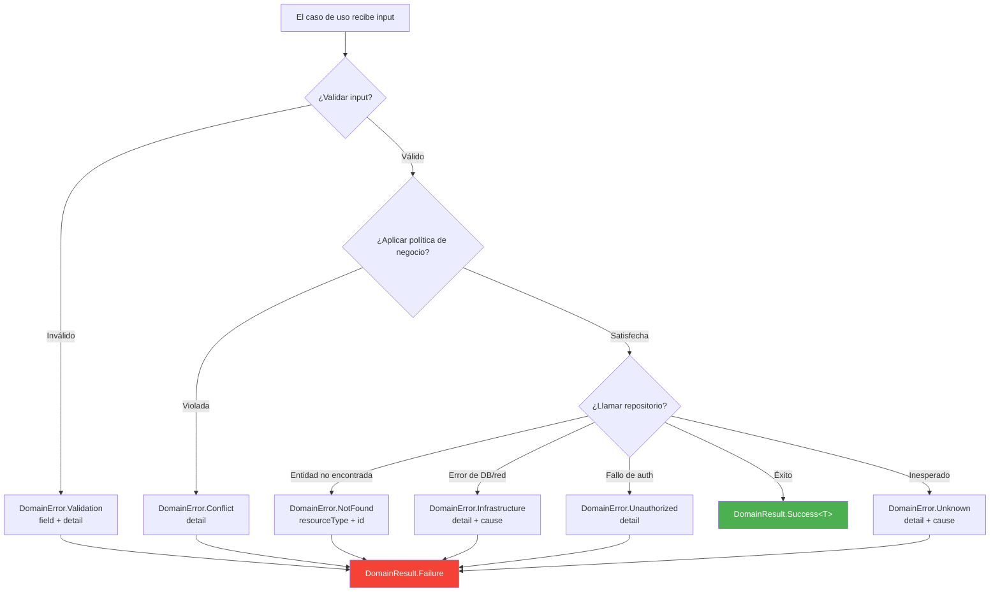

### Cuándo usar cada tipo de error

| Error | Cuándo usarlo | Ejemplo |
|---|---|---|
| `Validation` | El input falla un invariante del dominio | Formato de email inválido, título muy largo |
| `NotFound` | La entidad solicitada no existe | Usuario con ID "xyz" no está en la base de datos |
| `Unauthorized` | El llamador no tiene permiso | Un no-admin intenta eliminar un usuario |
| `Conflict` | La operación conflictúa con el estado actual | Email duplicado, transición de estado inválida |
| `Infrastructure` | Una dependencia externa falló | Timeout de base de datos, error de red |
| `Unknown` | Condición inesperada (debería ser raro) | Fallback para errores no clasificados |

---

## Estrategia de Testing

### Árbol de decisión de test doubles

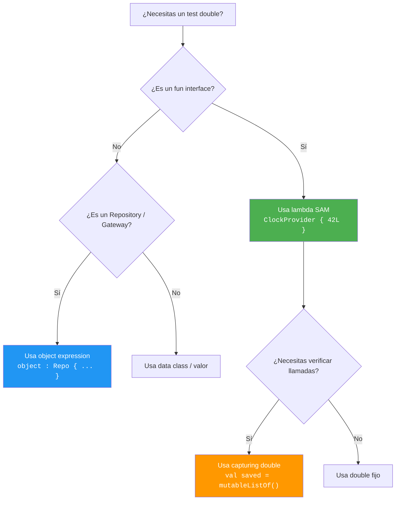

### Helpers de test disponibles

Importar desde `com.domain.core.testing.TestDoubles` (solo en `commonTest`):

| Helper | Descripción |
|---|---|
| `testDeps` | `DomainDependencies` con clock fijo + ID fijo |
| `fixedClock` / `clockAt(ms)` | `ClockProvider` determinista |
| `fixedId` / `idOf(s)` | `IdProvider` determinista |
| `sequentialIds(prefix)` | `IdProvider` que retorna "prefix-1", "prefix-2", … |
| `advancingClock(start, step)` | `ClockProvider` que avanza por step en cada llamada |
| `validationError(field, detail)` | Builder rápido de `DomainError.Validation` |
| `notFoundError(type, id)` | Builder rápido de `DomainError.NotFound` |
| `shouldBeSuccess()` | Extrae el valor o lanza un `AssertionError` descriptivo |
| `shouldBeFailure()` | Extrae el error o lanza un `AssertionError` descriptivo |
| `shouldFailWith<E>()` | Extrae y castea al subtipo de error esperado |

Consulta [TESTING.md](TESTING.md) para la guía completa de testing, convenciones
de nombres y anti-patrones.

---

## Versionado

Este SDK sigue [Versionado Semántico](https://semver.org/lang/es/):

| Tipo de cambio | Bump de versión | Impacto al consumidor |
|---|---|---|
| Corrección de bug, actualización de docs | **PATCH** | Seguro de actualizar |
| Nuevos contratos añadidos | **MINOR** | Seguro de actualizar |
| Cambios breaking en la API `public` | **MAJOR** | Se esperan errores de compilación |

Consulta [ARCHITECTURE.md](ARCHITECTURE.md) para principios de diseño e
[INTEGRATION.md](INTEGRATION.md) para reglas de frontera con la capa de datos.

---

## Licencia

Apache License 2.0 — ver [LICENSE](LICENSE).

---

<details>
<summary><h2 id="english-version">🇺🇸 English Version</h2></summary>

A **pure domain layer SDK** for Kotlin Multiplatform. Zero framework dependencies.
Zero infrastructure. Zero UI. Just typed contracts, functional error handling,
and Clean Architecture enforced at the compiler level.

```
Targets: JVM · Android · iOS (arm64, x64, simulator)
Language: Kotlin 2.1.20 · KMP
Dependencies: kotlinx-coroutines-core 1.10.1 (only)
```

---

## Installation

### Kotlin DSL (build.gradle.kts)

```kotlin
dependencies {
    implementation("io.github.dancrrdz93:coredomainplatform:1.0.2")
}
```

### Groovy DSL (build.gradle)

```groovy
dependencies {
    implementation 'io.github.dancrrdz93:coredomainplatform:1.0.2'
}
```

### Version Catalog (libs.versions.toml)

```toml
[versions]
coreDomainPlatform = "1.0.2"

[libraries]
core-domain-platform = { group = "io.github.dancrrdz93", name = "coredomainplatform", version.ref = "coreDomainPlatform" }
```

```kotlin
// build.gradle.kts
dependencies {
    implementation(libs.core.domain.platform)
}
```

---

## Why this SDK?

| Advantage | Detail |
|---|---|
| **Pure domain** | Your business logic does not depend on Room, Retrofit, Ktor, CoreData, SwiftUI or Compose. If you swap databases tomorrow, the domain doesn't know or care. |
| **No exceptions** | All contracts return `DomainResult<T>`. Errors are explicit, typed values — never silently propagating exceptions. |
| **Testable without mocking** | All contracts are `fun interface`. In tests, create stubs with a one-line lambda. Zero Mockito, zero MockK. |
| **Deterministic** | Time (`ClockProvider`) and ID generation (`IdProvider`) are injected dependencies. In tests, pass fixed values → 100% reproducible results. |
| **Composable** | Validators chain with `andThen`. Policies compose with `and` / `or` / `negate`. Results combine with `zip`. |
| **Multiplatform** | A single domain module for Android + iOS + Desktop. Same code, same business rules. |
| **Enforced Clean Architecture** | The compiler prevents the domain from importing data or UI. Dependency direction is guaranteed at compile time. |

---

## Architecture Overview

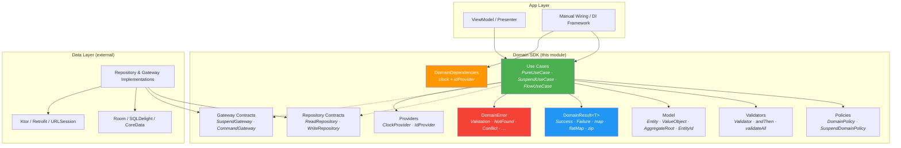

### Dependency Rule

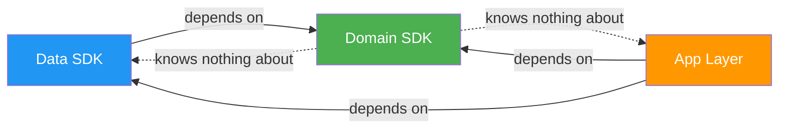

**The domain SDK defines contracts. External layers implement them.**
The domain never imports from data, UI, or any framework.

---

## Package Structure

```
com.domain.core/
├── di/            → DomainDependencies, DomainModule
├── error/         → DomainError (sealed hierarchy)
├── result/        → DomainResult<T> + operators (map, flatMap, zip, …)
├── model/         → Entity, ValueObject, AggregateRoot, EntityId
├── usecase/       → PureUseCase, SuspendUseCase, FlowUseCase, NoParams*
├── repository/    → Repository, ReadRepository, WriteRepository, ReadCollectionRepository
├── gateway/       → Gateway, SuspendGateway, CommandGateway
├── streaming/     → ConnectionState, StreamingConnection, StreamingGateway
├── validation/    → Validator<T>, andThen, validateAll, collectValidationErrors
├── policy/        → DomainPolicy, SuspendDomainPolicy, and/or/negate
└── provider/      → ClockProvider, IdProvider
```

---

## Core Components

### DomainResult


### DomainError Hierarchy


### Use Case Contracts

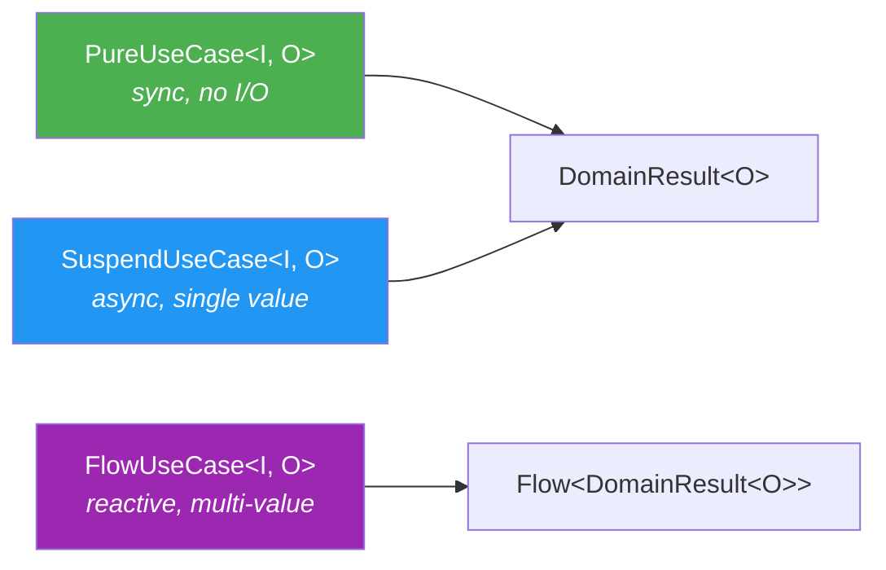

### Composition Flow

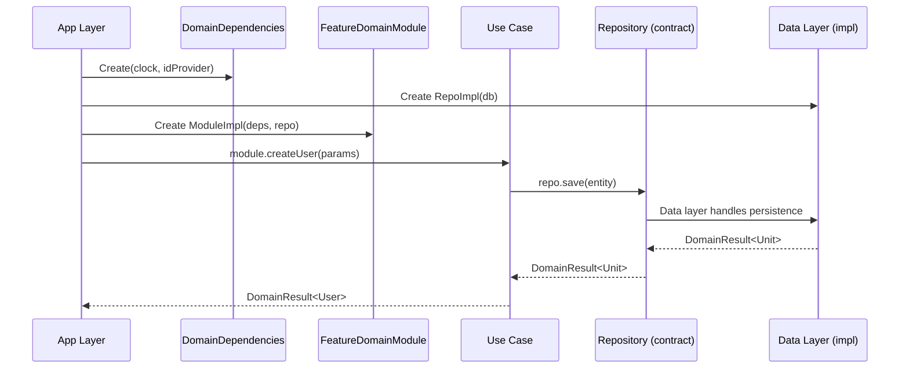

---

## DomainDependencies — The Domain Infrastructure Container

`DomainDependencies` is an immutable `data class` that groups the **only two infrastructure dependencies** the domain needs universally:

```kotlin
public data class DomainDependencies(
    val clock: ClockProvider,    // What time is it?
    val idProvider: IdProvider,  // Give me a unique ID
)
```

### The problem it solves

Every time a use case creates an entity it needs an **ID** and a **timestamp**. Without `DomainDependencies`:

```kotlin
// ❌ Impure — direct side-effects inside the domain
val task = Task(
    id = TaskId(UUID.randomUUID().toString()),   // coupled to JVM, won't compile on iOS
    createdAt = System.currentTimeMillis(),        // different result every execution
)
```

**Problems:** Not testable (every run generates different values → impossible to `assertEquals`), platform-coupled (won't compile on iOS), and not reproducible.

With `DomainDependencies`:

```kotlin
// ✅ Deterministic — the domain doesn't know where the values come from
val task = Task(
    id = TaskId(deps.idProvider.next()),
    createdAt = deps.clock.nowMillis(),
)
```

### How to configure it

**Production** — the app creates a single instance and passes it to all use cases:

```kotlin
// Android (Application.onCreate) or iOS (AppDelegate)
val domainDeps = DomainDependencies(
    clock = ClockProvider { System.currentTimeMillis() },
    idProvider = IdProvider { UUID.randomUUID().toString() },
)
```

**Tests** — fixed values, 100% reproducible results:

```kotlin
val testDeps = DomainDependencies(
    clock = ClockProvider { 1_700_000_000_000L },
    idProvider = IdProvider { "fixed-id-123" },
)

// Now you can verify with precision:
val result = createTask(CreateTaskParams("Buy milk"))
val task = result.getOrNull()!!
assertEquals("fixed-id-123", task.id.value)          // ✅ always passes
assertEquals(1_700_000_000_000L, task.createdAt)     // ✅ always passes
```

### Why group them in a single object?

If you have 20 use cases that create entities, without `DomainDependencies` you'd pass `clock` + `idProvider` as **40 individual parameters**. With the container, it's **20 parameters** (`deps`).

### What does NOT go here?

Feature repositories and gateways are injected **directly** into each use case. Only **cross-cutting** dependencies (needed by virtually all use cases) belong here:

```kotlin
class PlaceOrderUseCase(
    private val deps: DomainDependencies,          // ✅ cross-cutting: clock + id
    private val orderRepository: OrderRepository,  // ✅ feature-specific
    private val inventoryGateway: SuspendGateway<...>,
) : SuspendUseCase<PlaceOrderParams, Order> { ... }
```

---

## Complete Use Case Reference

The SDK provides **5 use case contracts**. All are `fun interface` (SAM), allowing
implementation as lambdas or classes:

| Contract | Signature | When to use |
|---|---|---|
| `PureUseCase<I, O>` | `(I) → DomainResult<O>` | Synchronous, pure logic. No I/O. Safe from main thread |
| `SuspendUseCase<I, O>` | `suspend (I) → DomainResult<O>` | Async single-result operations (create, update, fetch) |
| `FlowUseCase<I, O>` | `(I) → Flow<DomainResult<O>>` | Observe changes over time (reactive streams) |
| `NoParamsUseCase<O>` | `suspend () → DomainResult<O>` | No-params variant of `SuspendUseCase` |
| `NoParamsFlowUseCase<O>` | `() → Flow<DomainResult<O>>` | No-params variant of `FlowUseCase` |

> All return `DomainResult<T>`. They never throw exceptions to the consumer.

### 1. PureUseCase — Synchronous, pure logic

For calculations, transformations, business rules that **don't touch network or disk**.
Safe from any thread, including the main thread.

**Real-world scenario:** A bank needs to evaluate whether a client qualifies for a
personal loan. Rules depend on monthly income, debt-to-income ratio, and credit score.
No I/O — pure business rules.

```kotlin
data class LoanEligibilityParams(
    val monthlyIncome: Double,
    val currentDebtPercent: Double,
    val creditScore: Int,
    val requestedAmount: Double,
)

data class LoanEligibilityResult(
    val approved: Boolean,
    val maxApprovedAmount: Double,
    val interestRate: Double,
    val reason: String,
)

class EvaluateLoanEligibility : PureUseCase<LoanEligibilityParams, LoanEligibilityResult> {

    override fun invoke(params: LoanEligibilityParams): DomainResult<LoanEligibilityResult> {
        if (params.monthlyIncome <= 0)
            return domainFailure(DomainError.Validation("monthlyIncome", "must be positive"))
        if (params.creditScore !in 300..850)
            return domainFailure(DomainError.Validation("creditScore", "must be between 300 and 850"))

        // Rule 1: Deny if debt exceeds 40%
        if (params.currentDebtPercent > 40.0) {
            return LoanEligibilityResult(
                approved = false, maxApprovedAmount = 0.0, interestRate = 0.0,
                reason = "Current debt exceeds 40%",
            ).asSuccess()
        }

        // Rule 2: Interest rate based on credit score
        val interestRate = when {
            params.creditScore >= 750 -> 8.5
            params.creditScore >= 650 -> 12.0
            params.creditScore >= 550 -> 18.5
            else -> return LoanEligibilityResult(
                approved = false, maxApprovedAmount = 0.0, interestRate = 0.0,
                reason = "Insufficient credit score (minimum 550)",
            ).asSuccess()
        }

        // Rule 3: Max amount = 5x monthly income
        val maxAmount = params.monthlyIncome * 5
        val approved = params.requestedAmount <= maxAmount

        return LoanEligibilityResult(
            approved = approved, maxApprovedAmount = maxAmount, interestRate = interestRate,
            reason = if (approved) "Approved" else "Requested amount exceeds maximum allowed",
        ).asSuccess()
    }
}

// Usage — synchronous, safe from main thread:
val result = evaluateLoanEligibility(
    LoanEligibilityParams(monthlyIncome = 45_000.0, currentDebtPercent = 25.0, creditScore = 720, requestedAmount = 150_000.0)
)
// → Success(LoanEligibilityResult(approved=true, maxApprovedAmount=225000.0, interestRate=12.0, ...))
```

### 2. SuspendUseCase — Async single-result

For operations requiring I/O (persist, query, call API) that produce **one value**.

**Real-world scenario:** An e-commerce app needs to place an order. The use case validates
the cart, checks inventory, calculates taxes, and persists the order — all in one logical
transaction.

```kotlin
data class PlaceOrderParams(
    val cartId: CartId,
    val shippingAddressId: AddressId,
    val paymentMethodId: PaymentMethodId,
)

class PlaceOrderUseCase(
    private val deps: DomainDependencies,
    private val cartRepository: CartRepository,
    private val inventoryGateway: SuspendGateway<List<CartItem>, InventoryCheckResult>,
    private val orderRepository: OrderRepository,
    private val taxCalculator: PureUseCase<TaxParams, TaxResult>,
) : SuspendUseCase<PlaceOrderParams, Order> {

    override suspend fun invoke(params: PlaceOrderParams): DomainResult<Order> {
        // 1. Fetch cart
        val cart = cartRepository.findById(params.cartId).getOrElse { return domainFailure(it) }
            ?: return domainFailure(DomainError.NotFound("Cart", params.cartId.value))

        if (cart.items.isEmpty())
            return domainFailure(DomainError.Validation("cart", "Cart is empty"))

        // 2. Check inventory
        val inventoryCheck = inventoryGateway.execute(cart.items).getOrElse { return domainFailure(it) }
        if (!inventoryCheck.allAvailable)
            return domainFailure(DomainError.Conflict(
                detail = "Out of stock: ${inventoryCheck.unavailableItems.joinToString { it.name }}"
            ))

        // 3. Calculate tax (pure logic — PureUseCase)
        val tax = taxCalculator(TaxParams(cart.subtotal, cart.shippingState))
            .getOrElse { return domainFailure(it) }

        // 4. Build order
        val order = Order(
            id = OrderId(deps.idProvider.next()),
            items = cart.items,
            subtotal = cart.subtotal,
            tax = tax.amount,
            total = cart.subtotal + tax.amount,
            status = OrderStatus.CONFIRMED,
            createdAt = deps.clock.nowMillis(),
        )

        // 5. Persist
        return orderRepository.save(order).map { order }
    }
}

// Usage:
viewModelScope.launch {
    placeOrder(PlaceOrderParams(cartId, addressId, paymentId))
        .onSuccess { order -> navigateToConfirmation(order.id) }
        .onFailure { error ->
            when (error) {
                is DomainError.Conflict -> showOutOfStockDialog(error.detail)
                is DomainError.Validation -> showCartError(error.detail)
                else -> showGenericError(error.message)
            }
        }
}
```

### 3. FlowUseCase — Observe data over time

For reactive streams: self-updating data, real-time notifications, state changes.
Each emission can be success or failure individually without cancelling the stream.

**Real-world scenario:** A logistics dashboard where an operator observes shipments
filtered by status (pending, in transit, delivered). Whenever a shipment changes
status, the list updates automatically.

```kotlin
data class ShipmentFilterParams(
    val status: ShipmentStatus,
    val warehouseId: WarehouseId,
)

class ObserveShipmentsByStatus(
    private val shipmentRepository: ShipmentRepository,
) : FlowUseCase<ShipmentFilterParams, List<Shipment>> {

    override fun invoke(params: ShipmentFilterParams): Flow<DomainResult<List<Shipment>>> {
        return shipmentRepository
            .observeByWarehouseAndStatus(params.warehouseId, params.status)
    }
}

// Usage — in the ViewModel:
init {
    viewModelScope.launch {
        observeShipmentsByStatus(
            ShipmentFilterParams(status = ShipmentStatus.IN_TRANSIT, warehouseId = currentWarehouseId)
        ).collect { result ->
            result
                .onSuccess { shipments ->
                    _uiState.value = DashboardState.Loaded(shipments = shipments, count = shipments.size)
                }
                .onFailure { error -> _uiState.value = DashboardState.Error(error.message) }
        }
    }
}
```

### 4. NoParamsUseCase — Async without parameters

Same as `SuspendUseCase` but when **no parameters are needed**. Avoids passing `Unit`.

**Real-world scenario:** A healthcare app needs to log the user out. This involves
invalidating the token on the server, clearing the local cache, and recording an
audit event. No parameters needed — the active session determines everything.

```kotlin
class LogoutUseCase(
    private val sessionGateway: CommandGateway<LogoutCommand>,
    private val localCacheGateway: CommandGateway<ClearCacheCommand>,
    private val auditRepository: WriteRepository<AuditEvent>,
    private val deps: DomainDependencies,
) : NoParamsUseCase<Unit> {

    override suspend fun invoke(): DomainResult<Unit> {
        // 1. Invalidate token on the server
        sessionGateway.dispatch(LogoutCommand).getOrElse { return domainFailure(it) }

        // 2. Clear sensitive local data
        localCacheGateway.dispatch(ClearCacheCommand).getOrElse { return domainFailure(it) }

        // 3. Record audit event
        val event = AuditEvent(
            id = AuditEventId(deps.idProvider.next()),
            type = "LOGOUT",
            timestamp = deps.clock.nowMillis(),
        )
        return auditRepository.save(event)
    }
}

// Usage — no parameters:
viewModelScope.launch {
    logout()
        .onSuccess { navigateToLogin() }
        .onFailure { error -> showError("Could not log out: ${error.message}") }
}
```

### 5. NoParamsFlowUseCase — Reactive stream without parameters

Ideal for observing global data that requires no filter.

**Real-world scenario:** A fintech app needs to display the user's investment portfolio
total value updated in real time. The value changes as asset prices fluctuate. No
parameters needed — the authenticated user determines which portfolio to observe.

```kotlin
class ObservePortfolioValue(
    private val portfolioRepository: PortfolioRepository,
) : NoParamsFlowUseCase<PortfolioSummary> {

    override fun invoke(): Flow<DomainResult<PortfolioSummary>> {
        return portfolioRepository.observeCurrentUserPortfolio()
        // Emits every time a price changes or a transaction is executed
    }
}

data class PortfolioSummary(
    val totalValue: Double,
    val dailyChange: Double,
    val dailyChangePercent: Double,
    val holdings: List<Holding>,
)

// Usage — in the home screen ViewModel:
init {
    viewModelScope.launch {
        observePortfolioValue()
            .collect { result ->
                result
                    .onSuccess { summary ->
                        _uiState.value = HomeState.Loaded(
                            totalValue = summary.totalValue,
                            changePercent = summary.dailyChangePercent,
                            isPositive = summary.dailyChange >= 0,
                        )
                    }
                    .onFailure { error -> _uiState.value = HomeState.Error(error.message) }
            }
    }
}
```

### Decision diagram

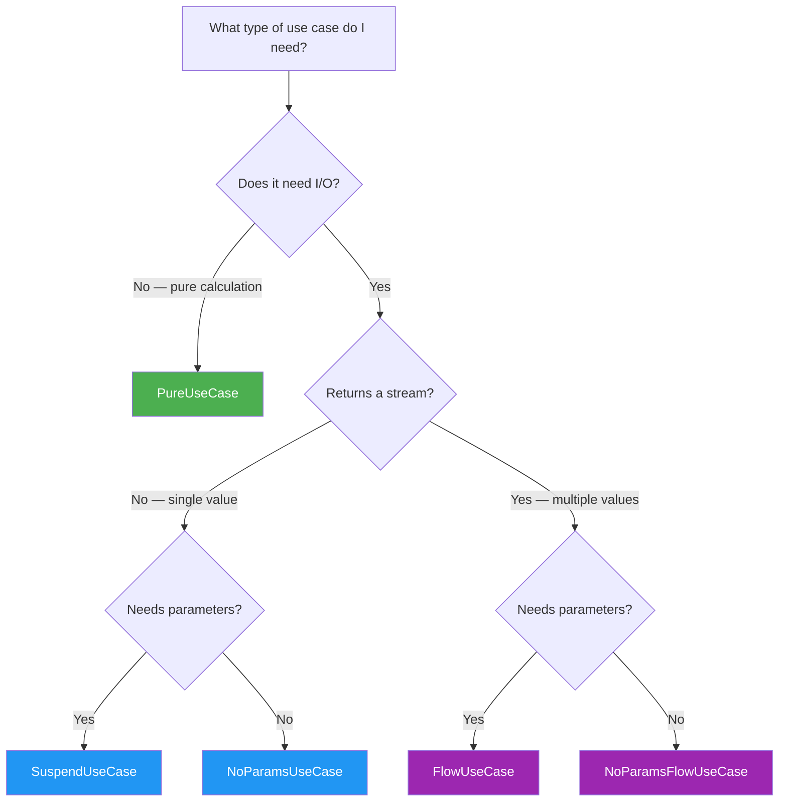

---

## Integration with Core Data Platform

The **Core Domain Platform** (this SDK) defines domain contracts. The **[Core Data Platform](https://github.com/DanCrRdz93/core-data-platform)** implements remote data access (HTTP, security, sessions). Both are KMP and **100% version-aligned**:

| | Domain SDK | Data SDK |
|---|---|---|
| Kotlin | 2.1.20 | 2.1.20 |
| Coroutines | 1.10.1 | 1.10.1 |
| Gradle | 9.3.1 | 9.3.1 |

### Full Architecture

```
┌─────────────────────────────────────────────────────────────────────────┐
│                          YOUR APP (Android/iOS)                         │
│                                                                         │
│  ┌──────────┐  ┌──────────┐  ┌──────────┐                              │
│  │Feature A │  │Feature B │  │Feature C │  ← ViewModels                 │
│  └────┬─────┘  └────┬─────┘  └────┬─────┘                              │
│       │              │              │                                    │
│  ┌────▼──────────────▼──────────────▼────────────────┐                  │
│  │     Domain Use Cases (this SDK)                   │                  │
│  │  PureUseCase · SuspendUseCase · FlowUseCase       │                  │
│  │  (generates operationId, decides retryOverride)    │                  │
│  └────┬──────────────┬──────────────┬────────────────┘                  │
│       │              │              │                                    │
│  ┌────▼──────────────▼──────────────▼────────────────┐                  │
│  │   Repository / Gateway Implementations            │  ← YOU WRITE     │
│  │   (bridge between both SDKs)                      │    THESE         │
│  │   Propagates: RequestContext, ResultMetadata       │                  │
│  └────┬──────────────┬──────────┬────────────────────┘                  │
│       │              │          │                                        │
│  ┌────▼────┐  ┌──────▼────┐  ┌─▼───────────────────────────────────┐   │
│  │network  │  │ network   │  │  security-core                      │   │
│  │ -core   │  │  -ktor    │  │  SessionController · CredentialProv │   │
│  │         │  │           │  │  SecretStore · TrustPolicy          │   │
│  └─────────┘  └───────────┘  └─────────────────────────────────────┘   │
│                 ↑ Data SDK                                              │
│  Observability: LoggingObserver · MetricsObserver · TracingObserver     │
└─────────────────────────────────────────────────────────────────────────┘
```

### 1. Error mapping: `NetworkError` → `DomainError`

#### The problem

When an HTTP request fails, the Data SDK returns `NetworkResult.Failure` with a `NetworkError`
(10 subtypes: `Connectivity`, `Timeout`, `Cancelled`, `Authentication`, `Authorization`,
`ClientError`, `ServerError`, `Serialization`, `ResponseValidation`, `Unknown`).

The domain must not know about `NetworkError`. It only understands `DomainError` (7 subtypes).
You need a **bridge function** that translates each `NetworkError` to the correct `DomainError`.

#### Important technical detail

`NetworkError` is **not** a `Throwable`. Internally it has `diagnostic: Diagnostic?` where
`Diagnostic.cause: Throwable?` holds the original exception. The mapping must extract
`diagnostic?.cause` to pass it to `DomainError.Infrastructure.cause`:

```
NetworkError.Connectivity
    ├── message: "No connection"           → goes to DomainError detail
    ├── diagnostic: Diagnostic?
    │       ├── description: "DNS failed"  → dev-only info (doesn't reach domain)
    │       └── cause: Throwable?          → GOES to DomainError.Infrastructure.cause
    └── isRetryable: true                  → infra info (doesn't reach domain)
```

#### Step-by-step flow

```
1. DataSource makes an HTTP request
        │
        ▼
2. Request fails → NetworkResult.Failure(NetworkError.Connectivity(...))
        │
        ▼
3. Repository (bridge) calls: error.toDomainError()
   │
   │  NetworkError.Connectivity → DomainError.Infrastructure
   │  NetworkError.Timeout      → DomainError.Infrastructure
   │  NetworkError.Cancelled    → DomainError.Cancelled        ← NOT Infrastructure!
   │  NetworkError.Authentication → DomainError.Unauthorized
   │  NetworkError.ClientError(404) → DomainError.NotFound
   │  NetworkError.ClientError(409) → DomainError.Conflict
   │  NetworkError.ClientError(422) → DomainError.Validation
   │  NetworkError.ServerError  → DomainError.Infrastructure
   │  NetworkError.Unknown      → DomainError.Unknown
        │
        ▼
4. Use case receives DomainResult.Failure(DomainError.Infrastructure("No connection"))
   │  Never saw NetworkError — only DomainError
        │
        ▼
5. ViewModel does exhaustive `when(error)` over DomainError
   │  Shows appropriate message to the user
```

#### Implementation

```kotlin
// Extension living in your data layer (NOT in either SDK)
fun NetworkError.toDomainError(): DomainError = when (this) {
    // ── Transport ──
    is NetworkError.Connectivity -> DomainError.Infrastructure(
        detail = "No internet connection",
        cause = diagnostic?.cause,     // ← Throwable? from Data SDK, NOT `this`
    )
    is NetworkError.Timeout -> DomainError.Infrastructure(
        detail = "Request timed out",
        cause = diagnostic?.cause,
    )
    is NetworkError.Cancelled -> DomainError.Cancelled(
        detail = "Request cancelled",  // ← Intentional, not infra failure
    )

    // ── HTTP semantic ──
    is NetworkError.Authentication -> DomainError.Unauthorized("Authentication required")
    is NetworkError.Authorization  -> DomainError.Unauthorized("Access denied")
    is NetworkError.ClientError -> when (statusCode) {
        404  -> DomainError.NotFound("Resource", diagnostic?.description ?: "")
        409  -> DomainError.Conflict(message)
        422  -> DomainError.Validation("request", diagnostic?.description ?: message)
        else -> DomainError.Infrastructure("HTTP error $statusCode", diagnostic?.cause)
    }
    is NetworkError.ServerError -> DomainError.Infrastructure(
        detail = "Server error ($statusCode)",
        cause = diagnostic?.cause,
    )

    // ── Data processing ──
    is NetworkError.Serialization -> DomainError.Infrastructure(
        detail = "Failed to process response",
        cause = diagnostic?.cause,
    )
    is NetworkError.ResponseValidation -> DomainError.Infrastructure(
        detail = reason,
        cause = diagnostic?.cause,
    )

    // ── Catch-all ──
    is NetworkError.Unknown -> DomainError.Unknown(
        detail = message,
        cause = diagnostic?.cause,
    )
}
```

#### Why `Cancelled` is not `Infrastructure`

A cancellation is **intentional** (user navigated away, coroutine scope was cancelled).
If you map it as `Infrastructure`, the ViewModel's `when` can't distinguish it from a
server crash:

```kotlin
// ❌ Without DomainError.Cancelled — both are Infrastructure
when (error) {
    is DomainError.Infrastructure -> showErrorDialog(error.message)
    // "Request cancelled" shows an unnecessary error dialog
}

// ✅ With DomainError.Cancelled — ViewModel decides correctly
when (error) {
    is DomainError.Cancelled -> { /* no-op, user already left */ }
    is DomainError.Infrastructure -> showErrorDialog(error.message)
}
```

### 2. Repository implementation (the bridge)

#### The problem

The use case `GetUserUseCase` needs a `ReadRepository<UserId, User>` — a pure domain contract.
But the data comes from an HTTP API via the Data SDK, which returns `NetworkResult<UserDto>`.

You need a **bridge class** that:
1. Receives a domain call (`findById(UserId)`)
2. Translates it to an infrastructure call (`dataSource.getUser(id.value)`)
3. Converts the result: `UserDto` → `User` (with a `Mapper`) and `NetworkError` → `DomainError`

#### Step-by-step flow

```
1. GetUserUseCase calls: userRepo.findById(UserId("abc-123"))
        │
        ▼
2. UserRepositoryImpl.findById(UserId("abc-123"))
   │  Extracts raw value: id.value → "abc-123"
   │  Calls Data SDK: dataSource.getUser("abc-123")
        │
        ▼
3. Data SDK executes HTTP request (GET /users/abc-123)
   │  Returns: NetworkResult<UserDto>
        │
        ├── Success: NetworkResult.Success(UserDto(id="abc-123", name="Ana", email="..."))
        │       │
        │       ▼
        │   mapper.map(dto) → User(id=UserId("abc-123"), name="Ana", email="...")
        │   Returns: DomainResult.Success(User(...))
        │
        └── Failure: NetworkResult.Failure(NetworkError.Connectivity(...))
                │
                ▼
            error.toDomainError() → DomainError.Infrastructure("No connection")
            Returns: DomainResult.Failure(DomainError.Infrastructure(...))
        │
        ▼
4. GetUserUseCase receives DomainResult<User?>
   │  Never saw UserDto, NetworkResult, or NetworkError
```

#### What each piece does

- **`ReadRepository<UserId, User>`** — Domain SDK contract, defines `findById`
- **`UserRemoteDataSource`** — Data SDK, executes HTTP and returns `NetworkResult<UserDto>`
- **`Mapper<UserDto, User>`** — Domain SDK, transforms DTOs to pure domain models
- **`networkResult.fold`** — Data SDK, exhaustive success/failure handling (equivalent to `DomainResult.fold`)

#### Implementation

```kotlin
class UserRepositoryImpl(
    private val dataSource: UserRemoteDataSource,      // ← Data SDK
    private val mapper: Mapper<UserDto, User>,          // ← Domain SDK contract
) : ReadRepository<UserId, User> {                      // ← Domain SDK contract

    override suspend fun findById(id: UserId): DomainResult<User?> {
        val networkResult = dataSource.getUser(id.value)  // NetworkResult<UserDto>
        return networkResult.fold(
            onSuccess = { dto -> mapper.map(dto).asSuccess() },   // UserDto → User
            onFailure = { error -> domainFailure(error.toDomainError()) }, // NetworkError → DomainError
        )
    }
}
```

#### Where does this class live?

```
your-app/
├── domain/          ← Defines interfaces (ReadRepository, Mapper)
├── data/            ← ★ UserRepositoryImpl lives HERE ★
│   ├── dto/         ← UserDto (@Serializable)
│   ├── mapper/      ← UserDtoMapper : Mapper<UserDto, User>
│   └── repository/  ← UserRepositoryImpl : ReadRepository<UserId, User>
└── di/              ← Wiring: connects implementation to contract
```

The domain **never** imports Data SDK classes. Only the `data/` module (which you write)
knows about both SDKs.

### 3. `ResponseMetadata` propagation to the domain

#### The problem

When an HTTP request succeeds, the Data SDK returns `NetworkResult.Success<T>` that in addition
to the data (`T`) carries **transport metadata**:

```
NetworkResult.Success<UserDto>
    ├── data: UserDto                        ← the data the domain needs
    └── metadata: ResponseMetadata
            ├── statusCode: 200
            ├── headers: Map<String, List<String>>
            ├── durationMs: 342              ← how long did it take?
            ├── requestId: "req-abc-123"     ← which request was it?
            └── attemptCount: 2              ← how many retries happened?
```

Most use cases don't need this metadata — `findById` returns the model and that's it.
But there are scenarios where **it matters**:

- **Support**: user reports an error → ViewModel shows the `requestId` so support can trace the request in server logs
- **Observability**: you want to measure perceived latency (`durationMs`) from the ViewModel
- **Debugging**: you want to know if the data came from the first attempt or a retry (`attemptCount`)

#### Step-by-step flow

```
1. ViewModel calls: userRepo.findByIdWithMeta(userId)
        │
        ▼
2. UserRepositoryWithMeta.findByIdWithMeta(UserId("abc-123"))
   │  Calls: dataSource.getUser("abc-123")
        │
        ▼
3. Data SDK executes HTTP → returns NetworkResult.Success(dto, metadata)
   │  metadata = ResponseMetadata(statusCode=200, durationMs=342, requestId="req-abc-123", attemptCount=2)
        │
        ▼
4. Repository converts BOTH:
   │  dto → User (with mapper)
   │  metadata → ResultMetadata (with toDomainMeta())
   │
   │  Returns: DomainResultWithMeta(
   │      result = DomainResult.Success(User(...)),
   │      metadata = ResultMetadata(requestId="req-abc-123", durationMs=342, attemptCount=2)
   │  )
        │
        ▼
5. ViewModel receives DomainResultWithMeta<User?>
   │  val (result, meta) = userRepo.findByIdWithMeta(userId)
   │  result.fold(onSuccess = { showUser(it) }, onFailure = { showError(it, meta.requestId) })
```

#### What each piece does

- **`ResponseMetadata`** (Data SDK) — raw HTTP metadata (statusCode, headers, durationMs, requestId, attemptCount)
- **`ResultMetadata`** (Domain SDK) — transport-agnostic domain metadata (requestId, durationMs, attemptCount, extra)
- **`DomainResultWithMeta<T>`** (Domain SDK) — wrapper combining `DomainResult<T>` + `ResultMetadata`
- **`toDomainMeta()`** — bridge extension converting `ResponseMetadata` → `ResultMetadata`

#### Implementation

```kotlin
class UserRepositoryWithMeta(
    private val dataSource: UserRemoteDataSource,
    private val mapper: Mapper<UserDto, User>,
) : ReadRepository<UserId, User> {

    // Returns DomainResultWithMeta so the ViewModel can access metadata
    suspend fun findByIdWithMeta(id: UserId): DomainResultWithMeta<User?> {
        val networkResult = dataSource.getUser(id.value)
        return when (networkResult) {
            is NetworkResult.Success -> DomainResultWithMeta(
                result = mapper.map(networkResult.data).asSuccess(),
                metadata = networkResult.metadata.toDomainMeta(),
            )
            is NetworkResult.Failure -> DomainResultWithMeta(
                result = domainFailure(networkResult.error.toDomainError()),
                // On failure you can also propagate metadata if available
            )
        }
    }

    // Standard contract (no metadata) remains available
    override suspend fun findById(id: UserId): DomainResult<User?> =
        findByIdWithMeta(id).result
}

// Extension in your data layer — converts HTTP metadata → domain metadata
fun ResponseMetadata.toDomainMeta(): ResultMetadata = ResultMetadata(
    requestId = requestId,
    durationMs = durationMs,
    attemptCount = attemptCount,
    extra = buildMap {
        headers["X-RateLimit-Remaining"]?.firstOrNull()?.let { put("rateLimitRemaining", it) }
        headers["ETag"]?.firstOrNull()?.let { put("etag", it) }
    },
)
```

#### Usage in the ViewModel

```kotlin
val (result, meta) = userRepo.findByIdWithMeta(userId)
result.fold(
    onSuccess = { user -> showUser(user) },
    onFailure = { error ->
        showError(error.message)
        // User can report the requestId to support
        analytics.logError(requestId = meta.requestId, duration = meta.durationMs)
    },
)
```

> **Note:** `findByIdWithMeta` is an **additional** method, it doesn't replace `findById`.
> If the use case doesn't need metadata, use `findById` directly and avoid the cost of
> creating `DomainResultWithMeta`.

### 4. `RequestContext` — domain → HTTP correlation

#### The problem

Your app has 20 use cases, each generating HTTP requests. In the Datadog dashboard (or any
observability tool) you see thousands of requests to `/api/orders`, `/api/inventory`, etc.
But **you can't tell which use case generated each request**.

The Data SDK supports `RequestContext` — an object that travels with each HTTP request:

```
RequestContext
    ├── operationId: "place-order"        ← use case name
    ├── tags: {"orderId": "abc-123"}      ← business context
    ├── parentSpanId: "span-xyz"          ← distributed tracing correlation
    ├── retryPolicyOverride: RetryPolicy? ← retry override (see Gap 5)
    └── requiresAuth: true                ← needs credentials?
```

The `operationId` and `tags` arrive as HTTP headers on the server. In Datadog you can filter:
`operation_id=place-order AND orderId=abc-123` → you see exactly that order's trace.

#### Step-by-step flow

```
1. PlaceOrderUseCase.invoke(input)
   │  Generates: operationId = "place-order"
   │  Calls: orderRepo.placeOrder(order, operationId = "place-order")
        │
        ▼
2. OrderRepositoryImpl.placeOrder(order, "place-order")
   │  Creates RequestContext:
   │    operationId = "place-order"        ← from the use case
   │    tags = {"orderId": "abc-123"}      ← from the domain model
   │    requiresAuth = true
   │
   │  Calls: dataSource.createOrder(orderDto, context)
        │
        ▼
3. Data SDK executes HTTP with the context:
   │  POST /api/orders
   │  Headers:
   │    X-Operation-Id: place-order
   │    X-Tags: orderId=abc-123
   │    Authorization: Bearer <token>
        │
        ▼
4. In Datadog / Grafana / your APM:
   │  Filter by: operation_id=place-order
   │  See: latency, status code, retries, errors
   │  Correlate: "this 342ms request was for order abc-123 from use case place-order"
```

#### What each piece does

- **`operationId`** — the use case knows its own name ("place-order", "get-user-profile", etc.). The repository doesn't invent names, it only propagates
- **`tags`** — business context added by the use case or repository (orderId, userId, etc.)
- **`requiresAuth`** — tells the Data SDK to inject the Bearer token via `CredentialProvider`

#### Implementation

```kotlin
// ── Contract in your domain layer (repository interface) ──
interface OrderRepository : WriteRepository<Order> {
    suspend fun placeOrder(order: Order, operationId: String): DomainResult<Unit>
}

// ── Implementation in your data layer (bridge) ──
class OrderRepositoryImpl(
    private val dataSource: OrderRemoteDataSource,
) : OrderRepository {

    override suspend fun placeOrder(order: Order, operationId: String): DomainResult<Unit> {
        val context = RequestContext(
            operationId = operationId,              // ← From the use case
            tags = mapOf("orderId" to order.id),    // ← Business context
            requiresAuth = true,
        )
        val result = dataSource.createOrder(order.toDto(), context)
        return result.fold(
            onSuccess = { Unit.asSuccess() },
            onFailure = { error -> domainFailure(error.toDomainError()) },
        )
    }

    // Standard save/delete for WriteRepository
    override suspend fun save(entity: Order) = placeOrder(entity, "save-order")
    override suspend fun delete(entity: Order): DomainResult<Unit> { /* ... */ }
}

// ── Use case generates the operationId ──
class PlaceOrderUseCase(
    private val orderRepo: OrderRepository,
    private val deps: DomainDependencies,
) : SuspendUseCase<PlaceOrderInput, Unit> {

    override suspend fun invoke(input: PlaceOrderInput): DomainResult<Unit> {
        val order = Order(id = deps.idProvider.generate(), /* ... */)
        return orderRepo.placeOrder(order, operationId = "place-order")
    }
}
```

#### Why does operationId come from the use case, not the repository?

Because the **same repository** can be called from **different use cases**:

```kotlin
// Same OrderRepository, different operationIds
class PlaceOrderUseCase(...)   { orderRepo.placeOrder(order, "place-order") }
class ReorderUseCase(...)      { orderRepo.placeOrder(order, "reorder") }
class AdminCreateOrder(...)    { orderRepo.placeOrder(order, "admin-create-order") }
```

If the operationId lived in the repository, all requests would look the same in Datadog.

### 5. `RetryPolicy` override from the domain

#### The problem

The Data SDK automatically retries failed requests (configured in `NetworkConfig.retryPolicy`,
e.g. `ExponentialBackoff(maxRetries = 3)`). This is useful for most operations: if a GET fails
due to timeout, retrying is safe.

**But a payment must NOT be retried.** Example:

```
1. User taps "Pay $500"
2. POST /payments → server processes the payment ✅
3. The RESPONSE is lost (network timeout)
4. Data SDK sees "timeout" → retries automatically
5. POST /payments → server processes ANOTHER payment ✅
6. Result: user was charged $1,000 💀
```

The domain (the use case) knows which operations are **idempotent** (safe to retry)
and which are not. The infrastructure only sees "request failed, retry".

#### Step-by-step flow

```
1. ProcessPaymentUseCase.invoke(payment)
   │  The USE CASE knows: "payments = no retry"
   │  Calls: paymentRepo.processPayment(payment, allowRetry = false)
        │
        ▼
2. PaymentRepositoryImpl.processPayment(payment, allowRetry = false)
   │  The BRIDGE translates the domain decision to infrastructure:
   │
   │  allowRetry = false  →  retryPolicyOverride = RetryPolicy.None
   │  allowRetry = true   →  retryPolicyOverride = null (use config default)
   │
   │  Creates RequestContext:
   │    operationId = "process-payment"
   │    retryPolicyOverride = RetryPolicy.None  ← "do NOT retry"
   │    requiresAuth = true
   │
   │  Calls: dataSource.charge(paymentDto, context)
        │
        ▼
3. Data SDK sees RetryPolicy.None in the context
   │  POST /payments → network timeout
   │  NORMALLY would retry, but the override says "NO"
   │  Returns: NetworkResult.Failure(NetworkError.Timeout(...))
        │
        ▼
4. Repository maps: NetworkError.Timeout → DomainError.Infrastructure("Request timed out")
   │  Returns: DomainResult.Failure(DomainError.Infrastructure(...))
        │
        ▼
5. ViewModel shows: "Payment failed. Would you like to try again?"
   │  The decision to retry is the USER's, not automatic
```

#### What each piece does

- **`allowRetry: Boolean`** — **business** language in the repository contract. The domain doesn't know what `RetryPolicy` is
- **`retryPolicyOverride`** — **infrastructure** language in the `RequestContext`. The bridge translates `false` → `RetryPolicy.None`
- **`null` as override** — means "use the config default" (don't override anything)

#### Implementation

```kotlin
// ── Repository contract (domain) — speaks business language ──
interface PaymentRepository : Repository {
    suspend fun processPayment(payment: Payment, allowRetry: Boolean = false): DomainResult<PaymentResult>
}

// ── Implementation (bridge) — translates business → infrastructure ──
class PaymentRepositoryImpl(
    private val dataSource: PaymentRemoteDataSource,
) : PaymentRepository {

    override suspend fun processPayment(
        payment: Payment,
        allowRetry: Boolean,
    ): DomainResult<PaymentResult> {
        val context = RequestContext(
            operationId = "process-payment",
            retryPolicyOverride = if (!allowRetry) RetryPolicy.None else null,
            requiresAuth = true,
        )
        val result = dataSource.charge(payment.toDto(), context)
        return result.fold(
            onSuccess = { dto -> PaymentResult(dto.transactionId).asSuccess() },
            onFailure = { error -> domainFailure(error.toDomainError()) },
        )
    }
}

// ── Use case — decides the business rule ──
class ProcessPaymentUseCase(
    private val paymentRepo: PaymentRepository,
) : SuspendUseCase<Payment, PaymentResult> {

    override suspend fun invoke(input: Payment): DomainResult<PaymentResult> =
        paymentRepo.processPayment(input, allowRetry = false) // ← NEVER retry payments
}
```

#### Isn't it easier to just set `RetryPolicy.None` in the payments `NetworkConfig`?

Yes, and in Gap 7 (multi-API) `paymentsConfig` is shown with `RetryPolicy.None` by default.
But this pattern is useful when:

- **The same DataSource has operations with different rules** — checking balance CAN be retried,
  paying CANNOT. Both use the same `PaymentRemoteDataSource`
- **The decision belongs to the domain** — the use case knows which operations are non-idempotent

They're complementary: `NetworkConfig` sets the default, `RequestContext.retryPolicyOverride`
overrides it per individual operation.

### 6. Full session lifecycle

#### The problem

The Data SDK has a `SessionController` that manages the authentication session:

```
SessionController (Data SDK)
    ├── startSession(credentials)    → starts session (login)
    ├── endSession()                 → closes session (voluntary logout)
    ├── invalidate()                 → forces close (401, compromised security)
    ├── refreshSession()             → renews token → RefreshOutcome (Refreshed/NotNeeded/Failed)
    ├── state: StateFlow<SessionState>  → Active / Idle / Expired
    └── events: Flow<SessionEvent>      → Started / Refreshed / Ended / Invalidated / RefreshFailed
```

The domain needs to use these operations, but **cannot depend on `SessionController` directly**
(that would couple the domain to infrastructure). You need **adapters** that wrap each operation
in a Domain SDK contract.

#### Contract mapping

| Data SDK operation | Domain SDK contract | Why? |
|---|---|---|
| `startSession(credentials)` | `CommandGateway<SessionCredentials>` | Fire-and-forget with input |
| `endSession()` | `CommandGateway<Unit>` | Fire-and-forget without input |
| `invalidate()` | `CommandGateway<Unit>` | Fire-and-forget without input |
| `refreshSession()` | `SuspendGateway<Unit, RefreshOutcome>` | Returns result (Refreshed/NotNeeded/Failed) |
| `state` (StateFlow) | `NoParamsFlowGateway<Boolean>` | Reactive stream without input |
| `events` (Flow) | `NoParamsFlowGateway<SessionEvent>` | Reactive stream without input |

#### Step-by-step flow (example: login)

```
1. LoginUseCase.invoke(LoginInput("user@mail.com", "password123"))
   │  Creates SessionCredentials from input
   │  Calls: loginGateway.dispatch(credentials)
        │
        ▼
2. LoginGateway.dispatch(credentials)
   │  Wraps the call in runDomainCatching:
   │    - If session.startSession(credentials) completes → DomainResult.Success(Unit)
   │    - If it throws → DomainResult.Failure(DomainError.Unknown(...))
        │
        ▼
3. SessionController.startSession(credentials)  ← Data SDK
   │  Validates credentials against the server
   │  Stores tokens in SecretStore (Keychain/Keystore)
   │  Emits SessionState.Active + SessionEvent.Started
        │
        ▼
4. SessionStateGateway.observe() emits: DomainResult.Success(true)
   │  ViewModel updates UI: shows main screen
```

#### Implementation

```kotlin
// ── Adapter: login ──
class LoginGateway(
    private val session: SessionController,
) : CommandGateway<SessionCredentials> {

    override suspend fun dispatch(input: SessionCredentials): DomainResult<Unit> =
        runDomainCatching { session.startSession(input) }
}

// ── Adapter: voluntary logout ──
// User taps "Sign out" — voluntary action
class LogoutGateway(
    private val session: SessionController,
) : CommandGateway<Unit> {

    override suspend fun dispatch(input: Unit): DomainResult<Unit> =
        runDomainCatching { session.endSession() }
}

// ── Adapter: force-logout ──
// Different from logout: this fires automatically when:
// - Server returns 401 (invalid token)
// - Compromised security detected
// - Admin revokes session remotely
class ForceLogoutGateway(
    private val session: SessionController,
) : CommandGateway<Unit> {

    override suspend fun dispatch(input: Unit): DomainResult<Unit> =
        runDomainCatching { session.invalidate() }
}

// ── Adapter: token refresh ──
// RefreshOutcome is a sealed from the Data SDK:
//   Refreshed  → token successfully renewed
//   NotNeeded  → token still valid, no renewal needed
//   Failed     → couldn't renew (credentials expired)
class RefreshSessionGateway(
    private val session: SessionController,
) : SuspendGateway<Unit, RefreshOutcome> {

    override suspend fun execute(input: Unit): DomainResult<RefreshOutcome> =
        runDomainCatching { session.refreshSession() }
}

// ── Adapter: session state (StateFlow → FlowGateway) ──
// Converts SessionState (Active/Idle/Expired) → Boolean (logged in / not)
class SessionStateGateway(
    private val session: SessionController,
) : NoParamsFlowGateway<Boolean> {

    override fun observe(): Flow<DomainResult<Boolean>> =
        session.state.map { state ->
            (state is SessionState.Active).asSuccess()
        }
}

// ── Adapter: session events for analytics ──
// Each event (Started, Refreshed, Ended, etc.) is emitted as DomainResult
class SessionEventsGateway(
    private val session: SessionController,
) : NoParamsFlowGateway<SessionEvent> {

    override fun observe(): Flow<DomainResult<SessionEvent>> =
        session.events.map { event -> event.asSuccess() }
}
```

#### Usage in use cases

```kotlin
// ── LogoutUseCase — chains logout + clear cache ──
class LogoutUseCase(
    private val logout: LogoutGateway,
    private val clearCache: ClearCacheGateway, // another gateway of yours
) : SuspendUseCase<Unit, Unit> {

    override suspend fun invoke(input: Unit): DomainResult<Unit> =
        logout.dispatch(Unit).flatMap { clearCache.dispatch(Unit) }
}

// ── ObserveSessionUseCase — ViewModel observes if there's an active session ──
class ObserveSessionUseCase(
    private val sessionState: SessionStateGateway,
) : NoParamsFlowUseCase<Boolean> {

    override fun invoke(): Flow<DomainResult<Boolean>> =
        sessionState.observe()
}
```

#### Why `runDomainCatching` and not `try/catch`?

`runDomainCatching` is a Domain SDK function that wraps a suspend lambda in `DomainResult`.
If the lambda throws, it returns `DomainResult.Failure(DomainError.Unknown(...))`. This
prevents Data SDK exceptions from propagating unhandled into the domain.

### 7. Multiple APIs with different configurations

#### The problem

In a real app, a single use case may need data from **multiple APIs** with completely
different requirements:

```
PlaceOrderUseCase
    ├── OrderRepository      → orders.api.example.com    (retry: 3, timeout: 10s)
    ├── InventoryGateway     → inventory.api.example.com  (retry: 2, timeout: 5s)
    └── PaymentRepository    → payments.api.example.com   (retry: NONE, timeout: 30s, TrustPolicy)
```

If you use a single `NetworkConfig` and a single executor for everything, you can't:
- Set different retry per API
- Use Certificate Pinning only for payments
- Configure timeouts based on expected API speed

#### Step-by-step flow

```
1. PlaceOrderUseCase.invoke(input)
   │  Orchestrates 3 sequential operations:
        │
        ▼
2. inventoryGateway.checkStock(productId)
   │  → inventoryExecutor → GET inventory.api.example.com/stock/xyz
   │  Config: timeout=5s, retry=FixedDelay(2, 1000ms)
   │  Why? Inventory is fast and can be retried safely
        │
        ▼ (if in stock)
3. paymentRepo.processPayment(payment, allowRetry = false)
   │  → paymentsExecutor → POST payments.api.example.com/charge
   │  Config: timeout=30s, retry=None, TrustPolicy with CertificatePin
   │  Why? Payments are slow (3D Secure), never retry, need MITM protection
        │
        ▼ (if payment succeeded)
4. orderRepo.placeOrder(order, "place-order")
   │  → ordersExecutor → POST orders.api.example.com/orders
   │  Config: timeout=10s, retry=ExponentialBackoff(3)
   │  Why? Creating order is idempotent (has orderId), can be retried
        │
        ▼
5. DomainResult.Success(OrderConfirmation(...))
```

#### What each piece does

- **`NetworkConfig`** (Data SDK) — per-API configuration: base URL, timeout, retry, headers
- **`KtorHttpEngine`** (Data SDK) — HTTP client configured with a specific `NetworkConfig`
- **`DefaultSafeRequestExecutor`** (Data SDK) — executes requests with retry, error classification, and observers
- Each API has its own `Config → Engine → Executor → DataSource → Repository`

#### Implementation

```kotlin
fun provideMultiApiDependencies(): AppDependencies {
    // ── Per-API configurations ── each with different rules
    val ordersConfig = NetworkConfig(
        baseUrl = "https://orders.api.example.com",
        connectTimeout = 10_000L,
        retryPolicy = RetryPolicy.ExponentialBackoff(maxRetries = 3),
    )
    val inventoryConfig = NetworkConfig(
        baseUrl = "https://inventory.api.example.com",
        connectTimeout = 5_000L,
        retryPolicy = RetryPolicy.FixedDelay(maxRetries = 2, delay = 1_000L),
    )
    val paymentsConfig = NetworkConfig(
        baseUrl = "https://payments.api.example.com",
        connectTimeout = 30_000L,
        retryPolicy = RetryPolicy.None, // ← Payments: NEVER retry by default
    )

    // ── Independent executors per API ──
    // Each executor has its own engine, config, and observers
    val ordersExecutor = DefaultSafeRequestExecutor(
        engine = KtorHttpEngine.create(ordersConfig),
        config = ordersConfig,
        classifier = KtorErrorClassifier(),
        observers = listOf(loggingObserver, metricsObserver),
    )
    val inventoryExecutor = DefaultSafeRequestExecutor(
        engine = KtorHttpEngine.create(inventoryConfig),
        config = inventoryConfig,
        classifier = KtorErrorClassifier(),
    )
    val paymentsExecutor = DefaultSafeRequestExecutor(
        engine = KtorHttpEngine.create(paymentsConfig, bankTrustPolicy), // ← TrustPolicy (see Gap 9)
        config = paymentsConfig,
        classifier = KtorErrorClassifier(),
    )

    // ── DataSources ── each uses its corresponding executor
    val orderDataSource = OrderRemoteDataSource(ordersExecutor)
    val inventoryDataSource = InventoryRemoteDataSource(inventoryExecutor)
    val paymentDataSource = PaymentRemoteDataSource(paymentsExecutor)

    // ── Repositories/Gateways (bridge) ──
    val orderRepo = OrderRepositoryImpl(orderDataSource)
    val inventoryGateway = InventoryGatewayImpl(inventoryDataSource)
    val paymentRepo = PaymentRepositoryImpl(paymentDataSource)

    // ── Use case orchestrates all 3 APIs ──
    val placeOrder = PlaceOrderUseCase(orderRepo, inventoryGateway, paymentRepo, domainDeps)

    return AppDependencies(placeOrder, /* ... */)
}
```

#### Wiring diagram

```
                    ┌─────────────────────────────────┐
                    │     PlaceOrderUseCase            │
                    │  (domain — doesn't know HTTP)    │
                    └───┬──────────┬──────────┬────────┘
                        │          │          │
               orderRepo  inventoryGW  paymentRepo
                        │          │          │
                    ┌───▼───┐  ┌───▼───┐  ┌───▼───┐
                    │OrderDS│  │InvDS  │  │PayDS  │   ← DataSources
                    └───┬───┘  └───┬───┘  └───┬───┘
                        │          │          │
                    ┌───▼───┐  ┌───▼───┐  ┌───▼───────────┐
                    │orders │  │inv    │  │payments       │   ← Executors
                    │Exec   │  │Exec   │  │Exec           │
                    │retry:3│  │retry:2│  │retry:0+Trust  │
                    └───┬───┘  └───┬───┘  └───┬───────────┘
                        │          │          │
                        ▼          ▼          ▼
                   orders.api  inventory.api  payments.api     ← Servers
```

### 8. Exposing Rate Limits to the domain

#### The problem

Many APIs return rate limiting headers in every HTTP response:

```
HTTP/1.1 200 OK
X-RateLimit-Limit: 100
X-RateLimit-Remaining: 3     ← Only 3 requests left!
X-RateLimit-Reset: 1620000000
```

The domain needs to know how many requests remain to:
- **Disable the "Refresh" button** when few requests remain
- **Show a warning** to the user: "3 queries remaining this hour"
- **Throttle preventively** in a bulk sync use case

But these headers live in the HTTP layer — the domain can't read them directly.

#### The solution: dual-role class

The implementation has a **dual role** — it's two things at once:

```
RateLimitGatewayImpl
    ├── IS a ResponseInterceptor (Data SDK)
    │   → The executor calls it on every HTTP response
    │   → Extracts X-RateLimit-Remaining from header
    │   → Stores the value in an internal StateFlow
    │
    └── IS a NoParamsFlowGateway<Int> (Domain SDK)
        → The use case observes it as a Flow<DomainResult<Int>>
        → Receives updates every time the StateFlow changes
```

#### Step-by-step flow

```
1. Executor makes an HTTP request → receives response with headers
        │
        ▼
2. RateLimitGatewayImpl.intercept(response)  ← ResponseInterceptor role
   │  Reads: response.headers["X-RateLimit-Remaining"] → "3"
   │  Updates: _remaining.value = 3
        │
        ▼
3. The StateFlow emits the new value: 3
        │
        ▼
4. RateLimitGatewayImpl.observe()  ← NoParamsFlowGateway role
   │  Emits: DomainResult.Success(3)
        │
        ▼
5. ViewModel receives: remaining = 3
   │  if (remaining < 5) disableRefreshButton()
```

#### Implementation

```kotlin
// ── Reactive gateway (domain) ──
interface RateLimitGateway : NoParamsFlowGateway<Int> // Remaining count

// ── Implementation (bridge) — dual role ──
class RateLimitGatewayImpl : RateLimitGateway, ResponseInterceptor {
    private val _remaining = MutableStateFlow(Int.MAX_VALUE)

    // Role 1: ResponseInterceptor from Data SDK — intercepts every HTTP response
    override suspend fun intercept(response: InterceptedResponse): InterceptedResponse {
        response.headers["X-RateLimit-Remaining"]?.firstOrNull()?.toIntOrNull()?.let {
            _remaining.value = it
        }
        return response // Always returns the response unmodified
    }

    // Role 2: NoParamsFlowGateway from Domain SDK — exposes to domain
    override fun observe(): Flow<DomainResult<Int>> =
        _remaining.map { it.asSuccess() }
}
```

#### Registration in the wiring

The same instance is registered in **two places**:

```kotlin
// 1. Create the instance
val rateLimitGateway = RateLimitGatewayImpl()

// 2. Register as ResponseInterceptor in the executor
val executor = DefaultSafeRequestExecutor(
    engine = engine,
    config = config,
    classifier = KtorErrorClassifier(),
    responseInterceptors = listOf(rateLimitGateway), // ← intercepts HTTP responses
)

// 3. Inject as Gateway in the use case
val checkRateLimit = ObserveRateLimitUseCase(rateLimitGateway) // ← exposes to domain
```

### 9. `TrustPolicy` and Certificate Pinning in the wiring

#### The problem

On a public or compromised Wi-Fi network, an attacker can perform a **MITM attack**
(Man-In-The-Middle): they intercept between the app and server, present a fake certificate,
and read/modify all traffic (including tokens and payment data).

```
Without pinning:
App → [Attacker with fake cert] → Real server
         ↑ reads passwords, tokens, card data

With pinning:
App → [Attacker with fake cert] → ❌ Connection rejected
         ↑ cert hash doesn't match known pins
```

For **banking, healthcare, or fintech** apps, this isn't optional — it's a regulatory requirement.

#### How it works

The Data SDK supports `TrustPolicy` with `CertificatePin`:

```
DefaultTrustPolicy
    └── pins: List<CertificatePin>
            ├── CertificatePin(hostname, sha256)  ← primary pin
            └── CertificatePin(hostname, sha256)  ← backup pin (cert rotation)
```

When creating the `KtorHttpEngine`, you pass the `TrustPolicy`. The engine validates that the
server certificate matches at least one pin. If not, it **rejects the connection** before
sending any data.

#### Step-by-step flow

```
1. App wants to POST /payments/charge
        │
        ▼
2. KtorHttpEngine opens TLS connection to payments.api.example.com
   │  Receives server certificate
   │  Calculates SHA-256 of the certificate
        │
        ├── SHA-256 matches a pin → ✅ connection allowed → continues request
        │
        └── SHA-256 doesn't match → ❌ connection rejected
            │  NetworkResult.Failure(NetworkError.Connectivity(...))
            │  diagnostic.cause = SSLPeerUnverifiedException(...)
```

#### Implementation

```kotlin
// ── TrustPolicy — configured once in the wiring ──
val bankTrustPolicy = DefaultTrustPolicy(
    pins = listOf(
        CertificatePin(
            hostname = "payments.api.example.com",
            sha256 = "AAAAAAAAAAAAAAAAAAAAAAAAAAAAAAAAAAAAAAAAAAA=", // SHA-256 of current cert
        ),
        CertificatePin(
            hostname = "payments.api.example.com",
            sha256 = "BBBBBBBBBBBBBBBBBBBBBBBBBBBBBBBBBBBBBBBBBBB=", // Backup pin
            // You need 2+ pins so the app keeps working during cert rotation
        ),
    ),
)

// ── Pass when creating the engine ──
val secureEngine = KtorHttpEngine.create(
    config = paymentsConfig,
    trustPolicy = bankTrustPolicy,    // ← Pinning active
)
val secureExecutor = DefaultSafeRequestExecutor(
    engine = secureEngine,
    config = paymentsConfig,
    classifier = KtorErrorClassifier(),
)
```

#### Why 2 pins?

SSL certificates are rotated periodically. If you only have 1 pin and the server rotates the
certificate, **all installed apps stop working** until you publish an update. With 2 pins
(current + next), the transition is seamless.

### 10. Observers in the wiring

#### The problem

You need visibility into the HTTP requests your app makes:
- In **development**: detailed logs for debugging (URL, headers, body, duration)
- In **production**: latency metrics for dashboards, 5xx error alerts
- In **both**: report errors to Crashlytics with the original exception

Without observers, the executor works as a black box — requests go in and out,
but you don't know what happened in between.

#### How it works

The Data SDK defines `NetworkEventObserver` with 4 callbacks:

```
NetworkEventObserver
    ├── onRequestStarted(url, method)                    ← before sending
    ├── onResponseReceived(url, statusCode, durationMs)  ← response received
    ├── onRetryScheduled(url, attempt, delayMs)          ← about to retry
    └── onRequestFailed(url, error: NetworkError)        ← failed permanently
```

`DefaultSafeRequestExecutor` calls all observers in the configured order.
You can have **multiple observers active** simultaneously.

#### Step-by-step flow

```
1. Executor starts a request: POST /api/orders
        │
        ▼
2. Notifies ALL observers:
   │  loggingObserver.onRequestStarted("/api/orders", "POST")
   │  crashlyticsObserver.onRequestStarted("/api/orders", "POST")
        │
        ▼
3. Sends HTTP request → timeout
        │
        ▼
4. Notifies: retry scheduled
   │  loggingObserver.onRetryScheduled("/api/orders", attempt=1, delayMs=1000)
   │  crashlyticsObserver.onRetryScheduled(...)
        │
        ▼ (waits 1 second)
5. Retries → success (200 OK, 342ms)
        │
        ▼
6. Notifies: response received
   │  loggingObserver.onResponseReceived("/api/orders", 200, 342)
   │  crashlyticsObserver.onResponseReceived("/api/orders", 200, 342)
```

#### Implementation

```kotlin
// ── LoggingObserver (Data SDK) — debug only ──
// Prints detailed logs for each request. The headerSanitizer prevents
// logging Authorization tokens in plain text.
val loggingObserver = LoggingObserver(
    logger = { tag, msg -> println("[$tag] $msg") },
    tag = "HTTP",
    headerSanitizer = { key, value ->
        if (key.equals("Authorization", ignoreCase = true)) "***" else value
    },
)

// ── Custom observer: Crashlytics reporting ──
// Only reports relevant errors — doesn't log successful requests.
val crashlyticsObserver = object : NetworkEventObserver {
    override fun onRequestStarted(url: String, method: String) {
        // No-op: we don't report successful requests to Crashlytics
    }
    override fun onResponseReceived(url: String, statusCode: Int, durationMs: Long) {
        // Only report server errors (5xx)
        if (statusCode >= 500) {
            crashlytics.log("Server error: $url → $statusCode (${durationMs}ms)")
        }
    }
    override fun onRetryScheduled(url: String, attempt: Int, delayMs: Long) {
        // Useful for detecting unstable APIs
        crashlytics.log("Retry #$attempt for $url in ${delayMs}ms")
    }
    override fun onRequestFailed(url: String, error: NetworkError) {
        // Reports the original exception (Throwable), not the NetworkError
        crashlytics.recordError(error.diagnostic?.cause ?: Exception(error.message))
    }
}
```

#### Registration in the executor

```kotlin
val executor = DefaultSafeRequestExecutor(
    engine = KtorHttpEngine.create(config),
    config = config,
    classifier = KtorErrorClassifier(),
    observers = listOf(loggingObserver, crashlyticsObserver), // ← both active
)
```

#### Which observers come built-in with the Data SDK?

| Observer | What it does |
|---|---|
| `LoggingObserver` | Prints logs with sensitive header sanitization |
| `MetricsObserver` | Records latency histograms for export to Prometheus/Datadog |
| `TracingObserver` | Creates OpenTelemetry spans for distributed tracing |

You can combine any number of observers — they don't interfere with each other.

### 11. WebSocket error mapping: `WebSocketError` → `DomainError`

#### The problem

The Data SDK now includes WebSocket modules (`network-ws-core`, `network-ws-ktor`).
When a WebSocket connection fails, it returns `WebSocketError` (8 subtypes). You need
a mapping similar to `NetworkError.toDomainError()`.

#### `WebSocketError` structure

```
WebSocketError (Data SDK)
    ├── ConnectionFailed   (isRetryable = true)   — could not establish connection
    ├── ConnectionLost     (isRetryable = true)   — connection lost during use
    ├── Timeout            (isRetryable = true)   — connection timeout
    ├── ProtocolError      (isRetryable = false)  — WebSocket protocol error
    ├── ClosedByServer     (isRetryable = varies) — server closed the connection
    ├── Authentication     (isRetryable = false)  — 401/403 during handshake
    ├── Serialization      (isRetryable = false)  — frame deserialization failed
    └── Unknown            (isRetryable = false)  — catch-all
```

#### Implementation

```kotlin
// Extension in your data layer (NOT in either SDK)
fun WebSocketError.toDomainError(): DomainError = when (this) {
    // ── Connection ──
    is WebSocketError.ConnectionFailed -> DomainError.Infrastructure(
        detail = "Could not connect to server",
        cause = diagnostic?.cause,
    )
    is WebSocketError.ConnectionLost -> DomainError.Infrastructure(
        detail = "Connection lost",
        cause = diagnostic?.cause,
    )
    is WebSocketError.Timeout -> DomainError.Infrastructure(
        detail = "Connection timeout",
        cause = diagnostic?.cause,
    )

    // ── Protocol ──
    is WebSocketError.ProtocolError -> DomainError.Infrastructure(
        detail = "Protocol error: $message",
        cause = diagnostic?.cause,
    )
    is WebSocketError.ClosedByServer -> DomainError.Infrastructure(
        detail = "Server closed connection (code: $code)",
        cause = diagnostic?.cause,
    )

    // ── Security ──
    is WebSocketError.Authentication -> DomainError.Unauthorized(
        detail = "Authentication required for WebSocket",
    )

    // ── Processing ──
    is WebSocketError.Serialization -> DomainError.Infrastructure(
        detail = "Failed to process stream message",
        cause = diagnostic?.cause,
    )

    // ── Catch-all ──
    is WebSocketError.Unknown -> DomainError.Unknown(
        detail = message,
        cause = diagnostic?.cause,
    )
}
```

### 12. Security error mapping: `SecurityError` → `DomainError`

#### The problem

The Data SDK's `security-core` module defines `SecurityError` (6 subtypes) for
session and secure storage errors. The session gateways (Gap 6) that use
`runDomainCatching` catch generic exceptions, but for correct semantic mapping
you need to map `SecurityError` explicitly.

#### `SecurityError` structure

```
SecurityError (Data SDK)
    ├── TokenExpired               — session token has expired
    ├── TokenRefreshFailed         — could not refresh the token
    ├── InvalidCredentials         — wrong username/password
    ├── SecureStorageFailure       — Keychain/Keystore failed
    ├── CertificatePinningFailure  — certificate doesn't match pins
    └── Unknown                    — catch-all
```

#### Implementation

```kotlin
fun SecurityError.toDomainError(): DomainError = when (this) {
    is SecurityError.TokenExpired -> DomainError.Unauthorized(
        detail = "Session expired",
    )
    is SecurityError.TokenRefreshFailed -> DomainError.Unauthorized(
        detail = "Could not refresh session",
    )
    is SecurityError.InvalidCredentials -> DomainError.Unauthorized(
        detail = "Invalid credentials",
    )
    is SecurityError.SecureStorageFailure -> DomainError.Infrastructure(
        detail = "Secure storage error",
        cause = diagnostic?.cause,
    )
    is SecurityError.CertificatePinningFailure -> DomainError.Infrastructure(
        detail = "Untrusted certificate for $host",
        cause = diagnostic?.cause,
    )
    is SecurityError.Unknown -> DomainError.Unknown(
        detail = message,
        cause = diagnostic?.cause,
    )
}
```

#### Usage in session gateways

```kotlin
class LoginGateway(
    private val session: SessionController,
) : CommandGateway<SessionCredentials> {

    override suspend fun dispatch(input: SessionCredentials): DomainResult<Unit> =
        runDomainCatching(
            errorMapper = { throwable ->
                // If the Data SDK throws SecurityError as an exception
                (throwable as? SecurityError)?.toDomainError()
                    ?: DomainError.Unknown(cause = throwable)
            }
        ) {
            session.startSession(input)
        }
}
```

### 13. WebSocket integration — Real-time streaming

#### The problem

Many apps need real-time data: cryptocurrency prices, chat, push notifications,
live scores. The Data SDK now has full WebSocket support with:

- `SafeWebSocketExecutor` — manages connection, reconnection, and error classification
- `WebSocketConnection` — reactive exposure of the stream with `state` and `incoming`
- `StreamingDataSource` — abstract class for WebSocket-based data sources

The Domain SDK now includes streaming contracts for full support:

```
Domain SDK (new contracts)
    ├── ConnectionState         — Connected / Connecting(attempt) / Disconnected(error?)
    ├── StreamingConnection<T>  — state + incoming + close
    ├── BidirectionalStreamingConnection<S, T>  — extends with send(message)
    ├── StreamingGateway<I, O>  — connect(input): StreamingConnection<O>
    ├── NoParamsStreamingGateway<O>  — connect(): StreamingConnection<O>
    └── BidirectionalStreamingGateway<I, S, O>  — connect(input): BidirectionalStreamingConnection<S, O>
```

#### Step-by-step flow

```
1. ViewModel calls: priceStreamGateway.connect("BTC-USD")
   │  Receives: StreamingConnection<PriceTick>
        │
        ▼
2. PriceStreamGatewayImpl.connect("BTC-USD")
   │  Creates: WebSocketRequest(path = "/ws/prices/BTC-USD")
   │  Calls: dataSource.connect("BTC-USD") → WebSocketConnection
   │  Wraps in: DomainStreamingConnectionAdapter
        │
        ▼
3. Data SDK opens WebSocket connection
   │  wss://api.example.com/ws/prices/BTC-USD
   │  WebSocketState → Connecting(0) → Connected
        │
        ▼
4. ConnectionState is mapped automatically:
   │  WebSocketState.Connecting(0) → ConnectionState.Connecting(0)
   │  WebSocketState.Connected     → ConnectionState.Connected
        │
        ▼
5. Frames arrive from the server:
   │  WebSocketFrame.Text('{"price":42000.50}')
   │    → deserialize → PriceTickDto
   │    → mapper.map(dto) → PriceTick(price=42000.50)
   │    → emit: DomainResult.Success(PriceTick(42000.50))
        │
        ▼
6. ViewModel observes:
   │  connection.state.collect { ... }      ← for connection state UI
   │  connection.incoming.collect { ... }   ← for real-time data
```

#### Adapter implementation (bridge)

```kotlin
class DomainStreamingConnectionAdapter<Dto, T>(
    private val wsConnection: WebSocketConnection,
    private val deserialize: (WebSocketFrame) -> Dto?,
    private val mapper: Mapper<Dto, T>,
    private val errorMapper: (WebSocketError) -> DomainError = { it.toDomainError() },
) : StreamingConnection<T> {

    // Maps WebSocketState → ConnectionState
    override val state: StateFlow<ConnectionState> =
        wsConnection.state.map { wsState ->
            when (wsState) {
                is WebSocketState.Connecting -> ConnectionState.Connecting(wsState.attempt)
                is WebSocketState.Connected -> ConnectionState.Connected
                is WebSocketState.Disconnected -> ConnectionState.Disconnected(
                    error = wsState.error?.let(errorMapper),
                )
            }
        }.stateIn(/* scope */)

    // Maps WebSocketFrame → DomainResult<T>
    override val incoming: Flow<DomainResult<T>> =
        wsConnection.incoming.mapNotNull { frame ->
            try {
                val dto = deserialize(frame) ?: return@mapNotNull null
                mapper.map(dto).asSuccess()
            } catch (e: Exception) {
                domainFailure(DomainError.Infrastructure("Error deserializing frame", e))
            }
        }

    override suspend fun close() {
        wsConnection.close()
    }
}
```

#### Gateway implementation

```kotlin
// ── Domain contract ──
interface PriceStreamGateway : StreamingGateway<String, PriceTick>

// ── Data layer implementation ──
class PriceStreamGatewayImpl(
    private val dataSource: PriceStreamDataSource,
    private val mapper: Mapper<PriceTickDto, PriceTick>,
) : PriceStreamGateway {

    override fun connect(input: String): StreamingConnection<PriceTick> =
        DomainStreamingConnectionAdapter(
            wsConnection = dataSource.connect(input),
            deserialize = { frame ->
                when (frame) {
                    is WebSocketFrame.Text -> Json.decodeFromString(frame.text)
                    else -> null
                }
            },
            mapper = mapper,
        )
}
```

#### ViewModel usage

```kotlin
class PriceViewModel(
    private val priceStream: PriceStreamGateway,
) : ViewModel() {

    private var connection: StreamingConnection<PriceTick>? = null

    fun startObserving(symbol: String) {
        connection = priceStream.connect(symbol)

        // Observe connection state
        viewModelScope.launch {
            connection!!.state.collect { state ->
                when (state) {
                    is ConnectionState.Connecting -> _uiState.value = UiState.Reconnecting(state.attempt)
                    is ConnectionState.Connected -> _uiState.value = UiState.Connected
                    is ConnectionState.Disconnected -> _uiState.value = UiState.Disconnected(state.error?.message)
                }
            }
        }

        // Observe prices
        viewModelScope.launch {
            connection!!.incoming.collect { result ->
                result.fold(
                    onSuccess = { tick -> _price.value = tick },
                    onFailure = { error -> _lastError.value = error.message },
                )
            }
        }
    }

    override fun onCleared() {
        viewModelScope.launch { connection?.close() }
    }
}
```

#### Bidirectional chat

```kotlin
// ── Domain contract ──
interface ChatGateway : BidirectionalStreamingGateway<String, ChatMessage, ChatMessage>

// ── ViewModel usage ──
val chatConnection = chatGateway.connect("room-42")

// Receive messages
chatConnection.incoming.collect { result ->
    result.onSuccess { msg -> addToChat(msg) }
}

// Send messages
chatConnection.send(ChatMessage(text = "Hello!")).onFailure { error ->
    showError("Could not send: ${error.message}")
}
```

### Full correspondence table

| Data SDK | Domain SDK | Where they connect |
|---|---|---|
| `NetworkResult<T>` | `DomainResult<T>` | Repository impl via `fold` |
| `NetworkResult.Success.metadata` | `ResultMetadata` / `DomainResultWithMeta` | `ResponseMetadata.toDomainMeta()` |
| `NetworkError.*` (10 subtypes) | `DomainError.*` (7 subtypes) | `NetworkError.toDomainError()` |
| `NetworkError.Cancelled` | `DomainError.Cancelled` | Correct semantic mapping |
| `NetworkError.diagnostic?.cause` | `DomainError.Infrastructure.cause` | `Throwable?` preserved |
| `RequestContext.operationId` | Use case generates the ID | Propagated via repository impl |
| `RequestContext.retryPolicyOverride` | Use case decides allowRetry | Repository propagates to `RequestContext` |
| `ResponseMetadata.headers` | `ResultMetadata.extra` | Rate limits, ETags, etc. |
| `SessionController.startSession` | `CommandGateway<SessionCredentials>` | `LoginGateway` adapter |
| `SessionController.endSession` | `CommandGateway<Unit>` | `LogoutGateway` adapter |
| `SessionController.invalidate` | `CommandGateway<Unit>` | `ForceLogoutGateway` adapter |
| `SessionController.refreshSession` | `SuspendGateway<Unit, RefreshOutcome>` | `RefreshSessionGateway` adapter |
| `SessionController.state` | `NoParamsFlowGateway<Boolean>` | `SessionStateGateway` adapter |
| `SessionController.events` | `NoParamsFlowGateway<SessionEvent>` | `SessionEventsGateway` adapter |
| `ResponseInterceptor` | `NoParamsFlowGateway<Int>` | `RateLimitGatewayImpl` (dual role) |
| `NetworkConfig` (per API) | Multiple executors | Multi-API wiring |
| `TrustPolicy` / `CertificatePin` | N/A (pure infra) | `KtorHttpEngine.create(config, trustPolicy)` |
| `NetworkEventObserver` | N/A (pure infra) | `DefaultSafeRequestExecutor(observers = ...)` |
| `LoggingObserver` | N/A (pure infra) | Configured in wiring |
| `WebSocketConnection` | `StreamingConnection<T>` | `DomainStreamingConnectionAdapter` |
| `WebSocketState` | `ConnectionState` | Mapped in adapter: Connecting/Connected/Disconnected |
| `WebSocketError.*` (8 subtypes) | `DomainError.*` (7 subtypes) | `WebSocketError.toDomainError()` |
| `SafeWebSocketExecutor` | `StreamingGateway<I, O>` | Gateway impl with adapter |
| `WebSocketFrame` | Deserialized type `T` | `Mapper<Dto, T>` in the adapter |
| `ReconnectPolicy` | N/A (pure infra) | Configured in `WebSocketConfig` |
| `WebSocketEventObserver` | N/A (pure infra) | `DefaultSafeWebSocketExecutor(observers = ...)` |
| `SecurityError.*` (6 subtypes) | `DomainError.*` (7 subtypes) | `SecurityError.toDomainError()` |
| DTOs (`@Serializable`) | Domain models (pure) | `Mapper<Dto, Model>` |
| Batch HTTP requests | `WriteRepository.saveAll()` | Repository impl override |

---

## Step-by-Step Implementation Guide

This guide walks you through integrating the SDK into a new or existing KMP project.
Follow each step in order.

### Step 1 — Add the SDK as a dependency

**Scenario:** You have a KMP project and want to use this SDK as your domain layer.

Add the SDK module to your project. If it's a local module:

```kotlin
// settings.gradle.kts
include(":coredomainplatform")
project(":coredomainplatform").projectDir = file("path/to/coredomainplatform")
```

Then in your feature or app module:

```kotlin
// build.gradle.kts of your app/feature module
kotlin {
    sourceSets {
        val commonMain by getting {
            dependencies {
                implementation(project(":coredomainplatform"))
            }
        }
    }
}
```

### Step 2 — Define your domain models

**Scenario:** You're building a task management feature and need a `Task` entity with a typed ID.

```kotlin
// In your feature's domain package (NOT in this SDK)
package com.myapp.feature.task.model

import com.domain.core.model.AggregateRoot
import com.domain.core.model.EntityId

@JvmInline
value class TaskId(override val value: String) : EntityId<String>

data class Task(
    override val id: TaskId,
    val title: String,
    val completed: Boolean,
    val createdAt: Long,
) : AggregateRoot<TaskId>
```

### Step 3 — Define your repository contract

**Scenario:** Your `Task` feature needs persistence — the domain defines what it needs, not how.

```kotlin
package com.myapp.feature.task.repository

import com.domain.core.repository.ReadRepository
import com.domain.core.repository.WriteRepository
import com.myapp.feature.task.model.Task
import com.myapp.feature.task.model.TaskId

interface TaskRepository : ReadRepository<TaskId, Task>, WriteRepository<Task>
```

### Step 4 — Create validators for your domain rules

**Scenario:** A task title must not be blank and must not exceed 200 characters.

```kotlin
package com.myapp.feature.task.validation

import com.domain.core.validation.notBlankValidator
import com.domain.core.validation.maxLengthValidator
import com.domain.core.validation.andThen

val taskTitleValidator = notBlankValidator("title")
    .andThen(maxLengthValidator("title", 200))
```

### Step 5 — Create policies for business rules

**Scenario:** A task can only be completed if it has a title (not blank). This is a semantic business rule, not just field validation.

```kotlin
package com.myapp.feature.task.policy

import com.domain.core.error.DomainError
import com.domain.core.policy.DomainPolicy
import com.domain.core.result.asSuccess
import com.domain.core.result.domainFailure
import com.myapp.feature.task.model.Task

val canCompleteTask = DomainPolicy<Task> { task ->
    if (task.title.isNotBlank()) Unit.asSuccess()
    else domainFailure(DomainError.Conflict(detail = "Cannot complete a task without a title"))
}
```

### Step 6 — Implement your use case

**Scenario:** Create a new task. The use case validates input, generates an ID, timestamps, and persists.

```kotlin
package com.myapp.feature.task.usecase

import com.domain.core.di.DomainDependencies
import com.domain.core.error.DomainError
import com.domain.core.result.DomainResult
import com.domain.core.result.asSuccess
import com.domain.core.result.domainFailure
import com.domain.core.result.flatMap
import com.domain.core.usecase.SuspendUseCase
import com.myapp.feature.task.model.Task
import com.myapp.feature.task.model.TaskId
import com.myapp.feature.task.repository.TaskRepository
import com.myapp.feature.task.validation.taskTitleValidator

data class CreateTaskParams(val title: String)

class CreateTaskUseCase(
    private val deps: DomainDependencies,
    private val repository: TaskRepository,
) : SuspendUseCase<CreateTaskParams, Task> {

    override suspend fun invoke(params: CreateTaskParams): DomainResult<Task> {
        // 1. Validate
        val validation = taskTitleValidator.validate(params.title)
        if (validation.isFailure) return validation as DomainResult<Task>

        // 2. Build entity
        val task = Task(
            id = TaskId(deps.idProvider.next()),
            title = params.title,
            completed = false,
            createdAt = deps.clock.nowMillis(),
        )

        // 3. Persist and return
        return repository.save(task).flatMap { task.asSuccess() }
    }
}
```

### Step 7 — Define your feature DomainModule

**Scenario:** Expose all use cases for the task feature through a single composable module.

```kotlin
package com.myapp.feature.task.di

import com.domain.core.di.DomainDependencies
import com.domain.core.di.DomainModule
import com.domain.core.usecase.SuspendUseCase
import com.myapp.feature.task.model.Task
import com.myapp.feature.task.repository.TaskRepository
import com.myapp.feature.task.usecase.CreateTaskParams
import com.myapp.feature.task.usecase.CreateTaskUseCase

interface TaskDomainModule : DomainModule {
    val createTask: SuspendUseCase<CreateTaskParams, Task>
}

class TaskDomainModuleImpl(
    deps: DomainDependencies,
    taskRepository: TaskRepository,
) : TaskDomainModule {
    override val createTask = CreateTaskUseCase(deps, taskRepository)
}
```

### Step 8 — Wire everything in the app layer

**Scenario:** Your app startup creates all dependencies and assembles all modules.

```kotlin
// App layer — wiring. This is the ONLY place where concrete types meet.
val domainDeps = DomainDependencies(
    clock = ClockProvider { System.currentTimeMillis() },
    idProvider = IdProvider { UUID.randomUUID().toString() },
)

val taskRepository: TaskRepository = TaskRepositoryImpl(database.taskDao())

val taskModule: TaskDomainModule = TaskDomainModuleImpl(
    deps = domainDeps,
    taskRepository = taskRepository,
)
```

### Step 9 — Test your use case

**Scenario:** Test that `CreateTaskUseCase` produces a task with deterministic ID and timestamp.

```kotlin
class CreateTaskUseCaseTest {

    private val testDeps = DomainDependencies(
        clock = ClockProvider { 1_700_000_000_000L },
        idProvider = IdProvider { "task-001" },
    )

    private val fakeRepo = object : TaskRepository {
        override suspend fun findById(id: TaskId) = null.asSuccess()
        override suspend fun save(entity: Task) = Unit.asSuccess()
        override suspend fun delete(entity: Task) = Unit.asSuccess()
    }

    private val useCase = CreateTaskUseCase(testDeps, fakeRepo)

    @Test
    fun `creates task with injected id and timestamp`() = runTest {
        val result = useCase(CreateTaskParams("Buy groceries"))
        val task = result.shouldBeSuccess()

        assertEquals("task-001", task.id.value)
        assertEquals(1_700_000_000_000L, task.createdAt)
        assertEquals("Buy groceries", task.title)
        assertFalse(task.completed)
    }

    @Test
    fun `rejects blank title`() = runTest {
        val result = useCase(CreateTaskParams("   "))
        result.shouldFailWith<DomainError.Validation>()
    }
}
```

---

## Android Integration Guide

> **Full guide:** [GUIDE_ANDROID.md](GUIDE_ANDROID.md)

Documents all SDK contracts (Use Cases, DomainResult, DomainError, Model, Repository,
Gateway, Validators, Policies, Providers) and how to inject use cases into your ViewModel.
Includes implementation examples, validation, testing, and FAQ.

---

## iOS Integration Guide

> **Full guide:** [GUIDE_IOS.md](GUIDE_IOS.md)

Documents all SDK contracts, how Kotlin types are exposed in Swift (Kotlin→Swift
mapping table), how to wire DomainDependencies for iOS, and how to inject use cases
into the Swift ViewModel. Includes examples, testing, and FAQ.

---

## Error Handling Reference

### Complete error mapping flow

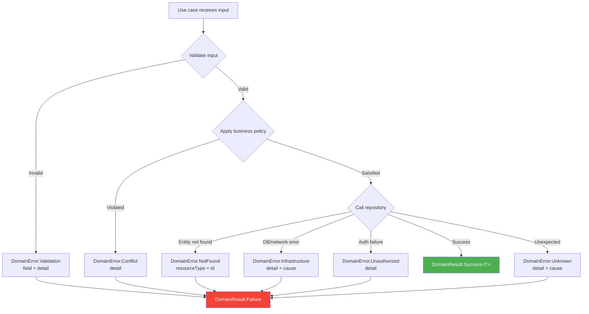

### When to use each error type

| Error | When to use | Example |
|---|---|---|
| `Validation` | Input fails a domain invariant | Email format invalid, title too long |
| `NotFound` | Requested entity does not exist | User with ID "xyz" not in database |
| `Unauthorized` | Caller lacks permission | Non-admin tries to delete a user |
| `Conflict` | Operation conflicts with current state | Duplicate email, invalid state transition |
| `Infrastructure` | External dependency failed | Database timeout, network error |
| `Unknown` | Unexpected condition (should be rare) | Fallback for unclassified errors |

---

## Testing Strategy

### Test double decision tree

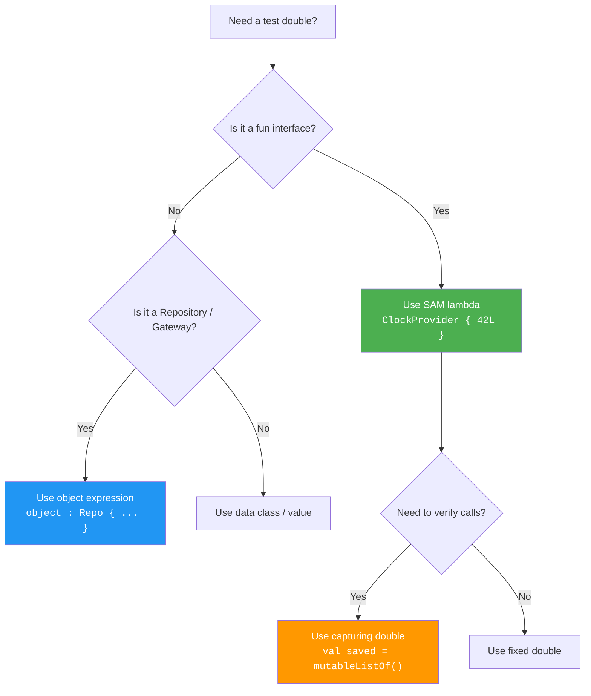

### Available test helpers

Import from `com.domain.core.testing.TestDoubles` (in `commonTest` only):

| Helper | Description |
|---|---|
| `testDeps` | `DomainDependencies` with fixed clock + fixed ID |
| `fixedClock` / `clockAt(ms)` | Deterministic `ClockProvider` |
| `fixedId` / `idOf(s)` | Deterministic `IdProvider` |
| `sequentialIds(prefix)` | `IdProvider` that returns "prefix-1", "prefix-2", … |
| `advancingClock(start, step)` | `ClockProvider` that advances by step on each call |
| `validationError(field, detail)` | Quick `DomainError.Validation` builder |
| `notFoundError(type, id)` | Quick `DomainError.NotFound` builder |
| `shouldBeSuccess()` | Extracts value or throws clear `AssertionError` |
| `shouldBeFailure()` | Extracts error or throws clear `AssertionError` |
| `shouldFailWith<E>()` | Extracts and casts to expected error subtype |

See [TESTING.md](TESTING.md) for the full testing guide, naming conventions,
and anti-patterns.

---

## Versioning

This SDK follows [Semantic Versioning](https://semver.org/):

| Change type | Version bump | Consumer impact |
|---|---|---|
| Bug fix, doc update | **PATCH** | Safe to update |
| New contracts added | **MINOR** | Safe to update |
| Breaking changes to `public` API | **MAJOR** | Compile-time errors expected |

See [ARCHITECTURE.md](ARCHITECTURE.md) for design principles and
[INTEGRATION.md](INTEGRATION.md) for data-layer boundary rules.

---

## License

Apache License 2.0 — see [LICENSE](LICENSE).

</details>
